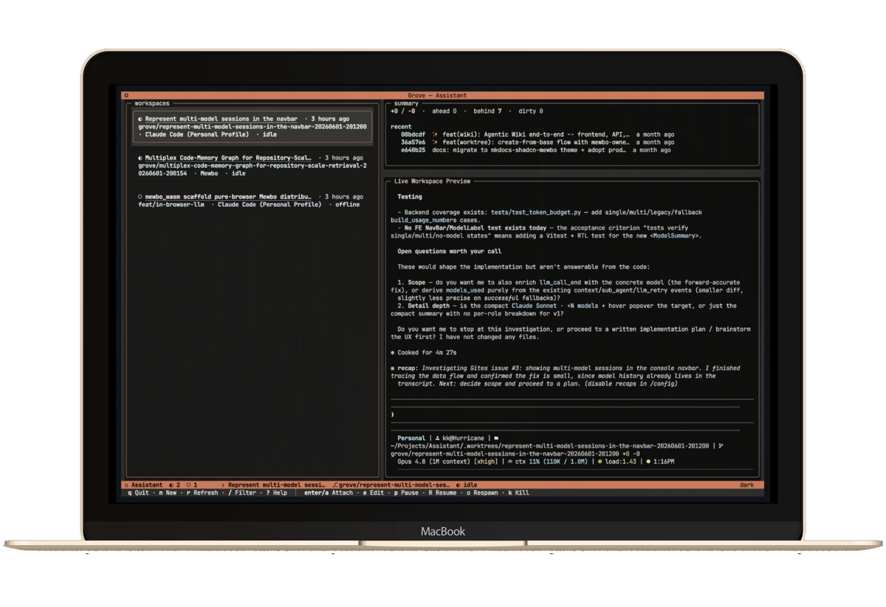
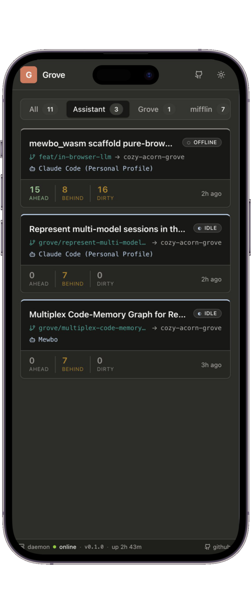
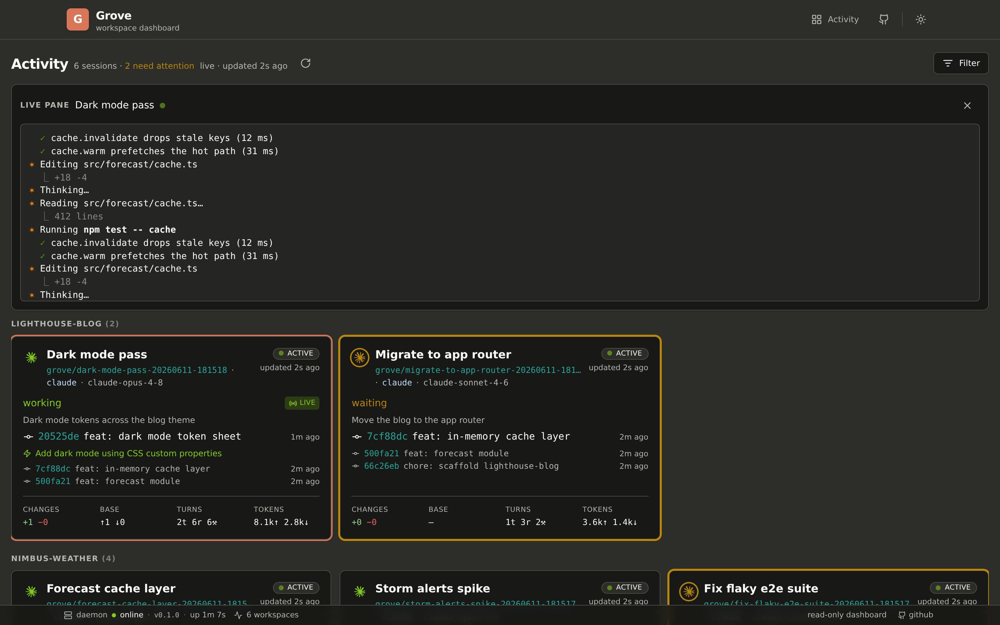

<p align="center">
  
</p>

<h1 align="center">Grove</h1>
<p align="center"><em>The terminal workspace manager for AI coding agents. Run a forest of them in parallel, and watch from your phone when you step away.</em></p>

<p align="center">
  <a href="https://github.com/bearlike/Grove/actions/workflows/ci.yml"></a>
  <a href="https://github.com/bearlike/Grove/actions/workflows/docs.yml"></a>
  <a href="https://www.python.org/"></a>
  <a href="LICENSE"></a>
</p>

<p align="center">
  
  &nbsp;&nbsp;&nbsp;
  
</p>
<p align="center">
  <sub>Grove in your terminal, and on your phone. Run agents in parallel from your desk, then watch them from anywhere.</sub>
</p>

## Overview

Grove is a terminal tool for running several AI coding agents at once, each in
its own isolated **workspace**. A workspace is a dedicated git worktree on its
own branch, paired with a tmux session and a window in the TUI. The rule is one
agent, one worktree, one window.

This matters because agents are productive in parallel but chaotic in the same
folder, where they overwrite each other's files and collide on the same branch.
Grove gives each one its own space. That lets you run Claude Code on a feature,
Codex on a failing test, OpenCode on a refactor, and Devin on a code review, all
at the same time, and watch each one work live.

Grove is unopinionated. Commit a `.grove/config.json` to set your team's shared
defaults, the agent list, the worktree layout, and the setup script every
workspace runs, and each developer can still override it locally without
touching the shared file.

A read-only **web dashboard** ships alongside the TUI, so you can check on every
agent from your phone while the daemon stays loopback-only behind a paired
session. Through all of it your git history stays yours: Grove never commits,
never pushes, and never touches a remote branch.

## Features

- **Project-scoped sessions.** Run `grove` inside repo `A` and you only see workspaces for repo `A`. No mixing across projects.
- **Configurable, not opinionated.** Worktree location, branch prefix, agent registry, init scripts, theme. Everything teams want to pin lives in `<repo>/.grove/config.json`. Six cascading layers (defaults → user → project → project-local → env → CLI) let teams enforce a baseline without taking the last word from individuals.
- **Branch-aware lifecycle.** Create, pause (keep the branch, drop the worktree), resume, kill (deletes only branches Grove created, never touches remotes), respawn (recover an OFFLINE workspace whose tmux session vanished).
- **Live activity peek.** A right-hand rail mirrors each agent's tmux pane four times per second and surfaces git position alongside it. It is best-effort and never blocks the TUI.
- **Side-effects at the edges.** A clean engine (`grove.core`) with zero UI dependencies, plus a thin Textual TUI (`grove.tui`) and a read-only web dashboard (`webapp/`). The boundary is enforced by `import-linter` so every client reuses the engine unchanged.

<p align="center">
  
</p>

## Get started

Grove needs `git` and `tmux`, and installs to your PATH as `grove` straight
from the repo, no clone required. With [uv](https://docs.astral.sh/uv/):

```bash
uv tool install "grove[daemon] @ git+https://github.com/bearlike/Grove"
```

No uv? `pipx install "grove[daemon] @ git+https://github.com/bearlike/Grove"`, or
plain `pip install --user "grove[daemon] @ git+https://github.com/bearlike/Grove"`.

Then launch it inside any git repo, and upgrade whenever you like:

```bash
cd path/to/your/repo
grove config init        # scaffold .grove/config.json
grove                    # launch the TUI
uv tool upgrade grove    # update later (or: pipx upgrade grove)
```

See [Get Started](https://bearlike.github.io/Grove/latest/getting-started/) for prerequisites and every install path.

## Configuration

Grove runs on sensible defaults, so it works the moment it is installed. To
change them, two files layer on top of each other: a committed **project
config** at `<repo>/.grove/config.json` (scaffold it with `grove config init`)
and a personal **user config** at `${user_config_dir}/grove/config.json`. Where
both set the same option, the project layer wins.

> [!TIP]
> The docs walk through writing them: [project setup](https://bearlike.github.io/Grove/latest/configure-project/),
> [agents](https://bearlike.github.io/Grove/latest/configure-agents/),
> [init scripts](https://bearlike.github.io/Grove/latest/configure-init-scripts/),
> the [full reference](https://bearlike.github.io/Grove/latest/configure-reference/),
> and the [six-layer cascade](https://bearlike.github.io/Grove/latest/features-cascade/).

<details>
<summary><b>Let an AI agent configure Grove for you</b></summary>

<br>

Configuration has a few layers and many knobs, so you do not have to write it by
hand. Hand the prompt below to Claude Code, Codex, or any coding agent; it reads
Grove's config skill and sets things up with you, verifying every field against
your installed version.

```text
Read https://raw.githubusercontent.com/bearlike/Grove/current/.claude/skills/configuring-grove/SKILL.md. It is the skill for configuring Grove, a terminal workspace manager for AI coding agents. Help me write my Grove user and project config, and verify every field against my installed version with `grove config schema --stdout`.
```

The skill teaches the agent the six-layer cascade, the exact file locations, the
full schema, common setups (dependency installs, secrets routing, test and
deploy directories, MCP server configs), and how to verify against your
installed Grove.

</details>

## Documentation

Full documentation lives at **<https://bearlike.github.io/Grove/latest/>**.

| Section | Covers |
| --- | --- |
| [Get Started](https://bearlike.github.io/Grove/latest/getting-started/) | Install, prerequisites, first run, verify. |
| [Configure](https://bearlike.github.io/Grove/latest/configure-project/) | Project setup, agents, init scripts, configuration reference. |
| [Use](https://bearlike.github.io/Grove/latest/use-tui/) | TUI tour, CLI, web dashboard, authentication, daily workflow. |
| [Capabilities](https://bearlike.github.io/Grove/latest/features-workspace-lifecycle/) | Lifecycle, branch provenance, live activity, status semantics, configuration cascade. |
| [Develop](https://bearlike.github.io/Grove/latest/develop-architecture/) | Architecture, public API, engineering principles, contributing, design system. |
| [Troubleshooting](https://bearlike.github.io/Grove/latest/troubleshooting/) | Symptom → cause → fix for common failures. |
| [Releases](https://github.com/bearlike/Grove/releases) | Release notes. |

## Contributing

Bugs and feature requests on the [issue tracker](https://github.com/bearlike/Grove/issues). For development setup, lint/test commands, and PR conventions, see the [contributing guide](https://bearlike.github.io/Grove/latest/develop-contributing/) and [`CLAUDE.md`](./CLAUDE.md).

## License

[MIT](./LICENSE) © Krishnakanth Alagiri.
