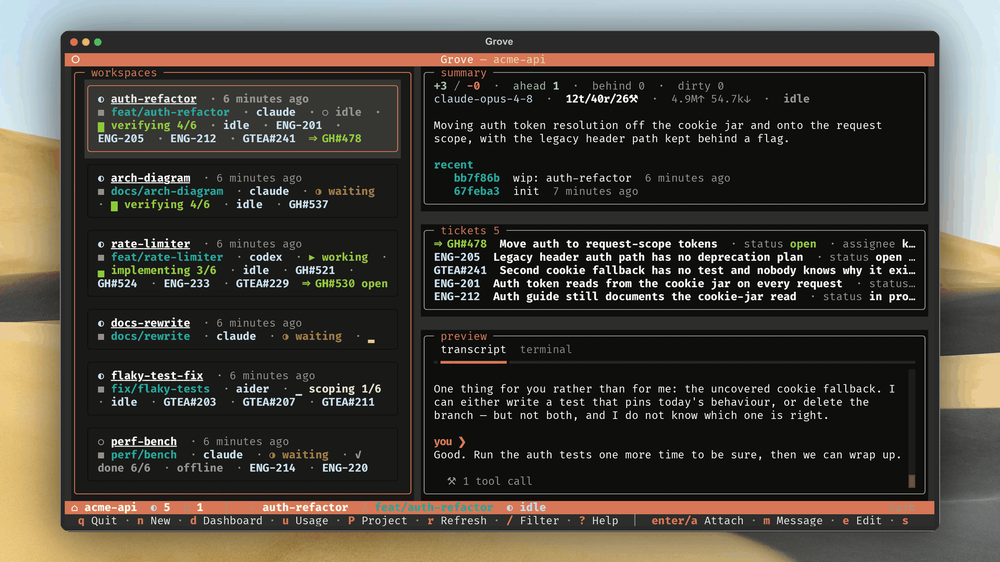
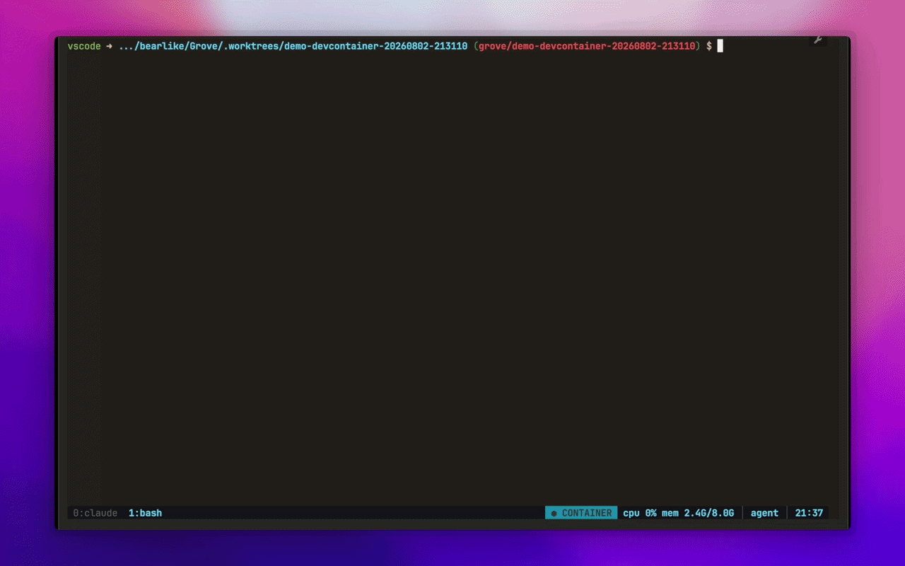
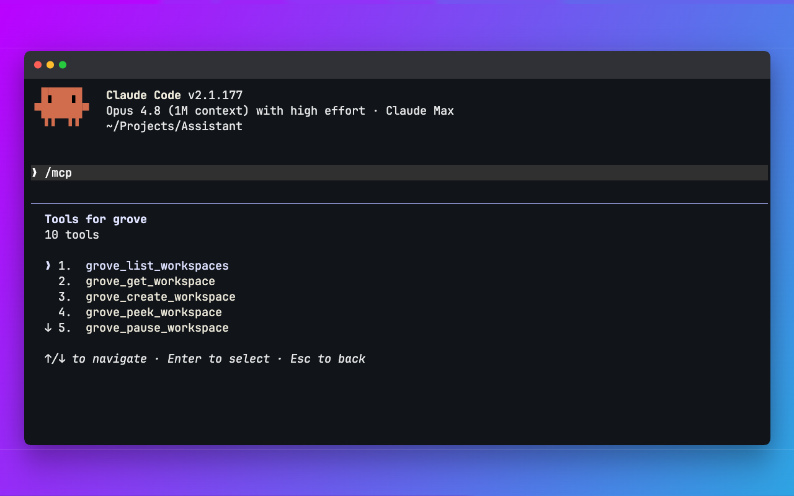
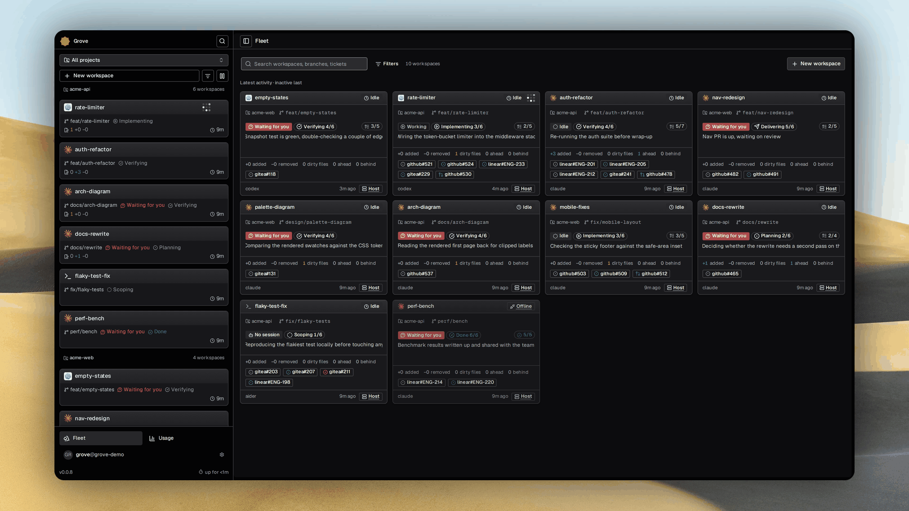
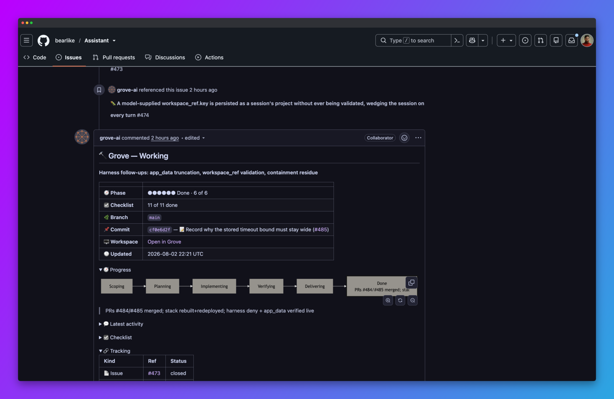

<p align="center">
  
</p>

<h1 align="center">Grove</h1>
<p align="center"><em>The terminal workspace manager for AI coding agents. Spin up a forest of isolated agent workspaces. Reach any of them asynchronously from your terminal, your browser, or another agent.</em></p>

<p align="center">
  <a href="https://github.com/bearlike/Grove/actions/workflows/ci.yml"></a>
  <a href="https://github.com/bearlike/Grove/actions/workflows/docs.yml"></a>
  <a href="https://www.python.org/"></a>
  <a href="LICENSE"></a>
</p>

## 🌳 Overview

Writing the code stopped being the slow part. Deciding what to build did. More agents would help, but two in one checkout overwrite each other's files and fight over the same branch. Grove gives each an isolated **workspace** and touches nothing about the agent itself. One worktree, one branch, one window. Add a [container](https://bearlike.github.io/Grove/latest/features-containers/) and it gets a whole stack of its own, so permissions off risks a sandbox and not your machine.

Then work arrives on its own. Assign an issue on Linear, GitHub or Gitea and a workspace starts against it, using that issue as its spec. It reports back on [the same ticket](https://bearlike.github.io/Grove/latest/issue-ops/), so nobody reads code to follow along. Shape the next one. Review what came back. Unblock what stalled. You stop writing the code. You do not stop owning it.

## ✨ Features

<table>
<tr>
<td width="50%" valign="middle">

### Terminal UI

Grove is a terminal program first. Run `grove` in a repo and create, attach, pause or kill a workspace in one keypress each, while a peek rail mirrors the selected agent's pane live next to its git position.

[Docs →](https://bearlike.github.io/Grove/latest/use-tui/)

</td>
<td width="50%">
  <a href="https://bearlike.github.io/Grove/latest/use-tui/"></a>
</td>
</tr>
<tr>
<td width="50%" valign="middle">

### Containerized agents

Optionally, run agents inside devcontainers. This gives each agent a complete stack of its own, Docker in Docker, so it starts its own database and services without touching yours. It comes up out of your project's `.devcontainer/`, under resource ceilings it cannot spend past. `--runtime host` keeps any workspace on your machine.

[Docs →](https://bearlike.github.io/Grove/latest/features-containers/)

</td>
<td width="50%">
  <a href="https://bearlike.github.io/Grove/latest/features-containers/"></a>
</td>
</tr>
<tr>
<td width="50%" valign="middle">

### Drive Grove from any agent

Grove ships an MCP server. Claude Code, Codex, OpenCode and other orchestrators create workspaces, dispatch tasks, send follow-ups and steer the fleet — your agents managing work at the scale of a whole project.

[Docs →](https://bearlike.github.io/Grove/latest/use-mcp/)

</td>
<td width="50%">
  <a href="https://bearlike.github.io/Grove/latest/use-mcp/"></a>
</td>
</tr>
<tr>
<td width="50%" valign="middle">

### A web IDE for your agents

Reach the whole fleet over your network. A session rail lists every agent thread by recency, and the landing is a composer, so a prompt spins up a workspace. Pair a device once and the daemon stays loopback.

[Docs →](https://bearlike.github.io/Grove/latest/use-webapp/)

</td>
<td width="50%">
  <a href="https://bearlike.github.io/Grove/latest/use-webapp/"></a>
</td>
</tr>
<tr>
<td width="50%" valign="middle">

### Status lands on the ticket

Every ticket a Grove workspace works gets one comment, rewritten in place as the work moves. The phase, the checklist and the latest commit stay current where your team already looks. Nobody has to ask, and there is no second dashboard to check.

[Docs →](https://bearlike.github.io/Grove/latest/features-ticket-providers/)

</td>
<td width="50%">
  <a href="https://bearlike.github.io/Grove/latest/features-ticket-providers/"></a>
</td>
</tr>
</table>

**Also in the box:**

- **[Branch-aware lifecycle](https://bearlike.github.io/Grove/latest/features-workspace-lifecycle/).** Create, pause, resume, respawn, and kill. Pause keeps the branch and drops the worktree. Kill deletes only branches Grove created, never remotes.
- **[Configuration cascade](https://bearlike.github.io/Grove/latest/features-cascade/).** A committed `.grove/config.json` sets the team baseline. Six layers let each developer override locally without touching it.
- **[Per-agent model selection](https://bearlike.github.io/Grove/latest/use-webapp/).** Each agent exposes its own model catalog. Pick the model per workspace: a cheap one for scaffolding, a strong one for the hard refactor, side by side.
- **[Session recovery](https://bearlike.github.io/Grove/latest/features-workspace-lifecycle/).** Grove pane-verifies each agent session and re-adopts it across daemon restarts and a different user attaching. A stale pointer remaps to the recovered session in a click.
- **[Ticket providers](https://bearlike.github.io/Grove/latest/features-ticket-providers/).** Attach a GitHub, Gitea or Linear issue or pull request to a workspace, or let Grove read the link straight off the branch name so it follows the branch.
- **[Push notifications](https://bearlike.github.io/Grove/latest/features-notifications/).** Get pinged when an agent finishes a turn or needs you.

https://github.com/user-attachments/assets/256714c5-37e5-4c9d-8b2d-47422d5aae0f

## 🚀 Get started

Grove needs `git` and `tmux`, and installs to your PATH as `grove` straight from the repo. With [uv](https://docs.astral.sh/uv/):

```bash
uv tool install "grove[daemon] @ git+https://github.com/bearlike/Grove"

cd path/to/your/repo
grove config init        # scaffold .grove/config.json
grove                    # launch the TUI
uv tool upgrade grove    # update later
```

No uv? Use `pipx install "grove[daemon] @ git+https://github.com/bearlike/Grove"` or plain `pip install --user`. See [Get Started](https://bearlike.github.io/Grove/latest/getting-started/) for prerequisites and every install path.

<details>
<summary><b>🤖 Let an AI agent configure Grove for you</b></summary>

<br>

Configuration has a few layers and many knobs, so you do not have to write it by hand. Hand the prompt below to Claude Code, Codex or any coding agent. It reads Grove's config skill and sets things up with you, then verifies every field against the version you actually installed.

```text
Read https://raw.githubusercontent.com/bearlike/Grove/current/src/grove/skills/configuring-grove/SKILL.md

It is the skill for configuring Grove, a terminal workspace manager for AI
coding agents. It covers the six-layer cascade, agents, init scripts,
containers and ticket providers.

Help me write my Grove user and project config, then verify every field
against my installed version with `grove config schema --stdout`.
```

---

</details>

## 🤖 Skills for Claude Code

```bash
claude plugin marketplace add https://github.com/bearlike/Grove.git
```

<details>
<summary><b>Teach your agent to drive Grove and to configure it for a project</b></summary>

<br>

Four skills, shipped from the repository that implements them, so they never
drift from the code. They are the same files `grove skills install` copies into
a tool's skills directory.

| Skill | For |
|---|---|
| `using-grove` | Driving a fleet from outside. CLI verbs, MCP tool ids, ticket and PR linking |
| `working-in-grove` | The agent inside a workspace, reporting phase and keeping attached tickets current |
| `configuring-grove` | The config cascade, agents, init scripts, containers, ticket providers |
| `reinstalling-grove` | When an update did not take |

</details>

## 📚 Documentation

Full documentation lives at **<https://bearlike.github.io/Grove/latest/>**.

| Section | Covers |
| --- | --- |
| [Get Started](https://bearlike.github.io/Grove/latest/getting-started/) | Install, prerequisites, first run, verify. |
| [Configure](https://bearlike.github.io/Grove/latest/configure-project/) | Project setup, agents, init scripts, configuration reference. |
| [Use](https://bearlike.github.io/Grove/latest/use-tui/) | TUI tour, CLI, web IDE, authentication, daily workflow. |
| [Capabilities](https://bearlike.github.io/Grove/latest/features-workspace-lifecycle/) | Lifecycle, branch provenance, live activity, status semantics, configuration cascade. |
| [Develop](https://bearlike.github.io/Grove/latest/develop-architecture/) | Architecture, public API, engineering principles, contributing, design system. |
| [Troubleshooting](https://bearlike.github.io/Grove/latest/troubleshooting/) | Symptom → cause → fix for common failures. |

## 🤝 Contributing

Bugs and feature requests on the [issue tracker](https://github.com/bearlike/Grove/issues). For development setup, lint/test commands, and PR conventions, see the [contributing guide](https://bearlike.github.io/Grove/latest/develop-contributing/) and [`CLAUDE.md`](./CLAUDE.md).

## 📄 License

[MIT](./LICENSE) © Krishnakanth Alagiri.
