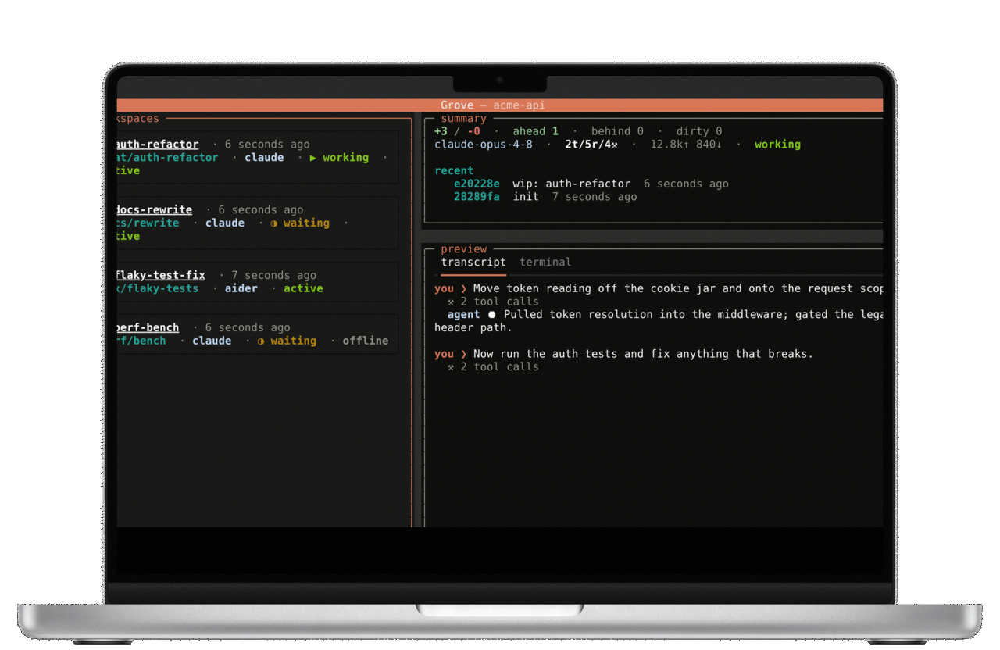
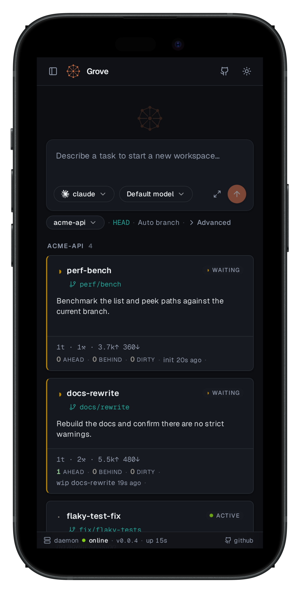
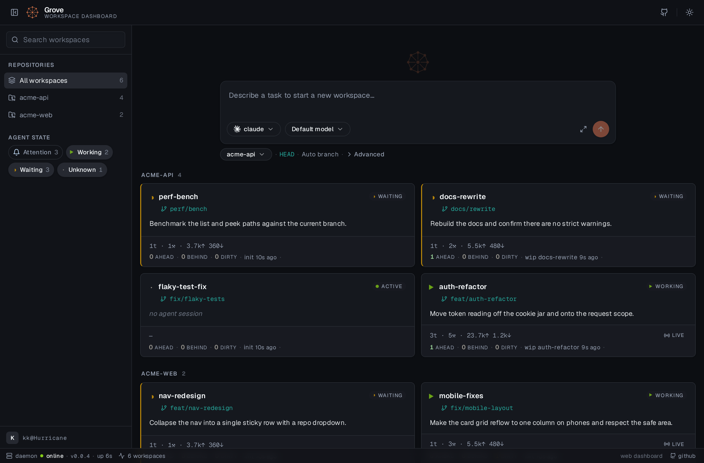
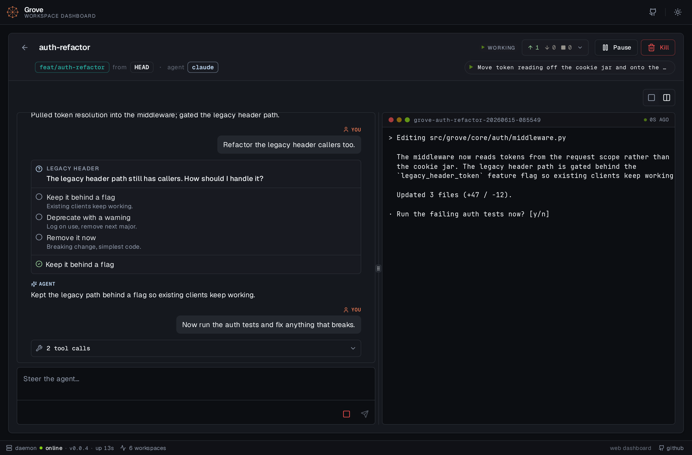

<p align="center">
  
</p>

<h1 align="center">Grove</h1>
<p align="center"><em>The terminal workspace manager for AI coding agents. Spin up a forest of isolated agent workspaces. Reach any of them asynchronously from your terminal, your browser, or another agent.</em></p>

<p align="center">
  <a href="https://github.com/bearlike/Grove/actions/workflows/ci.yml"></a>
  <a href="https://github.com/bearlike/Grove/actions/workflows/docs.yml"></a>
  <a href="https://www.python.org/"></a>
  <a href="LICENSE"></a>
</p>

<p align="center">
  
  &nbsp;&nbsp;
  
</p>
<p align="center">
  <sub>Grove in the terminal and the browser, and on your phone. One agent, one worktree, one window.</sub>
</p>

## 🌳 Overview

Grove runs several AI coding agents at once, each in its own isolated **workspace**: a dedicated git worktree on its own branch, paired with a tmux session and a window. The rule is one agent, one worktree, one window. Agents are productive in parallel but chaotic in the same folder, where they overwrite each other's files and collide on the same branch. Grove gives each one its own bench.

Every workspace is reachable asynchronously, from the terminal TUI, the CLI, the web dashboard on any device, or another agent over [MCP](https://bearlike.github.io/Grove/latest/use-mcp/). The same isolated-workspace primitive backs human and agent orchestration alike. Through all of it your git history stays yours: Grove never commits, never pushes, and never touches a remote branch.

## ✨ Features

<table>
<tr>
<td width="50%" valign="middle">

### Async access, any device

Reach the whole fleet over your network. A composer starts a workspace from a prompt, and the live, repo-grouped grid shows every agent. Pair a device once; the daemon stays loopback.

[Docs →](https://bearlike.github.io/Grove/latest/use-webapp/)

</td>
<td width="50%">
  <a href="https://bearlike.github.io/Grove/latest/use-webapp/"></a>
</td>
</tr>
<tr>
<td width="50%" valign="middle">

### Transcript and terminal, side by side

A split view shows the agent's transcript next to its live terminal. Read the conversation, send a follow-up, and answer the agent's structured questions inline. Watch the work happen at the same time.

[Docs →](https://bearlike.github.io/Grove/latest/use-webapp/#the-workspace-ide-shell)

</td>
<td width="50%">
  <a href="https://bearlike.github.io/Grove/latest/use-webapp/#the-workspace-ide-shell"></a>
</td>
</tr>
<tr>
<td width="50%" valign="middle">

### Drive Grove from any agent

Grove ships an MCP server. Claude Code, Codex, OpenCode, and other orchestrators use its tools to create workspaces, dispatch tasks, send follow-ups, and steer the fleet. Your agents manage work at the scale of a whole project.

[Docs →](https://bearlike.github.io/Grove/latest/use-mcp/)

</td>
<td width="50%">
  <a href="https://bearlike.github.io/Grove/latest/use-mcp/"></a>
</td>
</tr>
<tr>
<td width="50%" valign="middle">

### Terminal UI

Grove is a terminal program first. Run `grove` in a repo to see only its workspaces. Create, attach, pause, and kill, each one keypress. A peek rail mirrors the selected agent's pane live, next to its git position.

[Docs →](https://bearlike.github.io/Grove/latest/use-tui/)

</td>
<td width="50%">
  <a href="https://bearlike.github.io/Grove/latest/use-tui/"></a>
</td>
</tr>
</table>

**Also in the box:**

- **[Branch-aware lifecycle](https://bearlike.github.io/Grove/latest/features-workspace-lifecycle/).** Create, pause, resume, respawn, and kill. Pause keeps the branch and drops the worktree. Kill deletes only branches Grove created, never remotes.
- **[Configuration cascade](https://bearlike.github.io/Grove/latest/features-cascade/).** A committed `.grove/config.json` sets the team baseline. Six layers let each developer override locally without touching it.
- **[Ticket providers](https://bearlike.github.io/Grove/latest/features-ticket-providers/).** Branch-aware Gitea, GitHub, and Linear context, surfaced next to the workspace.
- **[Push notifications](https://bearlike.github.io/Grove/latest/features-notifications/).** Get pinged when an agent finishes a turn or needs you.

## 🚀 Get started

Grove needs `git` and `tmux`, and installs to your PATH as `grove` straight from the repo. With [uv](https://docs.astral.sh/uv/):

```bash
uv tool install "grove[daemon] @ git+https://github.com/bearlike/Grove"

cd path/to/your/repo
grove config init        # scaffold .grove/config.json
grove                    # launch the TUI
uv tool upgrade grove    # update later
```

No uv? Use `pipx install "grove[daemon] @ git+https://github.com/bearlike/Grove"` or plain `pip install --user`. See [Get Started](https://bearlike.github.io/Grove/latest/getting-started/) for prerequisites and every install path.

<details>
<summary><b>🤖 Let an AI agent configure Grove for you</b></summary>

<br>

Configuration has a few layers and many knobs, so you do not have to write it by hand. Hand the prompt below to Claude Code, Codex, or any coding agent; it reads Grove's config skill and sets things up with you, verifying every field against your installed version.

```text
Read https://raw.githubusercontent.com/bearlike/Grove/current/.claude/skills/configuring-grove/SKILL.md. It is the skill for configuring Grove, a terminal workspace manager for AI coding agents. Help me write my Grove user and project config, and verify every field against my installed version with `grove config schema --stdout`.
```

</details>

## 📚 Documentation

Full documentation lives at **<https://bearlike.github.io/Grove/latest/>**.

| Section | Covers |
| --- | --- |
| [Get Started](https://bearlike.github.io/Grove/latest/getting-started/) | Install, prerequisites, first run, verify. |
| [Configure](https://bearlike.github.io/Grove/latest/configure-project/) | Project setup, agents, init scripts, configuration reference. |
| [Use](https://bearlike.github.io/Grove/latest/use-tui/) | TUI tour, CLI, web dashboard, authentication, daily workflow. |
| [Capabilities](https://bearlike.github.io/Grove/latest/features-workspace-lifecycle/) | Lifecycle, branch provenance, live activity, status semantics, configuration cascade. |
| [Develop](https://bearlike.github.io/Grove/latest/develop-architecture/) | Architecture, public API, engineering principles, contributing, design system. |
| [Troubleshooting](https://bearlike.github.io/Grove/latest/troubleshooting/) | Symptom → cause → fix for common failures. |

## 🤝 Contributing

Bugs and feature requests on the [issue tracker](https://github.com/bearlike/Grove/issues). For development setup, lint/test commands, and PR conventions, see the [contributing guide](https://bearlike.github.io/Grove/latest/develop-contributing/) and [`CLAUDE.md`](./CLAUDE.md).

## 📄 License

[MIT](./LICENSE) © Krishnakanth Alagiri.
