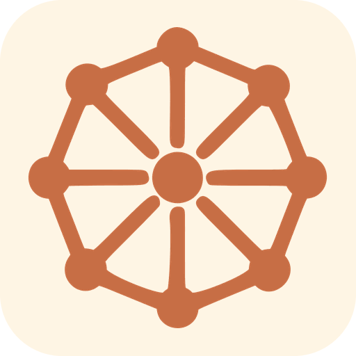
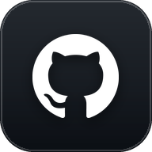
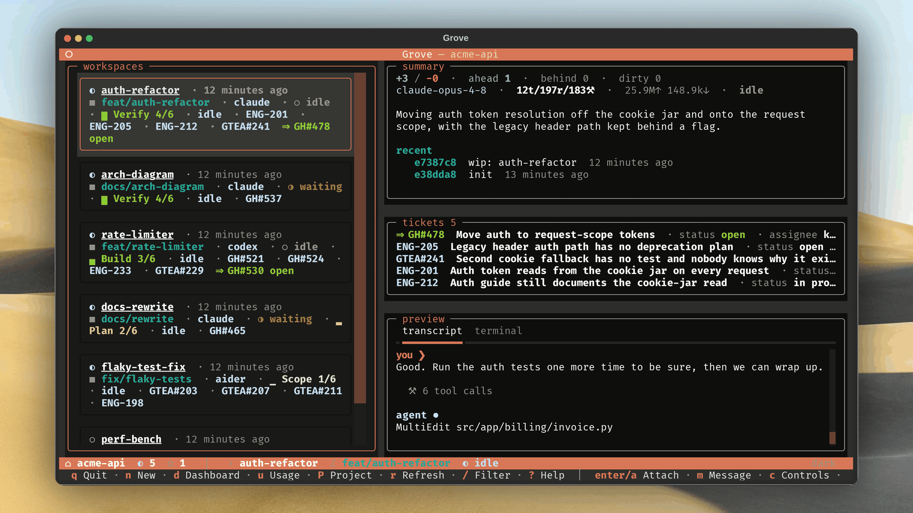
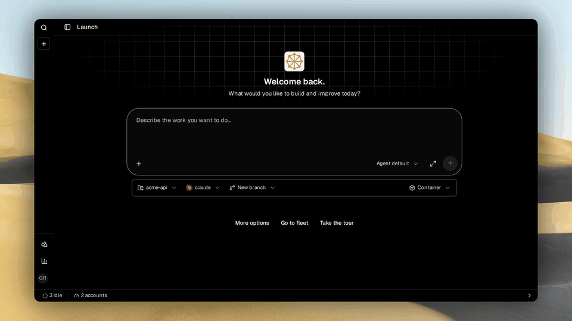
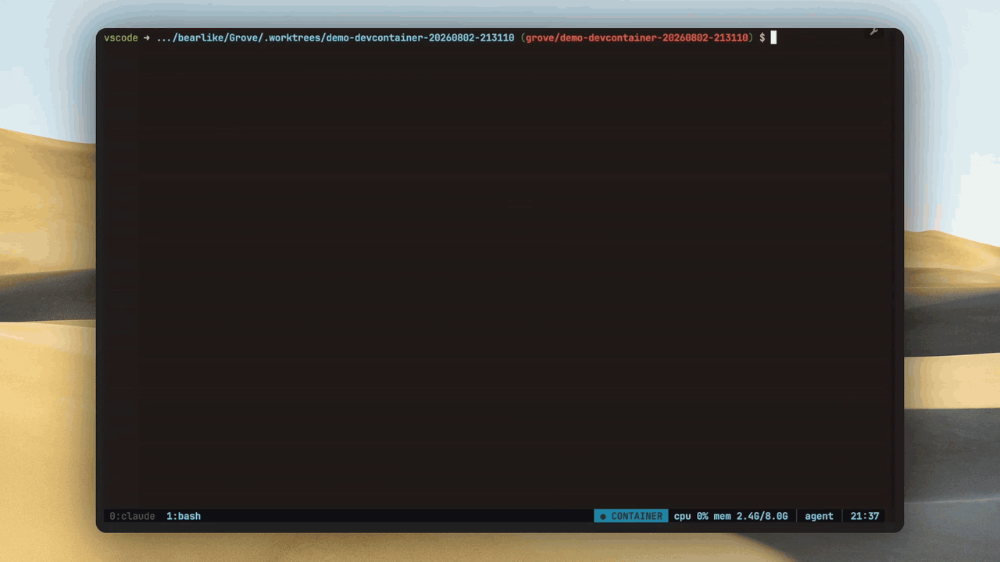
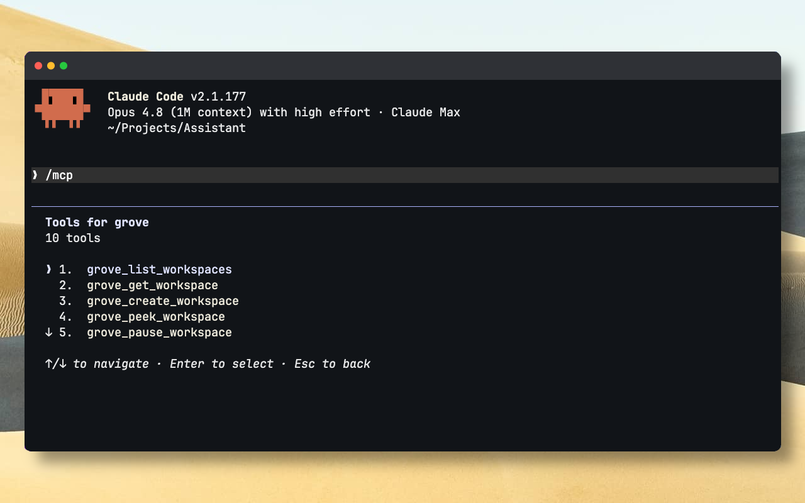
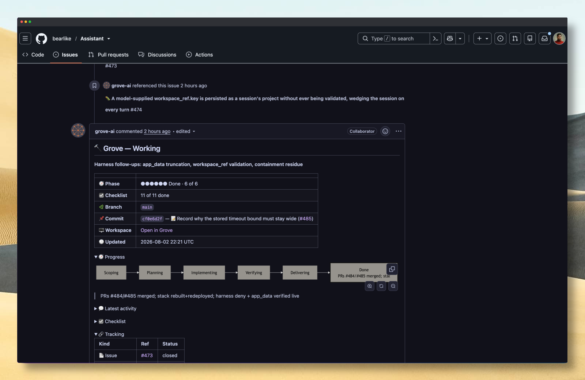
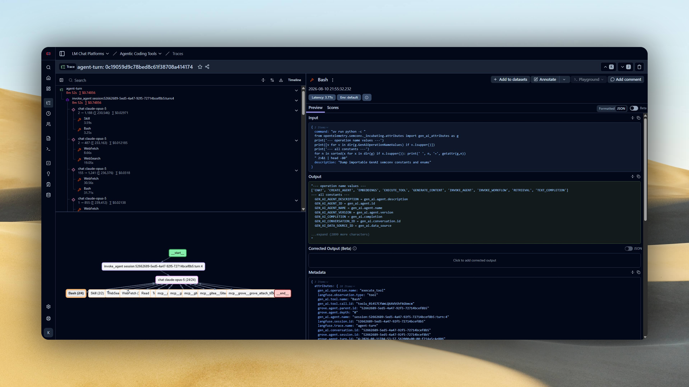

<p align="center">
  
</p>

<h1 align="center">Grove</h1>
<p align="center"><em>Grove is a software factory for the coding agents you already use. Give each task a workspace. Guide the work with files and diagrams. Follow delivery from ticket to trace.</em></p>

<p align="center">
  <a href="https://github.com/bearlike/Grove/actions/workflows/ci.yml"></a>
  <a href="https://github.com/bearlike/Grove/actions/workflows/docs.yml"></a>
  <a href="https://www.python.org/"></a>
  <a href="LICENSE"></a>
</p>

<p align="center"><strong>Supports</strong></p>
<p align="center">
  <a href="https://github.com/anthropics/claude-code"></a>&nbsp;
  <a href="https://github.com/openai/codex"></a>&nbsp;
  <a href="https://opencode.ai"></a>&nbsp;
  <a href="https://linear.app"></a>&nbsp;
  <a href="https://github.com"></a>&nbsp;
  <a href="https://about.gitea.com/"></a>
</p>

## 🌳 Overview

- **Writing the code stopped being the slow part.** Deciding what to build did. More agents can build in parallel but shared checkouts cause conflicts and laptops limit capacity. Grove turns the agents you already use into a software factory. Guide each task from ticket to delivery.
- **Give each task its own workspace.** Each agent gets its own worktree and branch in a separate window. Agents report progress phases for the workspace and each attached ticket independently. You can see what is being planned, built or verified across the fleet.
- **Choose how each agent runs.** Run agents on your host with the environment they normally inherit. Or use a [container](https://factory.mewbo.com/latest/features-containers/) defined by your repository's `.devcontainer/`. It provides separate services and ports with resource limits. Use that isolation for runs with agent permission checks disabled.
- **Choose where the work runs.** Tests, builds and scripts compete for CPU and memory across concurrent workspaces. Move those workloads off your laptop when it slows down. Reuse the container configuration on a shared team machine or serverless cloud infrastructure.
- **Let the tracker start the work.** Assign an issue and Grove starts a workspace for it. Progress returns to [the same ticket](https://factory.mewbo.com/latest/issue-ops/). Follow the task where you defined it.
- **Show it instead of describing it.** Mark up a [screenshot](https://factory.mewbo.com/latest/features-attachments/) or collaborate with the agent on a [diagram](https://factory.mewbo.com/latest/features-diagrams/). Approve the diagram or mockup and attach it to a ticket. Then coordinate your fleet around it.

## ✨ Features

<table>
<tr>
<td width="50%" valign="middle">

### Terminal UI and CLI

Use the terminal UI to see which agents need you. The CLI autocompletes commands and live workspace names. People and agents can launch, pause and resume work from the shell.

[Docs →](https://factory.mewbo.com/latest/use-tui/) · [CLI →](https://factory.mewbo.com/latest/use-cli/)

</td>
<td width="50%">
  <a href="https://factory.mewbo.com/latest/use-tui/"></a>
</td>
</tr>
<tr>
<td width="50%" valign="middle">

### The whole fleet in your browser

Follow headless agent sessions from any browser. Review the transcript beside the branch and diff. Upload files or annotate screenshots to show what needs changing. Edit a draw.io diagram together without leaving the workspace.

[Docs →](https://factory.mewbo.com/latest/use-webapp/)

</td>
<td width="50%">
  <a href="https://factory.mewbo.com/latest/use-webapp/"></a>
</td>
</tr>
<tr>
<td width="50%" valign="middle">

### Containerized agents

Run each agent in a containerized sandbox for its task. Separate files and services keep parallel work from colliding. Set CPU and memory limits per task. Scale each agent container independently on serverless cloud platforms as tasks arrive.

[Docs →](https://factory.mewbo.com/latest/features-containers/)

</td>
<td width="50%">
  <a href="https://factory.mewbo.com/latest/features-containers/"></a>
</td>
</tr>
<tr>
<td width="50%" valign="middle">

### Drive Grove from any agent

An orchestrator uses Grove's MCP tools to launch agents, track progress and steer the fleet. Worker agents use the mailbox to discover peers and exchange messages as tasks run in parallel. They can coordinate without sharing a checkout.

[Docs →](https://factory.mewbo.com/latest/use-mcp/)

</td>
<td width="50%">
  <a href="https://factory.mewbo.com/latest/use-mcp/"></a>
</td>
</tr>
<tr>
<td width="50%" valign="middle">

### Status lands on the ticket

Every ticket a Grove workspace works gets one comment, rewritten in place as the work moves. The phase, the checklist and the latest commit stay current where your team already looks. Nobody has to ask, and there is no second dashboard to check.

[Docs →](https://factory.mewbo.com/latest/features-ticket-providers/)

</td>
<td width="50%">
  <a href="https://factory.mewbo.com/latest/features-ticket-providers/"></a>
</td>
</tr>
<tr>
<td width="50%" valign="middle">

### Audit and tune the whole fleet

Trace each agent turn's work and cost. Rate the answer in Grove with a thumb. Add reasons or a note without leaving the transcript. That feedback stays on its Langfuse trace. Your team can review patterns and calibrate automated LLM judges against human scores.

[Docs →](https://factory.mewbo.com/latest/features-telemetry/)

</td>
<td width="50%">
  <a href="https://factory.mewbo.com/latest/features-telemetry/"></a>
</td>
</tr>
</table>

**Also in the box:**

- **[Branch-aware lifecycle](https://factory.mewbo.com/latest/features-workspace-lifecycle/).** Create, pause, resume, respawn, and kill. Pause keeps the branch and drops the worktree. Kill deletes only branches Grove created, never remotes.
- **[Configuration cascade](https://factory.mewbo.com/latest/features-cascade/).** A committed `.grove/config.json` sets the team baseline. Six layers let each developer override locally without touching it.
- **[Per-agent model selection](https://factory.mewbo.com/latest/use-webapp/).** Each agent exposes its own model catalog. Pick the model per workspace: a cheap one for scaffolding, a strong one for the hard refactor, side by side.
- **[Session recovery](https://factory.mewbo.com/latest/features-workspace-lifecycle/).** Grove pane-verifies each agent session and re-adopts it across daemon restarts and a different user attaching. A stale pointer remaps to the recovered session in a click.
- **[Ticket providers](https://factory.mewbo.com/latest/features-ticket-providers/).** Attach a GitHub, Gitea or Linear issue or pull request to a workspace, or let Grove read the link straight off the branch name so it follows the branch.
- **[Push notifications](https://factory.mewbo.com/latest/features-notifications/).** Get pinged when an agent finishes a turn or needs you.
- **[Attachments and annotation](https://factory.mewbo.com/latest/features-attachments/).** Paste a screenshot or attach a file in either composer, draw on the image before it goes, and the agent is handed a path inside its own worktree.
- **[Diagram collaboration](https://factory.mewbo.com/latest/features-diagrams/).** A person and an agent edit one draw.io file with revision checks. Quick UI mockups and architecture specs are approved as a picture before code exists.
- **[Subscription windows](https://factory.mewbo.com/latest/use-webapp/).** Track each plan's usage, reset and burn rate. See which limit comes first.
- **[Usage trends](https://factory.mewbo.com/latest/use-webapp/).** Track a year's daily tokens, model cost and latency. See where agents spend time across projects.
- **[Local by default](https://factory.mewbo.com/latest/features-telemetry/).** The audit reads local transcripts. Export is optional. Prompt bodies stay off until you enable them.

## 🚀 Get started

Grove needs `git` and `tmux`. It publishes to PyPI as `grove-factory`, and one install carries everything: the TUI, the CLI, the daemon, the MCP server and the web dashboard. With [uv](https://docs.astral.sh/uv/):

```bash
uv tool install grove-factory

cd path/to/your/repo
grove config init               # scaffold .grove/config.json
grove                           # launch the TUI
uv tool upgrade grove-factory   # pull the latest release later
```

Try it without installing with `uvx --from grove-factory grove`. The web dashboard is `grove daemon serve` plus `grove web`, and brings its own Node, so nothing else to install. No uv? `pipx install grove-factory` works too. Releases are cut on [GitHub](https://github.com/bearlike/Grove/releases) and land on PyPI minutes later. See [Get Started](https://factory.mewbo.com/latest/getting-started/) for prerequisites and every install path.

<details>
<summary><b>🤖 Let an AI agent configure Grove for you</b></summary>

<br>

Configuration has a few layers and many knobs, so you do not have to write it by hand. Hand the prompt below to Claude Code, Codex or any coding agent. It reads Grove's config skill and sets things up with you, then verifies every field against the version you actually installed.

```text
Read https://raw.githubusercontent.com/bearlike/Grove/current/src/grove/skills/configuring-grove/SKILL.md

It is the skill for configuring Grove, a software factory for coding agents.
It covers the six-layer cascade, agents, init scripts, containers and ticket
providers.

Help me write my Grove user and project config, then verify every field
against my installed version with `grove config schema --stdout`.
```

---

</details>

## 🤖 Skills for Claude Code

```bash
claude plugin marketplace add https://github.com/bearlike/Grove.git
```

<details>
<summary><b>Teach your agent to drive Grove and to configure it for a project</b></summary>

<br>

Grove's skills ship from the repository that implements them, so they never
drift from the code. They are the same files `grove skills install` copies into
a tool's skills directory; `grove skills list --details` is the full roster.

| Skill | For |
|---|---|
| `using-grove` | Driving a fleet from outside. CLI verbs, MCP tool ids, ticket and PR linking |
| `leading-in-grove` | Leading a fleet of teammates toward one deliverable. Splitting the work, check-ins, verification, teardown |
| `working-in-grove` | The agent inside a workspace, reporting phase and keeping attached tickets current |
| `configuring-grove` | The config cascade, agents, init scripts, containers, ticket providers |
| `reinstalling-grove` | When an update did not take |
| `collaborating-on-diagrams` | Editing a `.drawio` file together with a person, through managed reads and writes |
| `mocking-up-in-grove` | Getting a frontend mockup approved as a picture before any code exists |

</details>

## 📚 Documentation

Full documentation lives at **<https://factory.mewbo.com/>**.

| Section | Covers |
| --- | --- |
| [Get Started](https://factory.mewbo.com/latest/getting-started/) | Install, prerequisites, first run, verify. |
| [Configure](https://factory.mewbo.com/latest/configure-project/) | Project setup, agents, init scripts, configuration reference. |
| [Use](https://factory.mewbo.com/latest/use-tui/) | TUI tour, CLI, web IDE, authentication, daily workflow. |
| [Capabilities](https://factory.mewbo.com/latest/features-workspace-lifecycle/) | Lifecycle, branch provenance, live activity, status semantics, configuration cascade. |
| [Develop](https://factory.mewbo.com/latest/develop-architecture/) | Architecture, public API, engineering principles, contributing, design system. |
| [Troubleshooting](https://factory.mewbo.com/latest/troubleshooting/) | Symptom → cause → fix for common failures. |

## 🤝 Contributing

Bugs and feature requests on the [issue tracker](https://github.com/bearlike/Grove/issues). For development setup, lint/test commands, and PR conventions, see the [contributing guide](https://factory.mewbo.com/latest/develop-contributing/) and [`CLAUDE.md`](./CLAUDE.md).

## 📄 License

[MIT](./LICENSE) © Krishna Alagiri.
