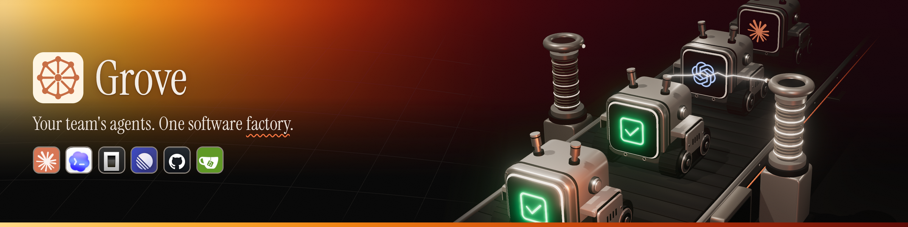
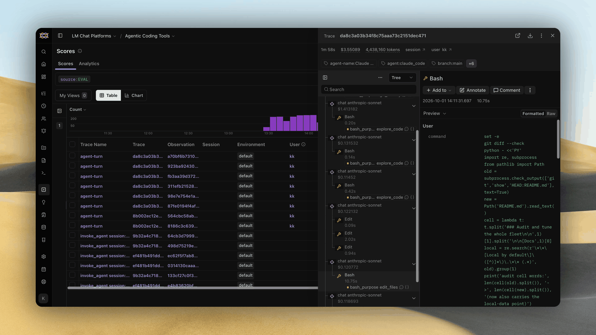

<p align="center">
  <a href="https://factory.mewbo.com/"></a>
</p>

<p align="center"><em>Run your coding agents as a software factory, each task in its own workspace and tracked from ticket to trace.</em></p>

<p align="center">
  <a href="https://github.com/bearlike/Grove/actions/workflows/ci.yml"></a>
  <a href="https://github.com/bearlike/Grove/actions/workflows/docs.yml"></a>
  <a href="https://www.python.org/"></a>
  <a href="LICENSE"></a>
</p>

<p align="center"><strong>Supports</strong>
  <a href="https://github.com/anthropics/claude-code" title="Claude Code">Claude Code</a> ·
  <a href="https://github.com/openai/codex" title="Codex">Codex</a> ·
  <a href="https://opencode.ai" title="OpenCode">OpenCode</a> ·
  <a href="https://linear.app" title="Linear">Linear</a> ·
  <a href="https://github.com" title="GitHub">GitHub</a> ·
  <a href="https://about.gitea.com/" title="Gitea">Gitea</a> ·
  <a href="https://langfuse.com" title="Langfuse">Langfuse</a>
</p>

## 🌳 Overview

- **Coding is no longer the slow part.** Deciding what to build is. Parallel agents hit checkout conflicts and laptop limits. Grove turns your agents into a software factory. Turn tickets into outcomes.
- **Give each task its own workspace.** Each agent gets a worktree and branch. Agents report phases for their workspace and each attached ticket. See what's planned, built or verified across the fleet.
- **Choose how each agent runs.** Run agents in their usual host environment or a [container](https://factory.mewbo.com/latest/features-containers/) defined by your repository's `.devcontainer/`. Containers provide separate services and ports with resource limits.
- **Choose where the work runs.** Concurrent tests and builds compete for CPU and memory. Reuse your container configuration on a shared team machine or serverless cloud to free your laptop.
- **Let the tracker start the work.** Assign an issue and Grove starts its workspace. Progress returns to [the same ticket](https://factory.mewbo.com/latest/issue-ops/). Follow the task where you defined it.
- **Show it instead of describing it.** Annotate a [screenshot](https://factory.mewbo.com/latest/features-attachments/) or draw a [diagram](https://factory.mewbo.com/latest/features-diagrams/) with your agent. Approve the diagram or mockup and attach it to a ticket to coordinate your fleet.

## ✨ Features

<table>
<tr>
<td width="50%" valign="middle">

### Terminal UI and CLI

Use the terminal UI to see which agents need you. The CLI autocompletes commands and live workspace names. People and agents can launch, pause and resume work from the shell.

[Docs →](https://factory.mewbo.com/latest/use-tui/) · [CLI →](https://factory.mewbo.com/latest/use-cli/)

</td>
<td width="50%">
  <a href="https://factory.mewbo.com/latest/use-tui/"></a>
</td>
</tr>
<tr>
<td width="50%" valign="middle">

### The whole fleet in your browser

Follow headless agent sessions from any browser. Review the transcript beside the branch and diff. Upload files or annotate screenshots to show what needs changing. Edit a [draw.io](https://www.drawio.com/) diagram together without leaving the workspace.

[Docs →](https://factory.mewbo.com/latest/use-webapp/)

</td>
<td width="50%">
  <a href="https://factory.mewbo.com/latest/use-webapp/"></a>
</td>
</tr>
<tr>
<td width="50%" valign="middle">

### Containerized agents

Run each agent in a containerized sandbox for its task. Separate files and services keep parallel work from colliding. Set CPU and memory limits per task. Scale each agent container independently on serverless cloud platforms as tasks arrive.

[Docs →](https://factory.mewbo.com/latest/features-containers/)

</td>
<td width="50%">
  <a href="https://factory.mewbo.com/latest/features-containers/"></a>
</td>
</tr>
<tr>
<td width="50%" valign="middle">

### Drive Grove from any agent

An orchestrator uses Grove's MCP tools to launch agents, track progress and steer the fleet. Worker agents use the mailbox to discover peers and exchange messages as tasks run in parallel. They can coordinate without sharing a checkout.

[Docs →](https://factory.mewbo.com/latest/use-mcp/)

</td>
<td width="50%">
  <a href="https://factory.mewbo.com/latest/use-mcp/"></a>
</td>
</tr>
<tr>
<td width="50%" valign="middle">

### Status lands on the ticket

Every ticket a Grove workspace works gets one comment, rewritten in place as the work moves. The phase, the checklist and the latest commit stay current where your team already looks. Nobody has to ask, and there is no second dashboard to check.

[Docs →](https://factory.mewbo.com/latest/features-ticket-providers/)

</td>
<td width="50%">
  <a href="https://factory.mewbo.com/latest/features-ticket-providers/"></a>
</td>
</tr>
<tr>
<td width="50%" valign="middle">

### Audit and tune the whole fleet

Every agent turn becomes a Langfuse trace. A small local decision model labels each observation, such as why a shell command ran, with a confidence score. Add thumbs up or down from Grove, then calibrate the labels against human judgement.

[Docs →](https://factory.mewbo.com/latest/features-feedback-evals/)

</td>
<td width="50%">
  <a href="https://factory.mewbo.com/latest/features-feedback-evals/"></a>
</td>
</tr>
</table>

**Also in the box:**

- **[Branch-aware lifecycle](https://factory.mewbo.com/latest/features-workspace-lifecycle/).** Create, pause, resume, respawn or kill. Pausing keeps the branch.
- **[Configuration cascade](https://factory.mewbo.com/latest/features-cascade/).** A committed `.grove/config.json` sets team defaults, overridable locally.
- **[Per-agent model selection](https://factory.mewbo.com/latest/use-webapp/).** Pick a model per workspace.
- **[Session recovery](https://factory.mewbo.com/latest/features-workspace-lifecycle/).** Sessions survive restarts and reattach, and a lost one remaps in a click.
- **[Feedback and evaluations](https://factory.mewbo.com/latest/features-feedback-evals/).** Human ratings and decision-model scores in Langfuse.
- **[Ticket providers](https://factory.mewbo.com/latest/features-ticket-providers/).** Link Linear, GitHub or Gitea tickets to show workspace phase and status.
- **[Push notifications](https://factory.mewbo.com/latest/features-notifications/).** Get pinged when an agent finishes a turn or needs you.
- **[Attachments and annotation](https://factory.mewbo.com/latest/features-attachments/).** Attach files for your agent, and draw annotations on images.
- **[Diagram collaboration](https://factory.mewbo.com/latest/features-diagrams/).** Sketch mockups and specs with your agent in [draw.io](https://www.drawio.com/).
- **[Subscription windows](https://factory.mewbo.com/latest/use-webapp/).** Track each plan's usage, reset and burn rate. See which limit comes first.
- **[Usage trends](https://factory.mewbo.com/latest/use-webapp/).** Daily tokens, model cost and latency, and where agents spend time across projects.

## 🚀 Get started

Needs `git` and `tmux`. Install with [uv](https://docs.astral.sh/uv/):

```bash
uv tool install grove-factory

cd path/to/your/repo
grove config init               # scaffold .grove/config.json
grove                           # launch the TUI
```

- **Try it first:** `uvx --from grove-factory grove`
- **No uv?** `pipx install grove-factory`, or see [every install path](https://factory.mewbo.com/latest/getting-started/).

<details>
<summary><b>🤖 Let an AI agent configure Grove for you</b></summary>

<br>

Hand this prompt to Claude Code, Codex or any coding agent. It configures Grove with you and checks every field against your installed version.

```text
Read https://raw.githubusercontent.com/bearlike/Grove/current/src/grove/skills/configuring-grove/SKILL.md

It is the skill for configuring Grove, a software factory for coding agents.
It covers the six-layer cascade, agents, init scripts, containers and ticket
providers.

Help me write my Grove user and project config, then verify every field
against my installed version with `grove config schema --stdout`.
```

---

</details>

## 🤖 Skills for Claude Code

```bash
claude plugin marketplace add https://github.com/bearlike/Grove.git
```

<details>
<summary><b>Teach your agent to drive Grove and to configure it for a project</b></summary>

<br>

Grove's skills ship from the repository that implements them, so they never
drift from the code. They are the same files `grove skills install` copies into
a tool's skills directory; `grove skills list --details` is the full roster.

| Skill | For |
|---|---|
| `using-grove` | Driving a fleet from outside. CLI verbs, MCP tool ids, ticket and PR linking |
| `leading-in-grove` | Leading a fleet of teammates toward one deliverable. Splitting the work, check-ins, verification, teardown |
| `working-in-grove` | The agent inside a workspace, reporting phase and keeping attached tickets current |
| `configuring-grove` | The config cascade, agents, init scripts, containers, ticket providers |
| `reinstalling-grove` | When an update did not take |
| `collaborating-on-diagrams` | Editing a `.drawio` file together with a person, through managed reads and writes |
| `mocking-up-in-grove` | Getting a frontend mockup approved as a picture before any code exists |

</details>

## 📚 Documentation

Full documentation lives at **<https://factory.mewbo.com/>**.

| Section | Covers |
| --- | --- |
| [Get Started](https://factory.mewbo.com/latest/getting-started/) | Install, prerequisites, first run, verify. |
| [Configure](https://factory.mewbo.com/latest/configure-project/) | Project setup, agents, init scripts, configuration reference. |
| [Use](https://factory.mewbo.com/latest/use-tui/) | TUI tour, CLI, web IDE, authentication, daily workflow. |
| [Capabilities](https://factory.mewbo.com/latest/features-workspace-lifecycle/) | Lifecycle, branch provenance, live activity, status semantics, configuration cascade. |
| [Develop](https://factory.mewbo.com/latest/develop-architecture/) | Architecture, public API, engineering principles, contributing, design system. |
| [Troubleshooting](https://factory.mewbo.com/latest/troubleshooting/) | Symptom → cause → fix for common failures. |

## 🤝 Contributing

Share bugs and ideas on the [issue tracker](https://github.com/bearlike/Grove/issues), or contribute using the [contributing guide](https://factory.mewbo.com/latest/develop-contributing/) and [`CLAUDE.md`](./CLAUDE.md).

## 📄 License

[MIT](./LICENSE) © Krishna Alagiri.
