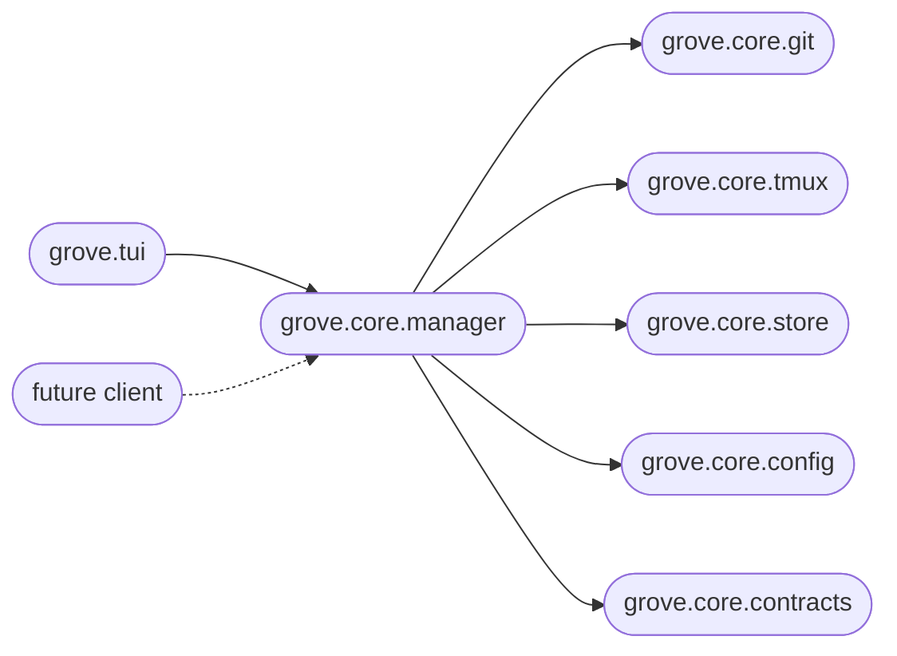

# Architecture

Grove is two packages: a headless engine (`grove.core`) and a Textual
client (`grove.tui`). The boundary is enforced in CI; nothing else
imports between them.

## The two-package layout

```
grove/
├── core/                # the engine, zero UI dependencies
│   ├── __init__.py     # public API (re-exports only)
│   ├── config.py       # Pydantic models + cascade resolver + schema dump
│   ├── workspace.py    # state dataclass + identity + transitions
│   ├── git.py          # subprocess wrappers (the `git` side-effect surface)
│   ├── tmux.py         # libtmux wrappers + init runner (the `tmux` side-effect surface)
│   ├── store.py        # atomic JSON state, repo-scoped queries
│   ├── manager.py      # WorkspaceManager façade, orchestration only
│   ├── paths.py        # platformdirs helpers
│   ├── errors.py       # exception hierarchy
│   └── contracts/      # cross-boundary Pydantic shapes (BranchPlan, requests)
│
└── tui/                 # the Textual client, the only one today
    ├── cli.py          # Typer entry points
    ├── app.py          # GroveApp(textual.App) root
    ├── theme.py        # color tokens + theme registration
    ├── _status.py      # Rich-side accessors keyed by `dark: bool`
    ├── keys.py         # global key spec + footer key partitions
    ├── screens/        # list, create, kill confirm, help
    └── widgets/        # workspace list, peek rail, status bar, footer
```

The shape encodes a single rule: `grove.core` must not depend on UI
code. Not Textual, not Rich, not Typer, not Click, and nothing inside
`grove.tui`. A future web client or MCP server imports
`WorkspaceManager` and the public types. Same engine, new client.

## The boundary, enforced

`pyproject.toml` configures `import-linter` with this contract:

```toml
[[tool.importlinter.contracts]]
name = "Core has no UI dependencies"
type = "forbidden"
source_modules    = ["grove.core"]
forbidden_modules = ["textual", "rich", "typer", "click", "grove.tui"]
```

`include_external_packages = true` is what makes the third-party block
real. Without it, `import textual` from inside `grove.core` would slip
through silently. CI runs `lint-imports` on every push. A violation
fails the lint job.

## Side effects at the edges

Two modules carry every subprocess call: `grove/core/git.py` and
`grove/core/tmux.py`. The five `git` operations Grove needs (`worktree
add`, `worktree remove`, `worktree prune`, `branch -D`, `status
--porcelain`) live in one file. Everything tmux-shaped (session create,
capture-pane, list-windows, switch-client) lives in the other.

Manager methods orchestrate them. The manager itself reads no config
file directly, runs no subprocess, and is fully testable against
in-memory fakes for both side-effect modules. New I/O concerns belong
in those two files, or a third side-effect module. They should not be
scattered.

## The contracts layer

`grove.core.contracts` is the canonical home for cross-boundary shapes.
That means anything that crosses a client to engine line now or could
cross one in the future. Today that is the branch-source intent
(`BranchPlan` discriminated union over `AutoBranch`, `NewNamedBranch`,
`ExistingLocalBranch`, `TrackRemoteBranch`) and the create-workspace
request envelope.

The convention is sharp. Pydantic at public-contract boundaries. Plain
dataclass for in-process state. Anything that might travel through JSON
(today's `BranchPlan` from the TUI to the engine, tomorrow's create
request from a web form to a JSON-RPC server) is Pydantic with
`extra="forbid"`. Anything that lives only inside the engine
(`WorkspaceState`, the resolved-branch IR) is a plain
`@dataclass(slots=True)`.

When in doubt: would a non-Python client ever construct or receive
this? If yes, Pydantic. If no, dataclass.

## Dependencies flow inward

The dependency graph runs strictly inward from clients to the engine:



Reverse arrows are smells. When a low-level helper has to know about a
high-level caller, the boundary is wrong. Most circular-import pain in
this codebase has historically traced back to that.

## See also

- [Public API](develop-public-api.md): the actual re-exports and their docstrings.
- [Engineering principles](develop-principles.md): the rules this layout enforces.
- [Contributing](develop-contributing.md): make targets, commit format, PR conventions.
