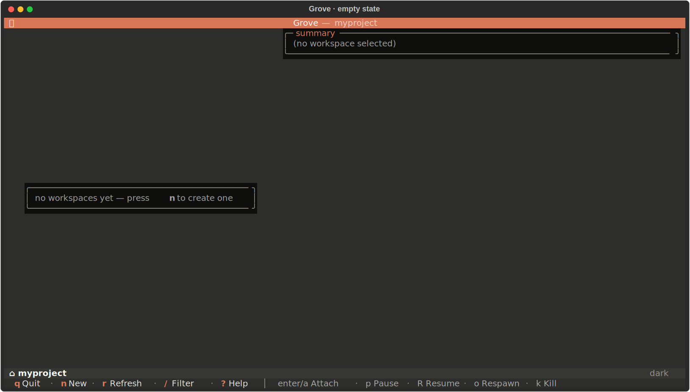

# Get Started

Grove pairs one git worktree with one tmux session per agent, scoped to the
repository it is launched from. This page covers install and first run.

## Prerequisites

| Platform | Requirement |
|---|---|
| Linux   | `git` ≥ 2.30, `tmux` ≥ 3.0 |
| macOS   | `git` (Xcode CLT), `tmux` (`brew install tmux`) |
| Windows | WSL2 with the above. The Windows-native install runs the non-tmux subcommands (`grove version`, `grove config show`, `grove debug`). The TUI itself requires tmux and runs from inside WSL. |

## Install

Grove installs to your user bin (`~/.local/bin`) as `grove`, straight from the
repo, so you can invoke it by name from anywhere. Each tab below needs one
fewer dependency than the last, so reach for whichever tool you already have.
The `[daemon]` extra pulls in the web dashboard backend; drop it for a
TUI-only install.

=== "uv (recommended)"

    Fewest steps. [uv](https://docs.astral.sh/uv/) installs Grove in its own
    isolated environment and links `grove` onto your `$PATH`.

    ```bash
    uv tool install "grove[daemon] @ git+https://github.com/bearlike/Grove"
    uv tool upgrade grove      # update on demand
    uv tool uninstall grove    # remove
    ```

    No uv yet? Install it first: `curl -LsSf https://astral.sh/uv/install.sh | sh`.

=== "pipx"

    No uv required. pipx also installs Grove in an isolated environment on your
    `$PATH`.

    ```bash
    pipx install "grove[daemon] @ git+https://github.com/bearlike/Grove"
    pipx upgrade grove
    ```

=== "pip"

    Only Python and pip required. Installs the `grove` script into your user
    bin.

    ```bash
    pip install --user "grove[daemon] @ git+https://github.com/bearlike/Grove"
    ```

    Re-run with `--upgrade` to update. On a system with an externally managed
    Python, add `--break-system-packages`, or use pipx instead.

---

## First run

```bash
cd path/to/your/git/repo
grove config init      # writes .grove/config.json with sensible defaults
grove                  # launch the TUI
```

A fresh repo lands on the empty state with a prompt to create the first
workspace.

<figure class="grove-shot" markdown>
  <span class="grove-shot__frame">
    
  </span>
  <p class="grove-shot__body">Empty state. The contextual footer lists the available keys.</p>
</figure>

Press `n` to open the create modal. Pick an agent, choose a branch source,
type a workspace title. Grove resolves the branch, creates the worktree,
runs the init script if one is configured, spawns a tmux session with
`agent` and `shell` windows, and sends the agent's command into the agent
window.

<figure class="grove-shot" markdown>
  <span class="grove-shot__frame">
    
  </span>
  <p class="grove-shot__body">Create modal. Branch source variants are atomic. Picking one activates only that variant's inputs.</p>
</figure>

Press `Enter` (or `a`) to attach. Detach with `Ctrl-B d` to return to Grove.
The workspace keeps running. The activity rail tracks output and flips
between ACTIVE and IDLE on its own.

## Verify

```bash
grove version          # prints the installed version
grove debug            # prints the resolved config + state paths
grove ls               # JSON list of this repo's workspaces
```

Set `GROVE_DEBUG=1` to enable verbose loguru output on stderr.

## Next steps

- [TUI tour](use-tui.md) walks through every screen, keybinding, and modal.
- [Project setup](configure-project.md) explains the per-repo `.grove/config.json`.
- [Custom agents](configure-agents.md) covers wiring Aider, Cursor, or any shell command.
- [Daily workflow](use-workflow.md) covers create, attach, pause, resume, kill.
- [Web dashboard](use-webapp.md) opens a read-only view in the browser or on your phone.
