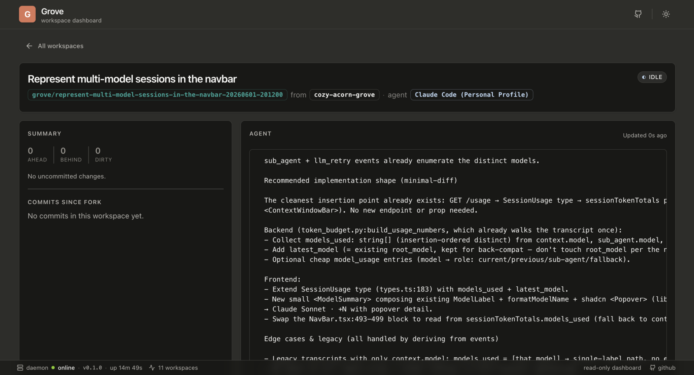

<div class="ms-hero">
  <p class="ms-hero__eyebrow">Grove · terminal workspace manager for AI coding agents</p>
  <h1 class="ms-hero__title">Run a forest of coding agents — without losing your place</h1>
  <p class="ms-hero__lede">
    Grove gives every AI coding agent its own git worktree and tmux session, scoped to the
    repository you launch it from. Spin up isolated sessions, watch each agent work in real time,
    pause and resume them at will, and tear them down cleanly — all from one terminal, one keypress
    at a time.
  </p>
  <div class="ms-cta-row">
    <a class="ms-btn ms-btn--primary" href="getting-started/">Install &amp; first workspace</a>
    <a class="ms-btn ms-btn--secondary" href="use-tui/">Take the tour</a>
    <a class="ms-btn ms-btn--ghost" href="https://github.com/bearlike/Grove">Source on GitHub</a>
  </div>
  <div class="ms-pills">
    <span class="ms-pill"><iconify-icon class="ms-pill__icon" icon="lucide:box"></iconify-icon> One worktree + tmux per agent</span>
    <span class="ms-pill"><iconify-icon class="ms-pill__icon" icon="lucide:bot"></iconify-icon> Bring your own agent</span>
    <span class="ms-pill"><iconify-icon class="ms-pill__icon" icon="lucide:activity"></iconify-icon> Live activity peek</span>
    <span class="ms-pill"><iconify-icon class="ms-pill__icon" icon="lucide:smartphone"></iconify-icon> Read-only web dashboard</span>
    <span class="ms-pill"><iconify-icon class="ms-pill__icon" icon="lucide:scale"></iconify-icon> MIT licensed</span>
  </div>
</div>

<figure class="grove-hero-shot" markdown>
  <span class="grove-hero-shot__frame">
    
  </span>
  <figcaption class="grove-hero-shot__caption">
    The Grove TUI — project-scoped workspaces on the left, a live agent peek rail on the right.
  </figcaption>
</figure>

## What is Grove? { .ms-h2-icon data-icon="target" }

Coding agents are at their best when you run several at once — one drafting a feature, another
chasing a flaky test, a third rewriting docs. Run in the same directory, though, and they trip
over each other's files, branches, and terminals. Grove gives each one a **workspace**: a
dedicated git worktree checked out on its own branch, paired with a tmux session running the
agent of your choice. Launch `grove` inside a repository and you see only that repository's
workspaces — create, attach, pause, resume, and kill them as one-key actions while a live rail
mirrors what every agent is doing.

Grove tends the worktrees and sessions; your git history stays yours. It never commits or pushes
on your behalf, and it never touches a remote branch.

## What you get { .ms-h2-icon data-icon="grid" }

<div class="ms-grid ms-grid--3">
  <div class="ms-card">
    <span class="ms-card__icon"><iconify-icon icon="lucide:box"></iconify-icon></span>
    <span class="ms-card__title">Isolated workspaces</span>
    <p class="ms-card__body">One git worktree plus one tmux session per agent, scoped to the repo you launch from. Agents never stomp each other's files or branches.</p>
  </div>
  <div class="ms-card">
    <span class="ms-card__icon"><iconify-icon icon="lucide:zap"></iconify-icon></span>
    <span class="ms-card__title">One-key lifecycle</span>
    <p class="ms-card__body">Create, attach, pause, resume, respawn, and kill — each a single keystroke. Pause frees the worktree but keeps the branch; resume rebuilds it.</p>
  </div>
  <div class="ms-card">
    <span class="ms-card__icon"><iconify-icon icon="lucide:activity"></iconify-icon></span>
    <span class="ms-card__title">Live activity peek</span>
    <p class="ms-card__body">A right-hand rail mirrors each agent's terminal four times a second and surfaces git position — ahead, behind, dirty, recent commits — beside it.</p>
  </div>
  <div class="ms-card">
    <span class="ms-card__icon"><iconify-icon icon="lucide:bot"></iconify-icon></span>
    <span class="ms-card__title">Bring your own agent</span>
    <p class="ms-card__body">Claude Code, Aider, Cursor, a plain shell — anything you can start from the command line goes in the agent registry and launches into its own window.</p>
  </div>
  <div class="ms-card">
    <span class="ms-card__icon"><iconify-icon icon="lucide:layers"></iconify-icon></span>
    <span class="ms-card__title">Configurable, not opinionated</span>
    <p class="ms-card__body">Six cascading config layers — defaults, user, project, project-local, env, CLI — let a team pin a shared standard while each developer keeps the last word.</p>
  </div>
  <div class="ms-card">
    <span class="ms-card__icon"><iconify-icon icon="lucide:smartphone"></iconify-icon></span>
    <span class="ms-card__title">Glance from anywhere</span>
    <p class="ms-card__body">An optional read-only web dashboard mirrors your fleet to a phone or another machine, with the daemon staying loopback-only behind a paired session.</p>
  </div>
</div>

## The lifecycle { .ms-h2-icon data-icon="route" }

Every workspace travels the same short path, and each step is one keypress in the TUI.

<div class="ms-lifecycle">
  <div class="ms-step">
    <p class="ms-step__title">Create</p>
    <p class="ms-card__body">Press <code>n</code>, pick an agent and a branch source, name it. Grove makes the worktree, runs your init script, and starts the agent in tmux.</p>
  </div>
  <div class="ms-step">
    <p class="ms-step__title">Attach</p>
    <p class="ms-card__body">Press <code>Enter</code> to drop into the agent's session. Detach with <code>Ctrl-B d</code> and the workspace keeps running behind you.</p>
  </div>
  <div class="ms-step">
    <p class="ms-step__title">Watch</p>
    <p class="ms-card__body">Back in the list, the peek rail shows each agent's live output and git position, flipping between active and idle on its own.</p>
  </div>
  <div class="ms-step">
    <p class="ms-step__title">Pause &amp; resume</p>
    <p class="ms-card__body">Press <code>p</code> to reclaim the worktree while keeping the branch; <code>R</code> rebuilds it later, exactly where you left off.</p>
  </div>
  <div class="ms-step">
    <p class="ms-step__title">Kill</p>
    <p class="ms-card__body">Press <code>k</code> to tear the workspace down. Grove deletes only branches it created, and never a remote.</p>
  </div>
</div>

## See every workspace at a glance { .ms-h2-icon data-icon="star" }

Every workspace reports one of seven states, computed live from tmux and the filesystem and painted
in the same colors across the TUI and the web dashboard. Three are intents Grove persists to disk;
four are derived the moment you look.

<div class="grove-status-grid" markdown>

<div class="grove-status-chip" data-status="active">
  <span class="grove-status-chip__glyph">●</span>
  <div class="grove-status-chip__text">
    <p class="grove-status-chip__label">Active</p>
    <p class="grove-status-chip__body">Session up. The agent pane produced output within the activity threshold.</p>
  </div>
</div>

<div class="grove-status-chip" data-status="idle">
  <span class="grove-status-chip__glyph">◐</span>
  <div class="grove-status-chip__text">
    <p class="grove-status-chip__label">Idle</p>
    <p class="grove-status-chip__body">Session up. The pane has been quiet past the threshold.</p>
  </div>
</div>

<div class="grove-status-chip" data-status="paused">
  <span class="grove-status-chip__glyph">‖</span>
  <div class="grove-status-chip__text">
    <p class="grove-status-chip__label">Paused</p>
    <p class="grove-status-chip__body">Worktree removed by you; branch retained. <code>R</code> resumes.</p>
  </div>
</div>

<div class="grove-status-chip" data-status="offline">
  <span class="grove-status-chip__glyph">○</span>
  <div class="grove-status-chip__text">
    <p class="grove-status-chip__label">Offline</p>
    <p class="grove-status-chip__body">tmux session vanished externally. <code>o</code> respawns it from the worktree.</p>
  </div>
</div>

<div class="grove-status-chip" data-status="orphaned">
  <span class="grove-status-chip__glyph">⊘</span>
  <div class="grove-status-chip__text">
    <p class="grove-status-chip__label">Orphaned</p>
    <p class="grove-status-chip__body">Worktree directory missing on disk; respawn no longer applies. <code>k</code> only.</p>
  </div>
</div>

<div class="grove-status-chip" data-status="error">
  <span class="grove-status-chip__glyph">✗</span>
  <div class="grove-status-chip__text">
    <p class="grove-status-chip__label">Error</p>
    <p class="grove-status-chip__body">Lifecycle failed mid-flight (init script non-zero, git add failed, etc.).</p>
  </div>
</div>

</div>

The reconciler that promotes intents into views lives at one site,
[`WorkspaceManager._reconcile_status`](https://github.com/bearlike/Grove/blob/main/src/grove/core/manager.py).
[Status semantics](features-status.md) walks the full transition table.

## Install in seconds { .ms-h2-icon data-icon="plug" }

Grove needs `git` and `tmux`. Run it without installing, or put it on your `$PATH`:

```bash
uvx grove                    # run in a disposable environment
uv tool install grove        # or install persistently

cd path/to/your/repo
grove config init            # scaffold .grove/config.json
grove                        # launch the TUI
```

It drives the agents you already use:

<div class="ms-chips">
  <span class="ms-chip"><span class="ms-chip__check">✓</span> Claude Code</span>
  <span class="ms-chip"><span class="ms-chip__check">✓</span> Aider</span>
  <span class="ms-chip"><span class="ms-chip__check">✓</span> Cursor</span>
  <span class="ms-chip"><span class="ms-chip__check">✓</span> Any command on $PATH</span>
</div>

See [Get Started](getting-started.md) for prerequisites, the bootstrap installer, and the canary build.

## In practice { .ms-h2-icon data-icon="grid" }

<div class="ms-grid ms-grid--3">
  <div class="ms-card">
    <span class="ms-card__title">Parallel features</span>
    <p class="ms-card__body">Run an agent per feature branch in the same repo. Each gets its own worktree, so builds and edits never collide.</p>
  </div>
  <div class="ms-card">
    <span class="ms-card__title">Bake-off two agents</span>
    <p class="ms-card__body">Point Claude Code and Aider at the same task in separate workspaces and compare the diffs side by side.</p>
  </div>
  <div class="ms-card">
    <span class="ms-card__title">Long refactors</span>
    <p class="ms-card__body">Pause a multi-day refactor to free the worktree, then resume it on the same branch without losing the agent's place.</p>
  </div>
  <div class="ms-card">
    <span class="ms-card__title">A clean main</span>
    <p class="ms-card__body">Keep your primary checkout pristine while every agent churns in a throwaway worktree you can kill in one key.</p>
  </div>
</div>

## Built for teams { .ms-h2-icon data-icon="flow" }

Grove is mechanism, not policy. A team commits a `.grove/config.json` to the repo to pin the shared
baseline — the agent registry, the worktree layout, the init script that installs dependencies and
seeds the environment for every new workspace — and the configuration cascade lets each developer
layer personal overrides on top without editing the shared file. Everyone gets the same reproducible
setup; nobody loses their last word.

When more than one person needs eyes on the fleet, point the read-only [web dashboard](use-webapp.md)
at the daemon. Teammates and stakeholders watch every workspace's status and live agent output from a
browser or phone, while lifecycle control stays with whoever owns the terminal.

<figure class="grove-shot" markdown>
  <span class="grove-shot__frame">
    
  </span>
  <p class="grove-shot__body">The read-only web dashboard — the same status and live output as the TUI, glanceable from any device on your network.</p>
</figure>

## Explore the docs { .ms-h2-icon data-icon="book" }

<div class="ms-grid ms-grid--3">
  <a class="ms-card" href="getting-started/">
    <span class="ms-card__icon"><iconify-icon icon="lucide:rocket"></iconify-icon></span>
    <span class="ms-card__title">Get Started</span>
    <span class="ms-card__body">Install, prerequisites, first run, verify.</span>
  </a>
  <a class="ms-card" href="configure-project/">
    <span class="ms-card__icon"><iconify-icon icon="lucide:sliders-horizontal"></iconify-icon></span>
    <span class="ms-card__title">Configure</span>
    <span class="ms-card__body">Project setup, agents, init scripts, the cascade, full reference.</span>
  </a>
  <a class="ms-card" href="use-tui/">
    <span class="ms-card__icon"><iconify-icon icon="lucide:monitor-play"></iconify-icon></span>
    <span class="ms-card__title">Use</span>
    <span class="ms-card__body">TUI tour, CLI, web dashboard, authentication, daily workflow.</span>
  </a>
  <a class="ms-card" href="features-workspace-lifecycle/">
    <span class="ms-card__icon"><iconify-icon icon="lucide:sparkles"></iconify-icon></span>
    <span class="ms-card__title">Capabilities</span>
    <span class="ms-card__body">Lifecycle, branch provenance, live peek, status, cascade.</span>
  </a>
  <a class="ms-card" href="use-webapp/">
    <span class="ms-card__icon"><iconify-icon icon="lucide:smartphone"></iconify-icon></span>
    <span class="ms-card__title">Web dashboard</span>
    <span class="ms-card__body">Glance at your fleet from a browser or phone, read-only.</span>
  </a>
  <a class="ms-card" href="develop-architecture/">
    <span class="ms-card__icon"><iconify-icon icon="lucide:code"></iconify-icon></span>
    <span class="ms-card__title">Developer reference</span>
    <span class="ms-card__body">Architecture, public API, engineering principles, contributing.</span>
  </a>
</div>
