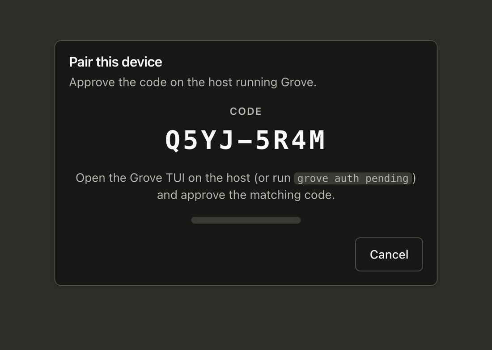
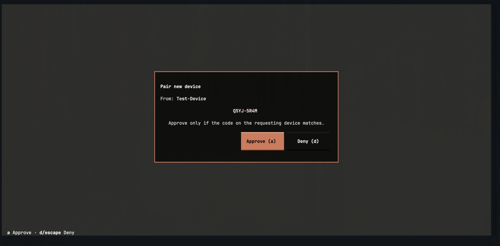

# Authentication & pairing

The [web dashboard](use-webapp.md) talks to a real HTTP daemon, so the daemon needs to know who is
calling. Grove borrows the model your headphones already use. A new device asks to connect. Both sides
show the same short code. You approve it on the host. There is no open, unauthenticated door on the
network. The daemon binds loopback, and every device earns its access by pairing.

## The handshake

Pairing is a three-step handshake, and the steps happen out of band. The first time a browser opens the
dashboard, it lands on a pairing screen.

Step one happens on the device. The browser suggests a label from its user agent, such as "Pixel 8" or
"MacBook". Edit it to something you will recognize, then request pairing. The daemon records the request
and returns a code.

<figure class="grove-shot" markdown>
  <span class="grove-shot__frame">
    
  </span>
  <p class="grove-shot__body">On the device. Name it, then request pairing.</p>
</figure>

Step two also happens on the device. The browser shows an eight-character code in the form `XXXX-XXXX`
and starts polling. This code is your proof. You compare it against what the host shows before you
approve.

<figure class="grove-shot" markdown>
  <span class="grove-shot__frame">
    
  </span>
  <p class="grove-shot__body">On the device. The code to confirm on the host. It expires after five minutes.</p>
</figure>

Step three happens on the host. Confirm the matching code on the machine that runs the daemon. The
moment you approve, the browser's next poll picks up its session and redirects into the dashboard.

<figure class="grove-shot" markdown>
  <span class="grove-shot__frame">
    
  </span>
  <p class="grove-shot__body">On the host. The TUI pops this modal on its own. Approve with <code>a</code>, deny with <code>d</code>.</p>
</figure>

## Approving on the host

There are two ways to approve, and both run on the host. Approval never travels over HTTP, so a remote
caller can never approve itself.

While the TUI is running, it watches for new requests and pops the modal above on its own. Press `a` to
approve or `d` to deny. On a headless host, use the CLI instead.

```bash
grove auth pending                 # list requests; each line shows the code
grove auth approve <challenge-id>  # approve the matching one
grove auth deny <challenge-id>     # reject it
```

Approve only when the code on the host matches the code on the device. That single check is what stops
someone who merely reached the pairing screen. The code lives for five minutes. After that it expires,
and the device has to start over.

## Managing sessions

A session lasts thirty days and renews itself on every use. So a device you use daily pairs just once.
List and revoke sessions from the host.

```bash
grove auth sessions                # active sessions with labels and expiry
grove auth revoke <session-id>     # lock a device out until it pairs again
```

The full command reference, with arguments, lives on the [CLI page](use-cli.md#grove-auth).

## The security model

Grove's access control rests on a few deliberate rules. Read them as one idea seen from several sides.
Keep the daemon private, and let people in by hand.

- **Loopback by default.** `grove daemon serve` binds `127.0.0.1`. There is no blessed
  `--host 0.0.0.0`. To reach the daemon from elsewhere, forward a port over SSH or stand up a real
  tunnel. See [reaching the dashboard from outside](use-webapp.md#reaching-it-from-outside-the-network).
  Widening the bind is the wrong lever.
- **Only two open endpoints.** The health probe (`/healthz`) and the pairing handshake answer without a
  session, so a device can bootstrap. Every other endpoint needs a session token, sent as
  `Authorization: Bearer`.
- **Approval cannot cross the wire.** The daemon exposes deny over HTTP, but never approve. A request
  can only be granted from the host's TUI or CLI.
- **Secrets stay where they belong.** Session tokens are stored only as SHA-256 hashes, in
  `${user_config_dir}/grove/auth.json`, with mode `0600`. The plaintext token is handed to the device
  once and never written to disk. In the browser the token never appears at all. The web app holds it
  on the server and gives the browser an `HttpOnly` cookie.

## See also

- [Web dashboard](use-webapp.md): what the paired session unlocks.
- [CLI](use-cli.md#grove-auth): the `grove auth` command group.
