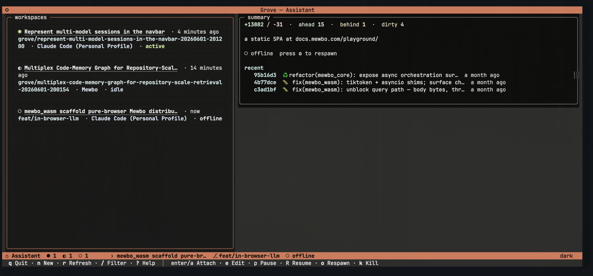
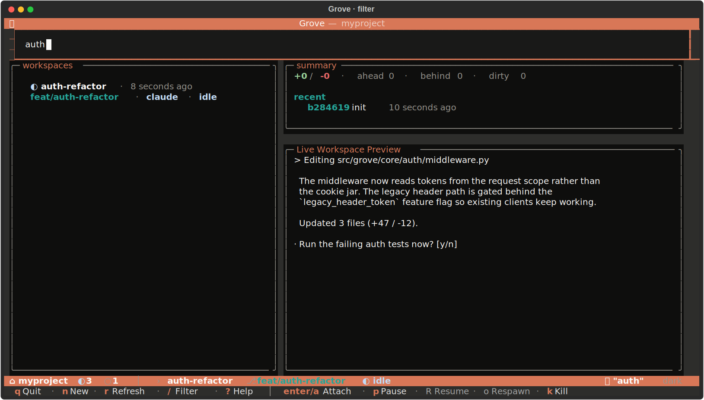
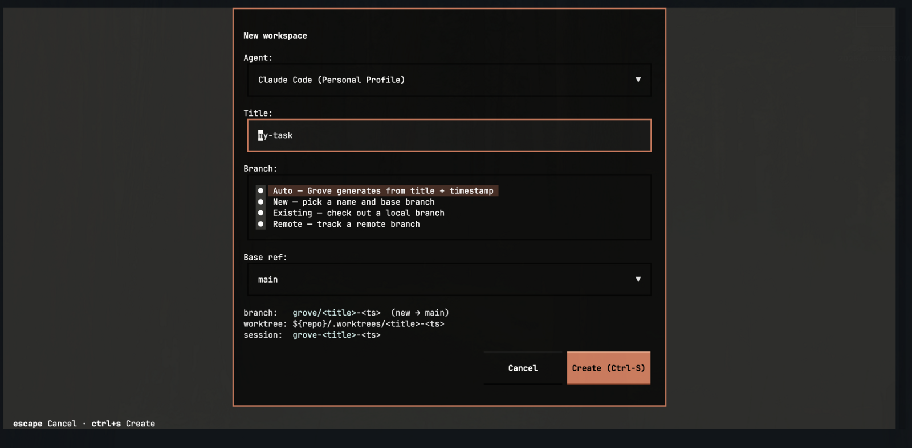
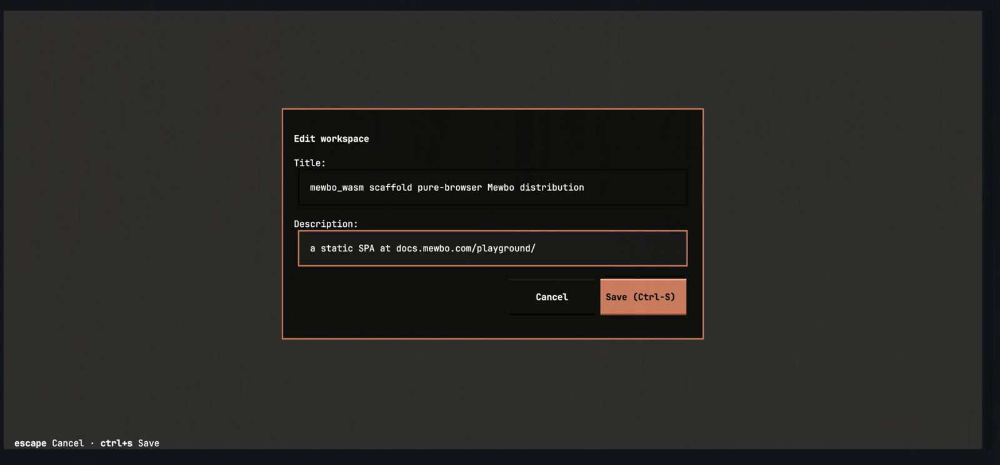
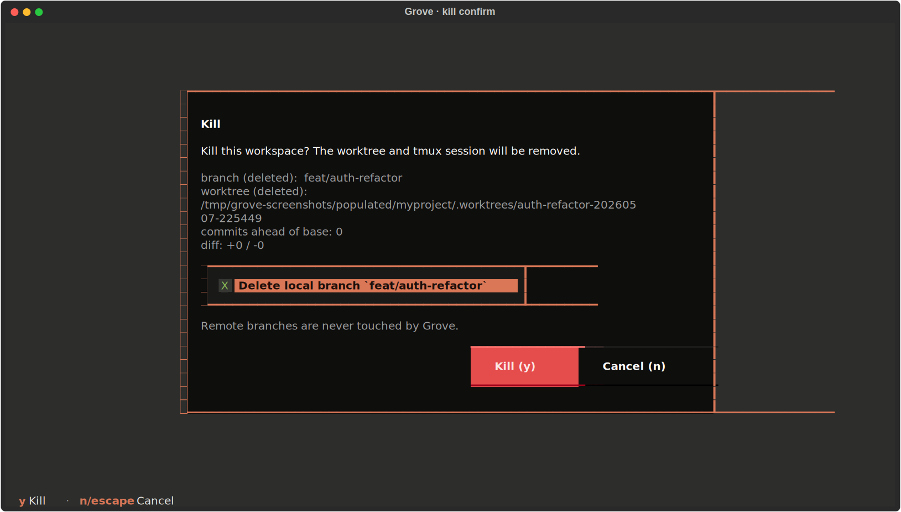
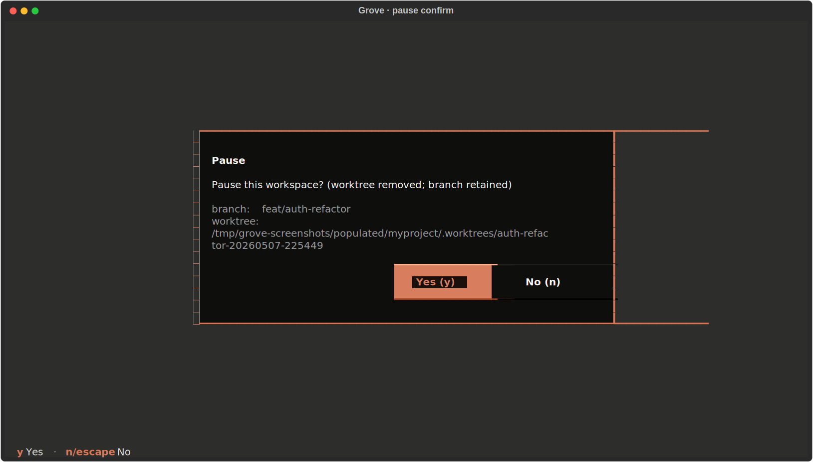
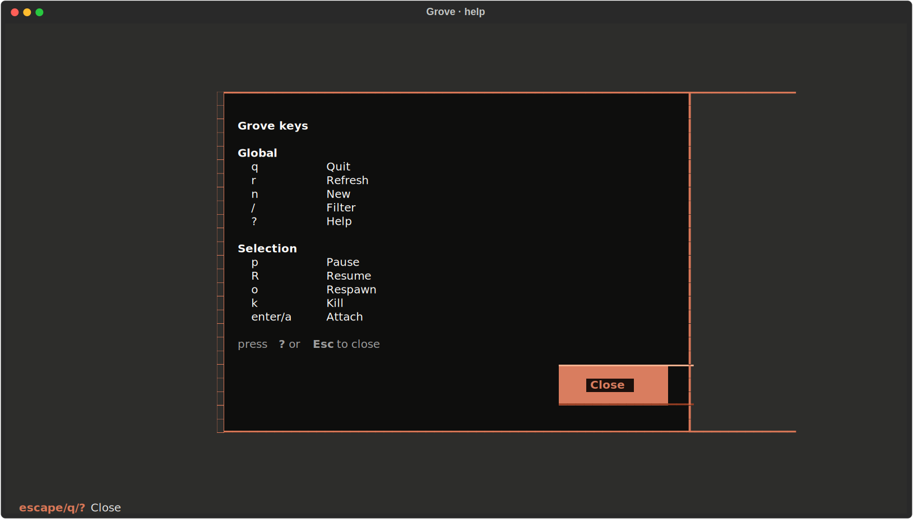

# TUI tour

The TUI is the primary way to drive Grove. This page names every region
and lists every key.

## Screen anatomy

The list screen has three vertical zones with a status bar and contextual
footer along the bottom.

<figure class="grove-shot" markdown>
  
    
  
  
Header (top), filter bar (slash-toggled), workspace list (left), peek rail (right), status bar and contextual footer (bottom).

</figure>

- **Header** carries the repo name and a count chip.
- **Filter bar** stays hidden until you press `/`. Type to narrow by title,
  branch, or agent. `Esc` clears.
- **Workspace list** is the left zone. Each row is a card with status glyph,
  title, agent, branch, and a stat strip (ahead, behind, dirty) with
  polarity-aware colours.
- **Peek rail** has two cards on the right. The *summary* card carries
  branch, stats, and age. The *agent* card mirrors the live tmux pane,
  refreshed at four ticks per second.
- **Status bar** sums the fleet on the left and shows the selected workspace
  on the right. The bar's background changes with state: clay by default,
  amber when any workspace needs attention, neutral when the fleet is empty.
- **Contextual footer** lists the keys that apply right now. Global keys on
  the left, selection keys on the right, separated by a muted divider.

## Keybindings

| Key | Action |
|-----|--------|
| `n` | Create a new workspace. |
| `Enter` / `a` | Attach to the selected workspace. |
| `p` | Pause. Removes the worktree, keeps the branch. |
| `R` | Resume. Recreates the worktree from the branch and restarts tmux. |
| `o` | Respawn an OFFLINE workspace whose tmux session vanished. |
| `k` | Kill. Removes the worktree and tmux session. Deletes the branch by default for Grove-created branches. |
| `r` | Refresh the list and the peek rail. |
| `/` | Filter. Type to narrow, `Esc` clears. |
| `?` | Help modal. On-screen reference for every key. |
| `q` | Quit. |

The footer adapts to the selected row's status. ACTIVE and IDLE rows show
`Enter / a · p · k`. PAUSED shows `R · k`. OFFLINE shows `o · k`. ORPHANED
shows only `k`. The mapping lives in one dict in `screens/list.py`, so the
footer never drifts from what is actually runnable.

<figure class="grove-shot" markdown>
  
    
  
  
Filter bar in action. Values are matched substring-style across title, branch, and agent.

</figure>

## Modals

### Create

`n` opens a four-step modal.

<figure class="grove-shot" markdown>
  
    
  
  
Create modal. Branch source on the left, agent picker, title input.

</figure>

1. **Branch source.** Pick *Auto* (Grove names the branch), *New named* (you
   type the name), *Existing local* (pick from your repo's branches), or
   *Track remote* (pick a remote-only branch and create a tracking local).
   Each variant carries its own form. All are mounted in the DOM with the
   inactive ones hidden, so values persist across mode switches.
2. **Agent.** Radio list of every agent the cascade resolved.
3. **Title.** Free text. Pre-fills with the chosen branch name when one is
   available.
4. **Confirm** with `Enter`. `Esc` cancels.

The branch-source plumbing is documented in
[branch provenance](features-branch-provenance.md).

### Edit

`e` opens the edit modal to change a workspace's title and description. Both
are metadata only. The worktree directory and tmux session keep their
original names, so attached clients and your muscle memory are never
disrupted.

<figure class="grove-shot" markdown>
  
    
  
  
Edit modal. Title and description are metadata; the worktree path and session name stay fixed.

</figure>

### Kill confirmation

`k` opens a confirm modal that doubles as a branch-deletion toggle. The
checkbox default is driven by the workspace's `branch_provenance`.
GROVE_CREATED defaults to "delete the branch". USER_ATTACHED defaults to
"keep the branch". You can flip either way. Grove never touches remote
branches. Remote deletion requires `git push --delete` from your shell.

<figure class="grove-shot" markdown>
  
    
  
  
Kill confirm. The checkbox default reflects whether Grove created the branch.

</figure>

### Pause confirmation

`p` opens a smaller confirm modal that names the branch retained and warns
when there are uncommitted changes that would block the pause.

<figure class="grove-shot" markdown>
  
    
  
  
Pause confirm. Grove refuses to pause a dirty worktree. Commit or stash first.

</figure>

### Help

`?` opens a read-only key reference grouped by zone. Press any key to
dismiss.

<figure class="grove-shot" markdown>
  
    
  
  
Help modal. Pulled from the same <code>DEFAULT_BINDINGS</code> tuple the contextual footer reads.

</figure>

### Pairing

When the [web dashboard](use-webapp.md) is in use, the TUI also surfaces
device pairing. A request from a new browser pops a modal on top of whatever
screen you are on, showing the device label and a code to confirm. Approve
with `a`, deny with `d`. The full handshake, and the `grove auth` commands
for headless hosts, are on the [authentication & pairing](use-auth.md) page.

## Theme

Grove ships three built-in themes: `dark`, `light`, and `auto` (which
follows the terminal polarity reported by Textual). User overrides land at
`${user_config_dir}/grove/themes/<name>.toml`. Reference one by name in
`ui.theme` and Grove resolves it at startup.

## Mouse vs keyboard

Both work. The cursor selects rows on hover, and clicking a row selects.
The selected row carries a clay border. Hovered rows that aren't selected
get a muted gray outline so the mouse position is visible. Every action
has a keyboard binding.
