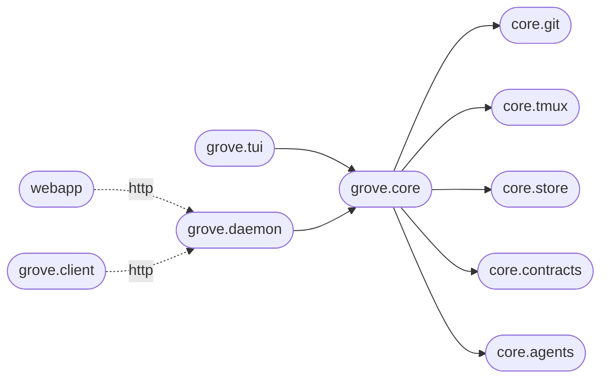

# Architecture

Grove is one engine with several clients around it. The engine
(`grove.core`) owns every decision. The daemon (`grove.daemon`) serves
it over loopback HTTP. The client SDK (`grove.client`) is the
transport-agnostic way to attach. The TUI (`grove.tui`) is the primary
interactive client, and the web dashboard (`webapp/`) is a read-only
Next.js client that talks to the daemon. The boundaries between them
are enforced in CI.

## The package layout

```
grove/
├── core/                # the engine, zero UI dependencies
│   ├── __init__.py     # public API (re-exports only)
│   ├── config.py       # Pydantic models + cascade resolver + schema dump
│   ├── workspace.py    # state dataclass + identity + transitions
│   ├── git.py          # subprocess wrappers (the `git` side-effect surface)
│   ├── tmux.py         # libtmux wrappers + init runner (the `tmux` side-effect surface)
│   ├── store.py        # atomic JSON state, repo-scoped queries
│   ├── manager.py      # WorkspaceManager façade, orchestration only
│   ├── registry.py     # RepoRegistry: one manager per repo, for multi-repo clients
│   ├── activity.py     # ActivityService: the cross-project activity hub
│   ├── sessions.py     # SessionExplorer: agent-session discovery across worktrees
│   ├── auth.py         # pairing handshake + session store
│   ├── paths.py        # platformdirs helpers
│   ├── errors.py       # exception hierarchy
│   ├── contracts/      # cross-boundary Pydantic shapes (plans, requests, views, palettes)
│   └── agents/         # agent adapters: per-kind session introspection
│
├── daemon/              # loopback FastAPI app: REST + SSE over the engine
├── client/              # transport-agnostic attach SDK (local PTY / SSH)
└── tui/                 # the Textual client
    ├── cli.py          # Typer entry points
    ├── app.py          # GroveApp(textual.App) root
    ├── theme.py        # color tokens + theme registration
    ├── _status.py      # Rich-side glyph + color accessors
    ├── keys.py         # global key spec + footer key partitions
    ├── screens/        # list, dashboard, create, edit, confirms, help, pairing
    └── widgets/        # workspace list, dashboard grid, peek rail, status bar, footer

webapp/                  # read-only Next.js dashboard, talks to the daemon
```

The shape encodes a single rule: `grove.core` must not depend on UI
code. Not Textual, not Rich, not Typer, not Click, and nothing inside
`grove.tui`. Every client, present or future, imports
`WorkspaceManager` and the public types. Same engine, new client.

## The boundaries, enforced

`pyproject.toml` configures `import-linter` with three contracts:

- **Core has no UI dependencies.** `grove.core` may not import
  `textual`, `rich`, `typer`, `click`, or `grove.tui`.
- **Daemon depends only on core.** `grove.daemon` may not import
  `grove.client` or `grove.tui`. The direction is clients → daemon →
  core, never the reverse.
- **The client SDK stays clean.** `grove.client` may not import
  `grove.daemon` or `grove.tui`. It speaks wire shapes and HTTP, not
  process internals.

`include_external_packages = true` is what makes the third-party block
real. Without it, `import textual` from inside `grove.core` would slip
through silently. CI runs `lint-imports` on every push. A violation
fails the lint job.

## Side effects at the edges

Two modules carry every subprocess call: `grove/core/git.py` and
`grove/core/tmux.py`. Everything git-shaped (worktree add and remove,
branch delete, status, log) lives in one file. Everything tmux-shaped
(session create, capture-pane, list-windows, switch-client) lives in
the other.

Manager methods orchestrate them. The manager itself reads no config
file directly, runs no subprocess, and is fully testable against
in-memory fakes for both side-effect modules. New I/O concerns belong
in those two files, or a third side-effect module. They should not be
scattered.

## The contracts layer

`grove.core.contracts` is the canonical home for cross-boundary shapes:
anything that crosses a client-to-engine line now or could later. That
covers the branch-source intent (`BranchPlan`, a discriminated union
over `AutoBranch`, `NewNamedBranch`, `ExistingLocalBranch`,
`TrackRemoteBranch`, `RootBranch`), the request envelopes, the response
views the daemon serializes (`WorkspaceStateView`, `WorkspacePeekView`,
the activity and session views), and the status and agent-state color
palettes every client must render identically.

The convention is sharp. Pydantic at public-contract boundaries. Plain
dataclass for in-process state. Anything that might travel through JSON
is Pydantic with `extra="forbid"`. Anything that lives only inside the
engine (`WorkspaceState`, the resolved-branch IR) is a plain
`@dataclass(slots=True)`.

When in doubt: would a non-Python client ever construct or receive
this? If yes, Pydantic. If no, dataclass.

## The agents layer

`grove.core.agents` is the provider boundary for coding agents. Each
adapter knows how to introspect one kind of agent's sessions: where the
transcripts live, how to parse them, and how to derive a live state.
`claude_code` reads Claude Code's transcript format. `generic` is the
deliberate no-op for everything else.

An adapter normalizes shape, not semantics. It translates launch
parameters and transcript formats. It never second-guesses what a model
does. Engine code asks the registry for an adapter by `kind` and stays
agnostic about which agent is behind it.

## The observability spine

Three engine pieces feed every dashboard, and both the TUI and the
daemon consume them the same way:

- **`ActivityService`** is the hub. It polls each repo's workspaces,
  blends agent state with tmux output, tracks dirty files and recent
  commits, and emits deltas only when something changed. The TUI's
  dashboard screen consumes it in process; the daemon streams the same
  events over SSE to the web dashboard.
- **`RepoRegistry`** holds one `WorkspaceManager` per repository, so
  multi-repo clients (the daemon, the activity wall) dispatch to the
  right engine without re-reading config.
- **`SessionExplorer`** discovers recorded agent sessions across the
  repo root and every worktree. The `grove sessions` CLI, the daemon's
  session endpoints, and the web sessions panel are all thin views over
  it.

## Dependencies flow inward

The dependency graph runs strictly inward from clients to the engine:



Reverse arrows are smells. When a low-level helper has to know about a
high-level caller, the boundary is wrong. Most circular-import pain in
this codebase has historically traced back to that.

## See also

- [Public API](develop-public-api.md): the actual re-exports and their docstrings.
- [Engineering principles](develop-principles.md): the rules this layout enforces.
- [Contributing](develop-contributing.md): make targets, commit format, PR conventions.
