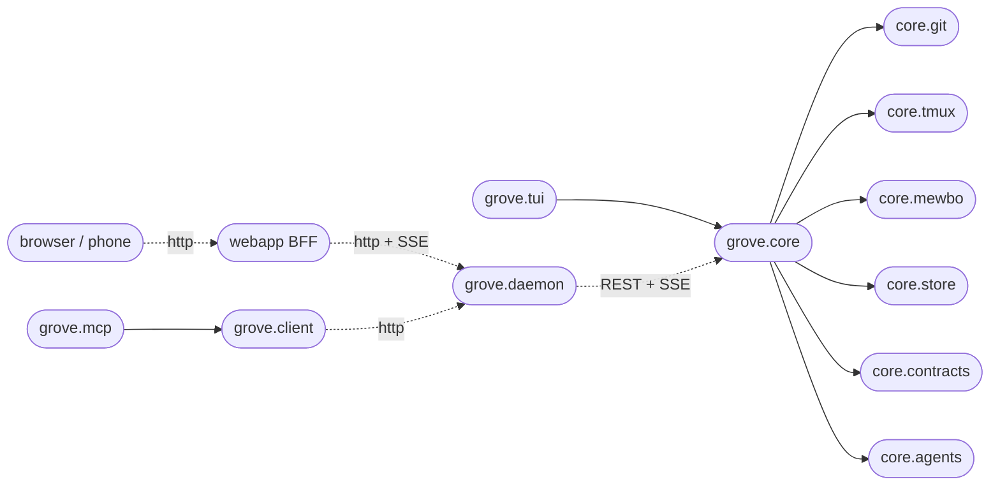

# Architecture

## How the packages fit together

Grove is one engine with several clients around it. `grove.core` owns
every decision, and CI enforces the boundaries between them.

- **`grove.daemon`**: loopback FastAPI, REST plus SSE.
- **`grove.client`**: transport-agnostic attach SDK.
- **`grove.tui`**: the primary interactive client.
- **`grove.mcp`**: the same lifecycle for MCP-capable agents.
- **`webapp/`**: a Next.js client with its own BFF.

## The package layout

```
grove/
├── core/                # the engine, zero UI dependencies
│   ├── __init__.py     # public API (re-exports only)
│   ├── config.py       # Pydantic models + cascade resolver + schema dump
│   ├── workspace.py    # state dataclass + identity + transitions
│   ├── git.py          # subprocess wrappers (the `git` side-effect surface)
│   ├── tmux.py         # libtmux wrappers + init runner (the `tmux` side-effect surface)
│   ├── mewbo.py        # Mewbo REST I/O (the `mewbo` side-effect surface)
│   ├── store.py        # atomic JSON state, repo-scoped queries
│   ├── manager.py      # WorkspaceManager façade, orchestration only
│   ├── registry.py     # RepoRegistry: one manager per repo, for multi-repo clients
│   ├── activity.py     # ActivityService: the cross-project activity hub
│   ├── sessions.py     # SessionExplorer: agent-session discovery across worktrees
│   ├── auth.py         # pairing handshake + session store
│   ├── paths.py        # platformdirs helpers
│   ├── errors.py       # exception hierarchy
│   ├── contracts/      # cross-boundary Pydantic shapes (plans, requests, views, palettes)
│   └── agents/         # agent adapters: per-kind session introspection
│
├── daemon/              # loopback FastAPI app: REST + SSE over the engine
├── client/              # transport-agnostic attach SDK (local PTY / SSH)
├── mcp/                 # MCP server: stdio or HTTP tools over the client SDK
└── tui/                 # the Textual client
    ├── cli.py          # Typer entry points
    ├── app.py          # GroveApp(textual.App) root
    ├── theme.py        # color tokens + theme registration
    ├── _status.py      # Rich-side glyph + color accessors
    ├── keys.py         # global key spec + footer key partitions
    ├── screens/        # list, dashboard, sessions, project picker, create, edit, steer, confirms, help, pairing
    └── widgets/        # workspace list, dashboard grid, peek rail, status bar, footer

webapp/                  # Next.js dashboard; its BFF routes talk to the daemon
```

Every client imports `WorkspaceManager` and the public types. Four
`import-linter` contracts in [`pyproject.toml`](repo:pyproject.toml)
make that a build gate.

## The boundaries, enforced

- **Core has no UI dependencies.** No `textual`, `rich`, `typer`, `click`, or `grove.tui` inside `grove.core`.
- **Daemon depends only on core.** No `grove.client` or `grove.tui` inside `grove.daemon`. Clients depend on the daemon, never the reverse.
- **The client SDK stays clean.** No `grove.daemon` or `grove.tui` inside `grove.client`. It speaks wire shapes, not process internals.
- **The MCP server speaks only through the client SDK.** MCP client to `grove.mcp` to `GroveClient` to daemon to core, so it can run on a different host.

`include_external_packages = true` catches third-party imports too, or
`import textual` would slip through silently. `lint-imports` runs on
every push.

## The public share boundary

Every route on the daemon requires a bearer token, with three exceptions:
the pairing handshake, the liveness probe, and the public share
namespace. A shared workspace is readable at `/public/{token}` by
somebody who has no Grove session at all.

Think of a share token as a coat-check ticket. Whoever holds it gets
that one coat and nothing else. They cannot browse the cloakroom, and
losing the ticket does not expose anybody else's coat.

Three properties make that true, and each is structural rather than a
check somebody has to remember.

**The token is the state.** `WorkspaceState.share_token` is one nullable
field. Present means public, absent means private, and the value is the
link itself. There is no second boolean that can disagree with it.
Revoking clears the field, which kills the link permanently rather than
parking it.

**A separate path prefix, not a scoped credential.** The tempting design
teaches the bearer dependency to recognise a share token and lets
`/workspaces/{id}/...` serve both audiences. That was rejected. It puts
the boundary in an allowlist that lives away from the route being
written, so a route added next year is one forgotten entry from being
world readable. With a prefix, every route under `/workspaces` carries
the auth dependency and always will. A test asserts set equality over
every route lacking it, so a new public route fails the suite rather
than shipping quietly.

**An allowlist, never a redaction.** `grove.core.contracts.public` writes
out every field by hand. A field added to `WorkspaceStateView` later is
private by default. The reverse design, serialising the state and then
dropping keys, fails open and fails silently: the leak ships with the
change that introduced the field. Host paths, container identities and
the token itself never cross. Nested shapes get the same scrutiny as top
level ones, because the authenticated activity view embeds a whole
workspace state and would have carried every path through a field
nobody inspects.

Sharing policy is per project, not per workspace, and lives in
`grove.core.share_policy`. It holds two things: how long a new link
lives, and an optional passcode (stored as a hash, never plaintext). The
two behave differently on purpose. Expiry is stamped when a link is
minted, so changing the TTL affects future links and leaves circulating
ones alone. A passcode is checked on every read, so setting one locks
existing links immediately.

The reader supplies a passcode as a request header. There is no grant,
no cookie and no session for an anonymous reader, which is what keeps
this small: a grant would need a lifetime, a store and a revocation
story, while a header needs none of them.

## Side effects at the edges

- [`src/grove/core/git.py`](repo:src/grove/core/git.py): worktree add and remove, branch delete, status, log.
- [`src/grove/core/tmux.py`](repo:src/grove/core/tmux.py): session create, capture-pane, list-windows, switch-client.
- [`src/grove/core/mewbo.py`](repo:src/grove/core/mewbo.py): Mewbo REST I/O for remote sessions.

Manager methods orchestrate them, staying testable against in-memory
fakes. A new I/O concern belongs in one of these files, or a fourth,
never scattered.

## The contracts layer

`grove.core.contracts` holds anything crossing a client-engine line now
or later:

- the branch-source intent (`BranchPlan`, a union over `AutoBranch`, `NewNamedBranch`, `ExistingLocalBranch`, `TrackRemoteBranch`, `RootBranch`)
- the request envelopes
- the daemon's response views (`WorkspaceStateView`, `WorkspacePeekView`, activity and session views)
- the status and agent-state color palettes every client renders alike

Pydantic at public-contract boundaries with `extra="forbid"`, plain
`@dataclass(slots=True)` for in-process state (`WorkspaceState`, the
resolved-branch IR). Test: would a non-Python client construct or
receive this? Pydantic if yes, dataclass if no.

## The agents layer

`grove.core.agents` is the provider boundary for coding agents. Each
adapter introspects one agent kind's sessions and maps its vocabulary
onto the shared `AgentActivityState` axis: `claude_code` for Claude
Code's transcripts, `codex` for Codex CLI rollout files, `mewbo` for
remote Mewbo sessions over REST, `generic` a deliberate no-op.

An adapter normalizes shape, not semantics. It never second-guesses what
a model does. Engine code asks the registry for an adapter by `kind`,
agnostic about which agent is behind it.

## The observability spine

Three engine pieces feed every dashboard, consumed the same way by the
TUI and the daemon.

- **`ActivityService`**, the hub. Polls workspaces, blends agent state with tmux output, tracks dirty files and commits, emits deltas only on change. The TUI consumes it in process, and the daemon streams it over SSE.
- **`RepoRegistry`**, one `WorkspaceManager` per repository, so clients dispatch without re-reading config.
- **`SessionExplorer`**, agent sessions found across the repo root and every worktree. `grove sessions`, the daemon endpoints, and the web sessions panel are thin views over it.

## Dependencies flow inward

The dependency graph runs strictly inward, clients to engine:


```mermaid
flowchart LR
    Browser([browser / phone]) -.http.-> BFF([webapp BFF])
    BFF -.http + SSE.-> Daemon([grove.daemon])
    TUI([grove.tui]) --> Core([grove.core])
    MCP([grove.mcp]) --> Client([grove.client])
    Client -.http.-> Daemon
    Daemon -.REST + SSE.-> Core
    Core --> Git([core.git])
    Core --> Tmux([core.tmux])
    Core --> Mewbo([core.mewbo])
    Core --> Store([core.store])
    Core --> Contracts([core.contracts])
    Core --> Agents([core.agents])
```

Reverse arrows are smells. Most circular-import pain here traces back to
a low-level helper that knew about a high-level caller.

## See also

- [Public API](develop-public-api.md): the re-exports and docstrings.
- [Engineering principles](develop-principles.md): the rules this layout enforces.
- [Contributing](develop-contributing.md): make targets, commits, PRs.
