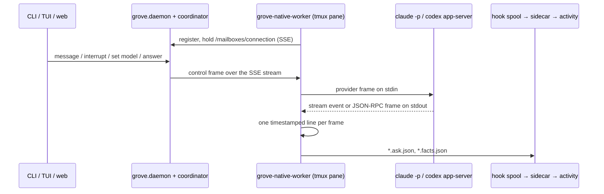
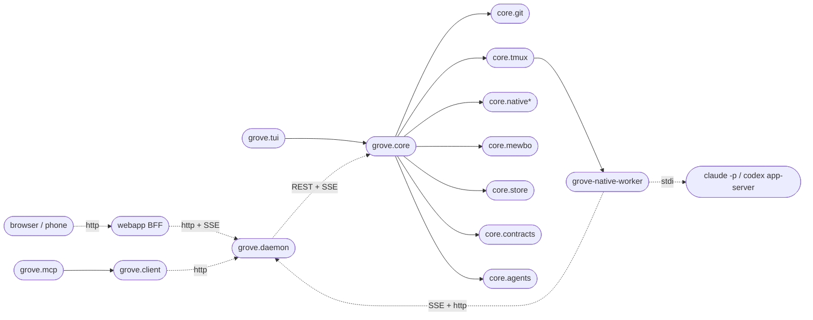

# Architecture

## How the packages fit together

- Grove has one engine and several clients. `grove.core` owns decisions while CI enforces dependency boundaries.
- The daemon serves REST and SSE. The TUI, client SDK, MCP server and web dashboard expose the engine through different interfaces.

## The package layout

```text
grove/
├── core/
│   ├── __init__.py          # public exports
│   ├── config.py            # configuration cascade
│   ├── workspace.py         # workspace state
│   ├── git.py
│   ├── tmux.py
│   ├── mewbo.py
│   ├── store.py             # atomic storage
│   ├── manager.py           # orchestration
│   ├── registry.py
│   ├── activity.py
│   ├── sessions.py
│   ├── auth.py              # pairing
│   ├── mailboxes.py         # native coordination
│   ├── native.py            # steering clients
│   ├── native_launch.py
│   ├── native_worker.py
│   ├── paths.py
│   ├── errors.py
│   ├── contracts/
│   └── agents/
│       ├── native_owner.py
│       ├── native_claude.py
│       └── native_codex.py
├── daemon/                  # loopback FastAPI
├── client/                  # local PTY and SSH SDK
├── mcp/                     # tools over the SDK
└── tui/                     # Textual
    ├── cli.py
    ├── app.py
    ├── theme.py
    ├── _status.py
    ├── keys.py
    ├── screens/
    └── widgets/

webapp/                     # Next.js and its BFF
```

- Public exports define the engine API. [`pyproject.toml`](repo:pyproject.toml) declares the import contracts that CI checks.

## The boundaries, enforced

- Core cannot import UI packages. The daemon depends on core, never on clients.
- The client SDK cannot import daemon or TUI internals. MCP reaches the daemon through `GroveClient`, including from another host.
- `include_external_packages = true` extends checks to external imports. `lint-imports` enforces these boundaries on every push.

## The public share boundary

- Bearer authentication protects daemon routes except pairing, liveness and `/public/{token}`. A share token opens one workspace, never the fleet.
- `WorkspaceState.share_token` is the publication state. Clearing it revokes the link without a second boolean to synchronize.
- Public routes have a separate prefix. A route census prevents accidentally exposing an authenticated route.
- `grove.core.contracts.public` explicitly selects public fields, including nested data. New fields stay private rather than escaping a redaction list.
- `grove.core.share_policy` sets project policy. Expiry is fixed when a link is minted, while an optional hashed passcode is checked on every read.
- Readers supply the passcode in a header. No anonymous grant, cookie or session needs storing.

## Side effects at the edges

- [`src/grove/core/git.py`](repo:src/grove/core/git.py), [`src/grove/core/tmux.py`](repo:src/grove/core/tmux.py) and [`src/grove/core/mewbo.py`](repo:src/grove/core/mewbo.py) isolate their respective I/O.
- [`src/grove/core/native_launch.py`](repo:src/grove/core/native_launch.py) prepares worker credentials and configuration. [`src/grove/core/native_worker.py`](repo:src/grove/core/native_worker.py) starts the provider and holds the daemon connection.
- Managers orchestrate these edges, which tests replace with fakes. New I/O belongs at one boundary.

## The contracts layer

- `grove.core.contracts` owns branch intent, request envelopes, response views and shared palettes.
- Values crossing client boundaries use Pydantic with `extra="forbid"`. Internal state uses `@dataclass(slots=True)`.

## The agents layer

- Adapters map Claude Code transcripts, Codex rollout files and Mewbo sessions onto `AgentActivityState`. The `generic` adapter deliberately does nothing.
- The registry selects by `kind`. Adapters normalize protocol shape, never model behavior.

## The native session control plane

- Claude Code, Codex and OpenCode default to Grove owned native sessions. Their tmux pane runs `grove-native-worker`, which owns the provider channel.
- The worker starts `claude -p` or `codex app-server` and registers through `/mailboxes/connection` SSE.
- Steering reaches a native owner through `OwnerSteerClient` inside the daemon or `DaemonSteerClient` over HTTP.
- Each sent or received frame becomes a timestamped stdout line. Dashboards expose this wire log as Stream.
- Questions and stream facts enter the hook spool. `ClaudeHook.drain` folds them into the existing session sidecar rather than adding another activity reader.


```mermaid
sequenceDiagram
    participant Client as CLI / TUI / web
    participant Daemon as grove.daemon + coordinator
    participant Worker as grove-native-worker (tmux pane)
    participant Provider as claude -p / codex app-server
    participant Spool as hook spool → sidecar → activity
    Worker->>Daemon: register, hold /mailboxes/connection (SSE)
    Client->>Daemon: message / interrupt / set model / answer
    Daemon->>Worker: control frame over the SSE stream
    Worker->>Provider: provider frame on stdin
    Provider-->>Worker: stream event or JSON-RPC frame on stdout
    Worker->>Worker: one timestamped line per frame
    Worker->>Spool: *.ask.json, *.facts.json
```

- `native: false`, `claude-terminal` or `codex-terminal` keeps the interactive agent UI. Grove steers it through pasted keystrokes.

## The observability spine

- `ActivityService` combines agent state, tmux output and git changes. The TUI consumes deltas directly and the daemon streams them over SSE.
- `RepoRegistry` keeps one manager per repository without repeatedly resolving configuration.
- `SessionExplorer` discovers sessions across the repository and its worktrees for CLI, daemon and web consumers.

## Dependencies flow inward

- Clients depend on the engine. Reverse dependencies couple internal helpers to callers and invite circular imports.


```mermaid
flowchart LR
    Browser([browser / phone]) -.http.-> BFF([webapp BFF])
    BFF -.http + SSE.-> Daemon([grove.daemon])
    TUI([grove.tui]) --> Core([grove.core])
    MCP([grove.mcp]) --> Client([grove.client])
    Client -.http.-> Daemon
    Daemon -.REST + SSE.-> Core
    Core --> Git([core.git])
    Core --> Tmux([core.tmux])
    Tmux --> Worker([grove-native-worker])
    Worker -.stdio.-> Provider([claude -p / codex app-server])
    Worker -.SSE + http.-> Daemon
    Core --> Native([core.native*])
    Core --> Mewbo([core.mewbo])
    Core --> Store([core.store])
    Core --> Contracts([core.contracts])
    Core --> Agents([core.agents])
```

## See also

- Read [Public API](develop-public-api.md) for exported contracts.
- Read [Engineering principles](develop-principles.md) for design rules.
- Read [Contributing](develop-contributing.md) for development commands and pull requests.
