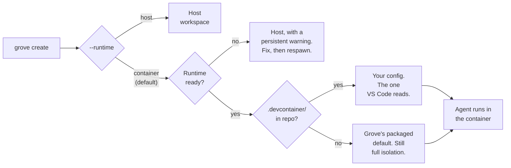

# Containerized agents

## Agents in their own stack

A container workspace gives one agent its own stack: Docker in Docker, a
database, services, ports, none of them yours. You own the repo, in
committed `.devcontainer/` and Grove config. Grove owns the boundary, and
the agent runtime the work, ungated.

<video preload="auto" poster="../img/posters/devcontainer-still.png">
  <source src="../videos/3-grove-devcontainer.mp4" type="video/mp4" />
</video>

## Host or container

Runtime is a per workspace choice, so two workspaces in one repo can differ.

| Run on the host when | Put it in a container when |
|---|---|
| One or two agents, sharing your machine like any program. | Twenty agents spawning sub agents, tests, and builds with no ceiling. |
| You approve tool calls as they come. | Permissions off, so the blast radius has to be the workspace. |
| One environment, already on your machine. | Dev and test stacks side by side, with their own services and ports. |
| Fastest start: your credentials, your `PATH`, nothing to build. | The environment your `.devcontainer/` describes, the one VS Code teammates read. |

The fan out row matters most: a shelled out test suite saturates a
machine, and a container turns that into a number you set.

## What the container is for

Permission prompts are the host's safety mechanism. The container is the
mechanism for `claude --dangerously-skip-permissions` or Codex full-auto:
the reachable set shrinks to the worktree, the mounts, and the nested
docker daemon, not another workspace, your dotfiles, or the host engine.

## How the runtime gets chosen



Runtime is picked once at create, shown for the workspace's life, editable
only by `respawn`.

## Start from the devcontainer you already have

```
grove create "fix login" --agent claude                      # configured default
grove create "fix login" --agent claude --runtime container
grove create "fix login" --agent claude --runtime host
```

The choice appears everywhere a workspace is created: CLI, TUI, the webapp's
create dialog, MCP's `grove_create_workspace`. A repo with
`.devcontainer/devcontainer.json` is read as is, so a VS Code teammate
gets the same environment. No `.devcontainer/` means a container badged
as Grove's packaged default, full isolation. Docker, Compose v2, and
`@devcontainers/cli` are yours to install, checked by `grove doctor`.

## Where your code lands

Grove bind mounts your worktree rather than cloning it, at
`/workspaces/<worktree-directory-name>`, the path `devcontainers` picks
and never overrides. That's the working directory unless
`devcontainer.json` pins its own, matched by Grove's default so a rebuild
never shifts it:

```json title=".devcontainer/devcontainer.json"
"workspaceMount": "source=${localWorkspaceFolder},target=${localWorkspaceFolder},type=bind",
"workspaceFolder": "${localWorkspaceFolder}"
```

Grove never guesses the container side path: it translates against what
the CLI reported, or skips substitution.

!!! tip "Why a linked worktree still works"

    A worktree's `.git` is a *file* pointing outside it, so mounting only
    the worktree breaks git. Grove binds the shared git directory at its
    identical host path with `GIT_COMMON_DIR` set, since the CLI's
    `--mount-git-worktree-common-dir` is silently ignored once a config
    sets `workspaceMount`. These are the only two host paths Grove
    preserves.

## Getting secrets and environment in

A host workspace inherits your shell. A container starts empty, so a
missing token fails an `.mcp.json` server silently.

```
container.env_file: ".env.grove"                    # pick one
container.env_command: "./scripts/print-secrets.sh" # or the other
```

| Fact | Detail |
|---|---|
| Two knobs, mutually exclusive | `env_file` loads a dotenv file (repo relative, absolute, or `~` expanded). `env_command` parses a host command's stdout as dotenv, so a secret never touches disk. |
| Any command printing `KEY=value` works | `container.env_command: "acme-secrets export --format=dotenv --project=my-app"`. |
| Two entry points | `--secrets-file` reaches `postCreateCommand`/`postStartCommand`. `--remote-env` reaches the agent. |
| Precedence, lowest to highest | Telemetry, `env_file`/`env_command`, agent config sharing, agent's own `env`. |
| A committed layer can't set `env_command` | It would run an arbitrary command on anyone who clones the repo. Use `.grove/config.local.json`. |
| A committed `env_file` loads inside the repo only | An absolute path, or one escaping the repo, is ignored. |

## Extending the environment

A container workspace is an ordinary devcontainer: anything the spec
supports is yours. `grove init devcontainer` scaffolds
`.devcontainer/devcontainer.json` from the packaged default to commit.
Pick the tier by change frequency: monthly or more belongs in tier 2 or 3,
since `uv sync` in `Dockerfile` rebuilds on every lockfile bump.

| Tier | Mechanism | Cost | What belongs here |
|---|---|---|---|
| 0 | `build` or a `Dockerfile` | minutes, rare | OS packages and language runtimes |
| 1 | `features` | cached layers | reusable toolchains pulled from a registry |
| 2 | `postCreateCommand` | once per container | dependency sync such as `uv sync` or `npm ci` |
| 3 | `postStartCommand` | every start, seconds | env seeding, trust, reachability checks |

Past a step or two, use the `init.d` convention: `bootstrap.sh create|start`
over numbered idempotent scripts in `.devcontainer/init.d/`. The first
workspace builds the image, the rest start in seconds. The build window
reads `PROVISIONING` with an elapsed clock and the provisioner's last
line, killable by respawn.

!!! tip "Your image needs `iproute2`. Grove brings its own `iptables`."

    The egress allowlist is an in-container firewall run from
    `postStartCommand`. A missing tool aborts container start rather than
    leave an unfirewalled workspace.

    - Grove mounts a static `iptables`/`ip6tables` pair read only at
      `/grove/netfilter`, used **only** when your image ships none
      (`grove doctor` calls it `container firewall`).
    - Grove supplies no `ip` (iproute2): Ubuntu's base has it,
      `python:*-slim` and `node:*` don't (`apt-get install -y iproute2`).
    - Failures name the missing tool and both remedies: install it, or set
      `container.egress.mode = "open"`.

## Setting the limits

Three controls, each one config line.

```
container.agent_config.share: full | projects | isolated   # default: full
container.egress.mode: allowlist | open | deny             # default: allowlist
container.resources: { memory: "8g", cpus: 4, pids: 2048 }
```

Sharing decides what crosses in from your host.

| Value | What the agent sees | When to use it |
|---|---|---|
| `full` | Sign-in, skills, commands, project memory. Works like the host. | The default. Trusted repositories. |
| `projects` | Transcripts only. No sign-in, no skills. | History persists without sharing credentials. |
| `isolated` | A separate Grove-owned config directory, with its own sign-in. | An untrusted repository. |

| Fact | Detail |
|---|---|
| Claude Code plugins cross as a read only seed | Anything installed lands in the workspace's own plugin directory, never on your host. |
| Workspace folder stamped trusted before the container starts | The first-run trust dialog is a prompt nobody answers. `container.agent_config.trust: false` restores it. |
| Egress allowlist is derived | From the agent's plane, your registries, your git remote, and Grove's plane. Ordinary development needs none. |
| `container.egress.allow` entries are hostnames or CIDRs | Resolved once at start, so wildcards don't work. List the hosts you reach, or set `mode: open`. |
| A container started outside Grove reads unprovisioned | Until you respawn, since the firewall runs from `postStartCommand`. |
| Resources apply to every service the workspace runs | Take effect next launch. Default is uncapped. |

!!! danger "A blast-radius boundary, not a credential boundary"

    Under the default `share: full`, your real agent credentials are
    mounted in, so a prompt-injected agent could use your token as you.
    The egress allowlist bounds where a token can go, and Grove seeds
    `~/.claude.json` per workspace so an MCP-rewrite attack dies with the
    workspace. For an untrusted repository, set `share: isolated`.

A committed layer may tighten sharing to `isolated`, never loosen to
`full`: only your own uncommitted config grants a capability.

## When it falls back to the host

The check runs first, so a missing Docker or devcontainer CLI is caught
before Grove touches the filesystem. The workspace lands on host with a
persistent warning naming the probe and the remedy. `grove respawn`
promotes it, clearing the marker with branch and worktree untouched. An
explicit `--runtime host` is your own decision, so Grove never
auto-promotes.

## Sessions outlive your terminal

The agent runs under tmux inside the container, not your host tmux, so
your host session is only a viewport. Detach, close the terminal, restart
the daemon, or let your host tmux die: the container owns the terminal and
the work continues. `grove attach` returns you mid-task with its
scrollback, naming the remedy if the host session is gone. `grove respawn`
rebuilds the viewport, not the agent. A detached workspace stays
observable, since peek, the webapp terminal, and steering read its own
pane.

!!! tip "Grove brings its own tmux, the same way it brings `iptables`"

    | What | Why it works this way |
    |---|---|
    | No base image ships tmux | Grove mounts a static build per host and architecture, read only, beside a terminfo database. An image with its own keeps it. `container.tmux.prefer_image: false` uses Grove's everywhere. |
    | Terminfo travels with the binary | tmux refuses an attach without an entry for your `TERM`. An unpackaged `TERM` retries once with `container.tmux.term_fallback` (`xterm-256color`). Empty it to disable the retry. |
    | `grove doctor` warns, doesn't fail | Reports `in-container tmux`. Without the bundle the agent runs the old way, which dies with your terminal. |

## Getting a shell inside

`grove attach` puts you in the workspace's tmux session, whose shell
window is already inside the container (Ctrl-b 0 for a container prompt).
`grove shell WORKSPACE` goes straight there, both landing in the same
in-container tmux session every time, surviving your leaving. Which shell
runs is `container.shell`, a chain tried in order.

## Reading the container status line

Grove bind mounts read only terminal assets at `/grove/decor`, so attach
shows a status bar instead of bare default chrome.

| Behavior | Detail |
|---|---|
| Vocabulary follows your terminal's fonts | Nerd Font icons by default. Set `GROVE_STATUSLINE_GLYPHS=ascii` for words instead. |
| Figures come from the container's own cgroup, not the host | `/proc/loadavg` isn't namespaced. The bundled script reads cgroup CPU and memory limits, with a v1 fallback. |
| An absent segment means an absent fact, not a bug | An API-key login has no quota pools, so that segment is absent, not zero. |
| Toggles: `container.decor.enabled`, `.statusline`, `.tmux_conf`, `.payload` | Turn pieces off or replace the bundle. A host workspace already has your own. |

## Several agents in one container

A workspace runs one agent. For a second, say a reviewer reading what the
first wrote, start it in the same container: `grove agent add WORKSPACE
--agent codex --name reviewer`, its own persistent tmux session, only
when you ask. `grove agent list`, `attach`, `peek`, `message`, and `kill`
manage them, and `list` drops an ended agent automatically. They share
the worktree, branch, and container, which is the point and the caveat:
two agents editing the same files collide like two people would. This
needs a reachable tmux, since a host workspace holds one agent only.

## Opening it in VS Code

`grove code WORKSPACE` opens VS Code's editor inside the container.
Source stays on the bind mount, build artifacts stay in the container's
own volumes, and the editor's server runs inside too, keeping a container
built `node_modules` from confusing a host language server. Cursor and
VSCodium can't open the container this way, since Dev Containers is
proprietary. `grove shell` and `grove attach` are the way in until an SSH
transport ships.

## Grove init scripts and container hooks

A [Grove init script](configure-init-scripts.md) and a devcontainer hook
run in a fixed order: the init script prepares the host worktree first,
then the devcontainer's own hooks run inside the container.
`init_script.applies_to: "host"` stops the init script running twice when
your hooks already install what it would. It also accepts `all` (default)
and `container`.

## Configuration reference

| Field | Default | Meaning |
|---|---|---|
| `container.enabled` | `true` | Cascade default for `runtime`. |
| `container.docker_bin` | `docker` | Container CLI Grove shells out to. |
| `container.shell` | `["bash", "sh"]` | Shells `grove shell` tries, in order. |
| `container.tmux.enabled` | `true` | Agent under in-container tmux. `false` is a bare exec, no persistence. |
| `container.tmux.prefer_image` | `true` | Prefer the image's own tmux. |
| `container.tmux.payload` | unset | Directory with a supplied `bin/<arch>/tmux` and `terminfo/`. |
| `container.tmux.session` | `agent` | Agent's session. Renaming orphans a live agent. |
| `container.tmux.shell_session` | `shell` | Session `grove shell` attaches to. |
| `container.tmux.term_fallback` | `xterm-256color` | `TERM` retried on a refused attach. Empty disables it. |
| `container.default_config` | packaged default | `devcontainer.json` for a repo with none. |
| `container.decor.enabled` | `true` | Mount and compose the terminal chrome. |
| `container.decor.statusline` | `true` | Statusline into the agent's settings. |
| `container.decor.tmux_conf` | `true` | Grove's tmux config into the container. |
| `container.decor.payload` | unset | Host assets replacing the bundled ones. |
| `container.agent_config.share` | `full` | `full`, `projects`, or `isolated`. |
| `container.agent_config.trust` | `true` | Folder seeded trusted, `.mcp.json` servers approved. |
| `container.env_file` | unset | Dotenv file loaded into container and agent. |
| `container.env_command` | unset | Host command printing dotenv. Excludes `env_file`. |
| `container.egress.mode` | `allowlist` | `allowlist`, `open`, or `deny`. |
| `container.egress.allow` | derived | Extra hosts and CIDRs on the allowlist. |
| `container.resources.memory` | uncapped | Memory limit, for example `8g`. |
| `container.resources.cpus` | uncapped | CPU limit, for example `4`. |
| `container.resources.pids` | uncapped | Process count limit. |
| `container.up_timeout_seconds` | `900` | Seconds before a container counts as failed. |

Full schema on the [configuration reference](configure-reference.md) page.

## See also

- [Workspace lifecycle](features-workspace-lifecycle.md): every lifecycle verb, including `respawn`.
- [CLI](use-cli.md): `grove create --runtime`, `grove init devcontainer`, `grove doctor`, `grove shell`, `grove agent`, and `grove code`.
