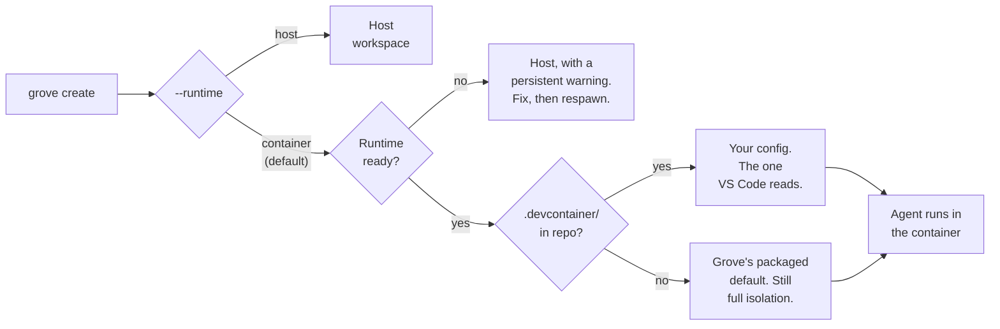

# Containerized agents

## Agents in their own stack

A container workspace hands one agent a complete stack of its own: Docker in
Docker, so it gets its own database, services, and ports, none of them
yours.

- **You own the repo.** The `.devcontainer/` and the Grove config, committed
  like code. Nothing here is a Grove format.
- **Grove owns the boundary.** Worktree, container lifecycle, mounts, resource
  ceilings, egress policy, session.
- **The agent runtime owns the work.** Grove passes your tool's flags through
  untouched and never gates what it does inside.

<video preload="auto" poster="../img/posters/devcontainer-still.png">
  <source src="../videos/3-grove-devcontainer.mp4" type="video/mp4" />
</video>
## Host or container

Runtime is a per workspace choice, so two workspaces in one repo can differ.

| Run on the host when | Put it in a container when |
|---|---|
| One or two agents, sharing your machine like any program. | Twenty, each spawning sub agents, test runs and builds with no ceiling. |
| You approve tool calls as they come. | Permissions off, so the blast radius has to be the workspace. |
| One environment, the one already on your machine. | A development stack and a test stack side by side, with their own services, ports and versions. |
| Fastest start. Your credentials, your `PATH`, nothing to build. | The environment the project describes, from the `.devcontainer/` your VS Code teammates read. |

- **The fan out row is met last and felt first.** One agent shelling out to a
  test suite can saturate a machine. A container makes that a number you set
  beforehand.

## What the container is actually for

- **Permission prompts are the safety mechanism on the host. The container is
  the mechanism when there are none.** Run `claude --dangerously-skip-permissions`
  or Codex full-auto and you trust the agent with everything you can touch.
- **The reachable set is the worktree, the mounts, and the workspace's own
  nested docker daemon**, not another workspace's code, your dotfiles, or the
  engine your containers run on.

## How the runtime gets chosen



- **Runtime is picked once at create** and shown for the workspace's life.
  No surface edits it afterward, except one verb: `respawn`.

## Start from the devcontainer you already have

```
grove create "fix login" --agent claude                      # configured default
grove create "fix login" --agent claude --runtime container
grove create "fix login" --agent claude --runtime host
```

- **The choice appears wherever a workspace is created**: the CLI's
  `--runtime` flag, the TUI create screen, the webapp composer, the MCP
  `grove_create_workspace` tool.
- **A repo with a `.devcontainer/devcontainer.json` is read as is**, nothing
  Grove-specific to commit, so a VS Code teammate gets the same environment
  from the same file.
- **No `.devcontainer/` still means a container**, running Grove's packaged
  default image under a quiet informational badge: full isolation, not
  project-owned.
- **Docker, Compose v2, and `@devcontainers/cli` are yours to install.**
  `grove doctor` runs the checks a create runs.

## Where your code lands

- **Grove bind mounts your worktree, never clones**, at
  `/workspaces/<worktree-directory-name>`: the path `devcontainers` CLI picks
  itself, named for the worktree. Grove sets no `workspaceMount` or
  `workspaceFolder` over a project's own config.
- **That path is the working directory**, unless your `devcontainer.json`
  pins its own `workspaceFolder`. Grove's config does, matching source and
  target so a rebuild never shifts the path under a running session:

```json title=".devcontainer/devcontainer.json"
"workspaceMount": "source=${localWorkspaceFolder},target=${localWorkspaceFolder},type=bind",
"workspaceFolder": "${localWorkspaceFolder}"
```

- **Grove never guesses the container-side path**, but translates host paths
  against what the CLI reported. A container reporting none gets no
  substitution, rather than a path resolving to nothing inside.

!!! tip "Why a linked worktree still works"

    A worktree's `.git` is a *file* pointing outside it, so mounting only the
    worktree breaks git inside. Grove binds the shared git directory at its
    identical host path with `GIT_COMMON_DIR` set, synthesized every start,
    since the CLI's `--mount-git-worktree-common-dir` is silently ignored
    once a config sets its own `workspaceMount`. These are the only two host
    paths Grove preserves rather than translates.

## Getting secrets and environment in

A host workspace inherits your shell. A container starts empty, so a
missing token an `.mcp.json` server expects fails the integration quietly.

```
container.env_file: ".env.grove"                    # pick one
container.env_command: "./scripts/print-secrets.sh" # or the other
```

| Fact | Detail |
|---|---|
| Two knobs, mutually exclusive | `env_file` loads a dotenv file (repo relative, absolute, or `~` expanded); `env_command` parses a host command's stdout as dotenv instead, so a secret never touches disk. A missing configured file is a hard error at create. |
| Any command printing `KEY=value` works | `container.env_command: "acme-secrets export --format=dotenv --project=my-app"`. |
| Two entry points | `--secrets-file` reaches `postCreateCommand`/`postStartCommand`; `--remote-env` reaches the agent. Feeding one doesn't feed the other. Grove resolves each once and caches nothing, so `env_command` must be idempotent and cheap. |
| Precedence, lowest to highest | Telemetry passthrough, `env_file`/`env_command`, agent configuration sharing variables, the agent's own `env`. |
| A committed layer can't set `env_command` | It would run an arbitrary command on anyone who clones the repo; Grove strips it with a warning. Use `.grove/config.local.json` or your user config instead. |
| A committed `env_file` is honored inside the repository only | Loading it executes nothing, and an absolute path, or one escaping the repo, is ignored. |

## Extending the environment

A container workspace is an ordinary devcontainer: anything the spec
supports is yours, and every later create inherits it.

- **`grove init devcontainer` scaffolds `.devcontainer/devcontainer.json`**
  from the packaged default. Commit it for a versioned agent environment.
- **Pick the tier by change frequency**, so a dependency bump doesn't force
  a rebuild: anything changing more often than monthly belongs in tier 2 or
  3 (`uv sync` in the `Dockerfile` rebuilds the image on every lockfile
  bump).

| Tier | Mechanism | Cost | What belongs here |
|---|---|---|---|
| 0 | `build` or a `Dockerfile` | minutes, rare | OS packages and language runtimes |
| 1 | `features` | cached layers | reusable toolchains pulled from a registry |
| 2 | `postCreateCommand` | once per container | dependency sync such as `uv sync` or `npm ci` |
| 3 | `postStartCommand` | every start, seconds | env seeding, trust, reachability checks |

- **Past a step or two, use the `init.d` convention**: `bootstrap.sh
  create|start` over numbered idempotent scripts in
  `.devcontainer/init.d/`.
- **The first workspace builds the image, the rest start in seconds**: the
  build window reads `PROVISIONING`, with an elapsed clock and the
  provisioner's last line, and a respawn destroys that build in flight.

!!! tip "Your image needs `iproute2`. Grove brings its own `iptables`."

    The egress allowlist is an in-container firewall run from
    `postStartCommand`. A missing tool aborts container start, rather than
    leaving a workspace you believe is firewalled and isn't.

    - Grove mounts a static `iptables`/`ip6tables` pair read only at
      `/grove/netfilter`, used **only** when your image ships none
      (`grove doctor` calls it `container firewall`).
    - Grove supplies no `ip` (iproute2): Ubuntu's base has it,
      `python:*-slim` and `node:*` don't (`apt-get install -y iproute2`
      there).
    - Failures name the missing tool and both remedies: install it, or set
      `container.egress.mode = "open"`.

## Setting the limits

Three controls, each one config line.

```
container.agent_config.share: full | projects | isolated   # default: full
container.egress.mode: allowlist | open | deny             # default: allowlist
container.resources: { memory: "8g", cpus: 4, pids: 2048 }
```

- **Sharing decides what crosses in from your host.**

| Value | What the agent sees | When to use it |
|---|---|---|
| `full` | Sign-in, skills, commands, project memory. Works like the host. | The default. Trusted repositories. |
| `projects` | Transcripts only. No sign-in, no skills. | History persists without sharing credentials. |
| `isolated` | A separate Grove-owned config directory, with its own sign-in. | An untrusted repository. |

| Fact | Detail |
|---|---|
| Claude Code plugins cross as a read-only seed | Anything installed inside lands in that workspace's own plugin directory, never on your host. |
| Workspace folder stamped trusted before the container starts | The first-run trust dialog is a prompt nobody is there to answer. `container.agent_config.trust: false` restores it, and a workspace waiting for you. |
| Egress allowlist is derived | From the agent's plane, your package registries, your git remote, and Grove's plane. Ordinary development needs no configuration. |
| `container.egress.allow` entries are hostnames or CIDRs | Resolved once at start, so wildcards don't work. List the hostnames you reach, or set `mode: open`. |
| A container started outside Grove reads unprovisioned | Until you respawn, since the firewall runs from `postStartCommand` and that start never ran it. |
| Resources apply to every service the workspace runs | Take effect next launch; default is uncapped. |

!!! danger "A blast-radius boundary, not a credential boundary"

    Under the default `share: full`, your real agent credentials are mounted
    in, so a prompt-injected agent could use your token as you. The egress
    allowlist bounds where a token can go, and Grove seeds `~/.claude.json`
    per workspace so an MCP-rewrite attack dies with the workspace. For a
    repository you don't trust, set `share: isolated` and accept a separate
    sign-in.

- **A committed layer may tighten sharing to `isolated`, never loosen it to
  `full`.** Only your own uncommitted config can grant a capability.
## When it falls back to the host

- **The check runs first**, so if Docker or the devcontainer CLI is
  unreachable, Grove finds out before touching the filesystem and rolling
  back costs nothing.
- **The fallback is visible, not silent.** The workspace lands on host, and
  every surface carries a persistent warning for its whole life, naming the
  failing probe and the remedy.
- **Recovery is a respawn.** Fix the runtime, run `grove respawn`, and Grove
  promotes the workspace and clears the marker. Branch and worktree stay untouched.
- **An explicit `--runtime host` is different**: that's your decision, so
  Grove never auto-promotes it.

## Sessions outlive your terminal

The agent runs under tmux inside the container, not your host tmux. Your
host session is only a viewport onto it.

- **Closing your terminal doesn't stop the agent.** Detach, close the
  terminal, restart the daemon, or let your host tmux server die: the
  container owns the agent's terminal.
- **`grove attach` returns you to the same agent**, mid-task, with its
  scrollback, and names the remedy if the host session itself is gone.
- **`grove respawn` rebuilds the viewport, not the agent**, reattaching
  rather than starting a second one.
- **A detached workspace stays observable**: peek, the webapp terminal tab,
  and steering all read the agent's own pane.

!!! tip "Grove brings its own tmux, the same way it brings `iptables`"

    | What | Why it works this way |
    |---|---|
    | No base image ships tmux | Grove mounts a static build per host and architecture, read only, beside a full terminfo database. An image with its own keeps it; `container.tmux.prefer_image: false` uses Grove's everywhere. |
    | Terminfo travels with the binary | tmux refuses an attach without an entry for your `TERM`. An unpackaged `TERM` retries once with `container.tmux.term_fallback` (`xterm-256color`) and warns; empty it to disable the retry. |
    | `grove doctor` warns, doesn't fail | Reports `in-container tmux`. Without the bundle the agent runs the old way, which works and dies with your terminal. |

## Getting a shell inside

- **`grove attach` puts you in the workspace's tmux session**, whose shell
  window is already inside the container (Ctrl-b 0 for a container prompt).
- **`grove shell WORKSPACE` goes straight there** without attaching first.
- **Both land in the same shell every time**: its own session on the
  in-container tmux, surviving you leaving, with history, environment, and
  anything still running.
- **Which shell runs is `container.shell`**, a chain tried in order.

## Reading the container status line

Grove bind-mounts a read-only set of terminal assets at `/grove/decor`, so
attach shows a status bar instead of bare default chrome.

| Behavior | Detail |
|---|---|
| Vocabulary follows your terminal's fonts | Nerd Font icons by default, replacing the word. Set `GROVE_STATUSLINE_GLYPHS=ascii` for words instead. |
| Figures come from the container's own cgroup, not the host | `/proc/loadavg` isn't namespaced. The bundled script reads cgroup CPU and memory limits, with a cgroup v1 fallback. |
| An absent segment means an absent fact, not a bug | An API-key login has no subscription quota pools, so that segment is absent, not zero; identity behaves the same when nothing can answer. |
| Toggles: `container.decor.enabled`, `.statusline`, `.tmux_conf`, `.payload` | Turn pieces off or replace the bundle. A host workspace already has your own tmux and status line. |

## Several agents in one container

A workspace runs one agent. For a second, say a reviewer reading what the
first wrote, start it in the same container instead of a new workspace.

- **`grove agent add WORKSPACE` starts one**, optionally of another kind:
  `--agent codex --name reviewer`. Each gets its own persistent tmux session,
  and only starts when you ask.
- **`grove agent list`, `attach`, `peek`, `message`, and `kill` manage them.**
  `list` reads the container itself, so an ended agent stops appearing.
- **An extra of the workspace's own kind joins its agent axis**, visible in
  `grove sessions list --workspace WORKSPACE`. A different kind runs and is
  fully reachable, but the workspace card still tracks its own kind.
- **They share the worktree, branch, and container**, which is the point and
  the caveat: two agents editing the same files collide like two people
  would.
- **This needs a containerized workspace with a reachable tmux.** A host
  workspace holds one agent only.

## Opening it in VS Code

`grove code WORKSPACE` opens VS Code's editor running inside the container.

- **Source stays on the bind mount. Build artifacts stay in the container's
  own volumes.** The editor's server runs inside too, keeping a
  container-built `node_modules` from confusing a host language server.
- **Cursor and VSCodium can't open the container this way**, since VS Code's
  Dev Containers extension is proprietary. `grove shell` and `grove attach`
  are the way in until an SSH transport ships.

## Grove init scripts and container hooks

A [Grove init script](configure-init-scripts.md) and a devcontainer hook run
in different places, in a fixed order.

- **The init script prepares the host worktree**, the directory bind mounted
  into the container, and runs first.
- **The devcontainer's own hooks run second**, inside the container, after
  the mount is in place.
- **`init_script.applies_to: "host"` stops the init script running twice**
  when your hooks already install what it would. It also accepts `all`
  (default) and `container`.

## Configuration reference

| Field | Default | Meaning |
|---|---|---|
| `container.enabled` | `true` | Cascade default for `runtime`. |
| `container.docker_bin` | `docker` | Container CLI Grove shells out to. |
| `container.shell` | `["bash", "sh"]` | Shells `grove shell` tries, in order. |
| `container.tmux.enabled` | `true` | Agent under an in-container tmux. `false` is a bare exec, no persistence. |
| `container.tmux.prefer_image` | `true` | Prefer the image's own tmux. |
| `container.tmux.payload` | unset | Directory of a supplied `bin/<arch>/tmux` and `terminfo/`. |
| `container.tmux.session` | `agent` | Agent's session. Renaming it orphans a live agent. |
| `container.tmux.shell_session` | `shell` | Session `grove shell` attaches to. |
| `container.tmux.term_fallback` | `xterm-256color` | `TERM` retried on a refused attach. Empty disables it. |
| `container.default_config` | packaged default | `devcontainer.json` for a repo with none. |
| `container.decor.enabled` | `true` | Mount and compose the terminal chrome at all. |
| `container.decor.statusline` | `true` | Statusline into the agent's settings. |
| `container.decor.tmux_conf` | `true` | Grove's tmux config into the container. |
| `container.decor.payload` | unset | Host assets replacing the bundled ones. |
| `container.agent_config.share` | `full` | `full`, `projects`, or `isolated`. |
| `container.agent_config.trust` | `true` | Folder seeded trusted, `.mcp.json` servers approved. |
| `container.env_file` | unset | Dotenv file loaded into container and agent. |
| `container.env_command` | unset | Host command printing dotenv. Excludes `env_file`. |
| `container.egress.mode` | `allowlist` | `allowlist`, `open`, or `deny`. |
| `container.egress.allow` | derived | Extra hosts and CIDRs on the allowlist. |
| `container.resources.memory` | uncapped | Memory limit, for example `8g`. |
| `container.resources.cpus` | uncapped | CPU limit, for example `4`. |
| `container.resources.pids` | uncapped | Process count limit. |
| `container.up_timeout_seconds` | `900` | Seconds before a container counts as failed. |

Full schema on the [configuration reference](configure-reference.md) page.

## See also

- [Workspace lifecycle](features-workspace-lifecycle.md): every lifecycle verb, including `respawn`.
- [CLI](use-cli.md): `grove create --runtime`, `grove init devcontainer`, `grove doctor`, `grove shell`, `grove agent`, and `grove code`.
