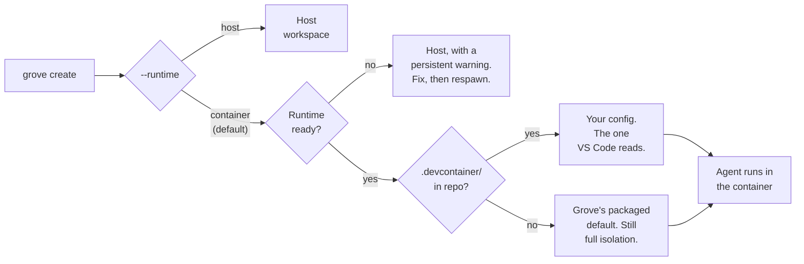

# Containerized agents

A container workspace hands one agent a complete stack of its own. It runs
Docker in Docker, so the workspace starts its own database, its own services and
its own ports, and none of them are yours.

Three things own different parts of that workspace, and the rest of this page is
easier to read once you know which is which.

- **You own the repo.** The `.devcontainer/` and the Grove config are yours,
  committed and reviewed like the code. Nothing on this page is a Grove format.
- **Grove owns the boundary.** The worktree, the container lifecycle, the
  mounts, the resource ceilings, the egress policy and the session. This is
  everything around the agent, and it is all Grove touches.
- **The agent runtime owns the work.** Grove passes your tool's flags through
  untouched and never inspects, gates or second-guesses what it does inside.

<video autoplay muted loop playsinline preload="auto" poster="../img/posters/devcontainer-still.png" style="width:100%;max-width:960px;height:auto;display:block;margin:0 auto 1.75rem;">
  <source src="../videos/3-grove-devcontainer.mp4" type="video/mp4" />
</video>
## Host or container

Runtime is a per workspace choice, so the answer can differ for two workspaces
in the same repo.

| Run on the host when | Put it in a container when |
|---|---|
| You are running one or two agents. Their processes share your machine the way any other program does, and that is fine. | You are running twenty. Each agent spawns sub agents, test runs and build processes with no ceiling of their own, so the ceiling has to come from somewhere. |
| You approve tool calls as they come. The permission prompt is your safety mechanism. | You run with permissions turned off. The blast radius needs to be the workspace instead of everything your account can reach. |
| One environment, the one already working on your machine. | A development stack and a test stack side by side, each with its own services, ports and dependency versions. |
| You want the fastest start. Your credentials, your `PATH` and your language versions, with nothing to build. | You want the environment the project already describes, out of the `.devcontainer/` your VS Code teammates read. |

- **The fan out row is the one people meet last and feel first.** A single
  agent that shells out to a test suite can saturate a machine on its own, and
  twenty of them is not a workload you can reason about after the fact. A
  container turns that into a number you set beforehand.

## What the container is actually for

- **Permission prompts are the safety mechanism when an agent runs on your
  host. The container is the safety mechanism when it doesn't.** Run
  `claude --dangerously-skip-permissions` or Codex full-auto on your machine
  and you trust the agent with everything you can touch.
- **Grove passes the agent's flags through untouched.** It never gates or
  second-guesses what the tool does. The container is what makes running with
  permissions off a decision rather than a gamble.
- **The reachable set is the worktree, the mounts, and the nested docker daemon
  the workspace owns.** Not another workspace's code, not your dotfiles, not
  the engine your own containers run on.
- **The container runs Docker in Docker**, so the workspace gets its own
  database, its own services and its own ports, and none of them are yours.

## How the runtime gets chosen



- **Runtime is picked once at create** and displayed for the workspace's whole
  life. No surface lets you edit it afterward.
- **The one exception is a verb, not a field.** `respawn` promotes a workspace
  that fell back to host once its container runtime is available again.

## Start from the devcontainer you already have

```
grove create "fix login" --agent claude                      # configured default
grove create "fix login" --agent claude --runtime container
grove create "fix login" --agent claude --runtime host
```

- **The same choice appears everywhere a workspace is created:** the CLI's
  `--runtime` flag, the TUI create screen, the webapp composer, and the MCP
  `grove_create_workspace` tool.
- **A repo that already has a `.devcontainer/devcontainer.json` is read as
  is.** Nothing to add and nothing Grove-specific to commit. A teammate opening
  the same repo in VS Code gets the identical environment, because you are both
  pointed at one file.
- **No `.devcontainer/` is not a reason to fall back to the host.** The
  workspace runs in Grove's packaged default image instead, marked with a quiet
  informational badge. That is still full isolation, just not project-owned.
- **Container workspaces need Docker, Compose v2, and `@devcontainers/cli` on
  your host, and Grove installs none of them.** Run `grove doctor` to see what
  is missing: it runs the same checks Grove uses at create time, so its answer
  is exactly what a create will do.

## Where your code lands

- **Grove never clones. It bind mounts your repository** at the path the
  `devcontainers` CLI would choose itself: source at your worktree, target
  `/workspaces/<worktree-directory-name>`. Grove sets neither `workspaceMount`
  nor `workspaceFolder` for a project's own config.
- **The mounted directory takes your worktree's name**, not the repository's,
  since each workspace gets its own worktree.
- **That path is also the agent's working directory**, unless your
  `devcontainer.json` pins its own `workspaceFolder`. Grove's own config does,
  matching source and target so a rebuild never shifts the path under a running
  session:

```json
"workspaceMount": "source=${localWorkspaceFolder},target=${localWorkspaceFolder},type=bind",
"workspaceFolder": "${localWorkspaceFolder}"
```

- **Grove never guesses the container-side path.** It reads back what the CLI
  reported and translates every host path against it. A container that reported
  no workspace folder gets no substitution rather than a host path that resolves
  to nothing inside.

!!! tip "Why a linked worktree still works"

    A worktree's `.git` is a *file* pointing outside the worktree, so mounting
    only the worktree breaks every git command inside the container.

    - **Grove binds the shared git directory at the identical absolute path** it
      has on your host, with `GIT_COMMON_DIR` pointing at it.
    - **It synthesizes that mount every start** rather than relying on the CLI's
      `--mount-git-worktree-common-dir`, which is silently ignored once a config
      defines its own `workspaceMount`.
    - **Those two are the only host paths Grove preserves rather than
      translates.** Each has to mean one thing on both sides of the boundary.

## Getting secrets and environment in

A host workspace inherits your shell. A container starts empty, so a token an
`.mcp.json` server expects goes missing, the container comes up looking healthy,
and the integration fails quietly.

```
container.env_file: ".env.grove"                    # pick one
container.env_command: "./scripts/print-secrets.sh" # or the other
```

- **Two knobs, mutually exclusive.** `env_file` loads a dotenv file, repo
  relative or absolute, `~` expanded. `env_command` runs a host command and
  parses its stdout as dotenv, so a secret never touches disk. A configured file
  that is missing is a hard error at create.
- **Nothing here is Grove-specific.** Any command printing `KEY=value` works:
  `container.env_command: "acme-secrets export --format=dotenv --project=my-app"`.
- **Two separate roads lead into the container, and feeding one does not feed
  the other.** Grove resolves your knob twice per start: once through the
  devcontainer CLI's `--secrets-file`, which reaches your `postCreateCommand`
  and `postStartCommand` only, and once through `--remote-env`, which reaches
  the agent process.
- **No value is cached or threaded between those calls.** A daemon's manager
  lives for days, so a cache would serve a secret long after its source rotated
  it. The trade is that `env_command` must be idempotent and cheap.
- **Precedence, lowest to highest:** telemetry passthrough, then `env_file` or
  `env_command`, then agent configuration sharing variables, then the agent's
  own `env`.
- **A committed layer may not set `env_command`.** It is stripped with a warning
  naming the section, because honoring it would let a repository run an
  arbitrary command on anyone who clones it. Put it in
  `.grove/config.local.json` or your user config.
- **A committed `env_file` is honored, but only inside the repository.** Loading
  a file executes nothing, so a committed layer may set it. An absolute path or
  one escaping the repository is ignored.

## Extending the environment

Nothing here is a Grove format. A container workspace is an ordinary
devcontainer, so anything the spec supports is yours, and what you add every
workspace inherits from the next create onward.

- **Add a service, every agent gets its own.** Postgres, a browser, a queue.
  Your VS Code teammates get the same one from the same file.
- **Start from what Grove already runs.** `grove init devcontainer` scaffolds
  `.devcontainer/devcontainer.json` from the packaged default. Commit it and the
  project has a versioned agent environment.
- **Where a change goes matters more than what it is.** Four tiers, and the
  right one is what keeps a dependency bump from forcing an image rebuild.

| Tier | Mechanism | Cost | What belongs here |
|---|---|---|---|
| 0 | `build` or a `Dockerfile` | minutes, rare | OS packages and language runtimes |
| 1 | `features` | cached layers | reusable toolchains pulled from a registry |
| 2 | `postCreateCommand` | once per container | dependency sync such as `uv sync` or `npm ci` |
| 3 | `postStartCommand` | every start, seconds | env seeding, trust, reachability checks |

- **Anything changing more often than monthly belongs in tier 2 or 3.** Baking
  `uv sync` into the `Dockerfile` means every lockfile bump rebuilds the image.
- **Past a step or two, use the `init.d` convention.** A phase runner
  (`bootstrap.sh create|start`) iterating numbered idempotent scripts under
  `.devcontainer/init.d/`, so new setup is a new file rather than a longer
  one-liner.
- **The first workspace builds the image.** Every one after it starts in
  seconds.

!!! tip "Your image needs `iproute2`. Grove brings its own `iptables`."

    - The egress allowlist runs as an in-container firewall from
      `postStartCommand`, and a missing tool aborts container start rather than
      leaving a workspace you believe is firewalled and is not.
    - Grove builds a static `iptables`/`ip6tables` pair per host and mounts it
      read only at `/grove/netfilter`, used **only** when your image ships
      none of its own. `grove doctor` reports it as `container firewall`.
    - Grove does not supply `ip` (iproute2). Ubuntu's devcontainer base has it,
      `python:*-slim` and `node:*` do not, so add
      `apt-get install -y iproute2` there.
    - Any failure names the missing tool and both remedies: install it in the
      image, or set `container.egress.mode = "open"`.

## Setting the limits

Three controls, each one config line.

```
container.agent_config.share: full | projects | isolated   # default: full
container.egress.mode: allowlist | open | deny             # default: allowlist
container.resources: { memory: "8g", cpus: 4, pids: 2048 }
```

- **Agent configuration sharing decides what crosses in from your host.**

| Value | What the agent sees | When to use it |
|---|---|---|
| `full` | Sign-in, skills, commands, project memory. Works like the host. | The default. Trusted repositories. |
| `projects` | Transcripts only. No sign-in, no skills. | History persists without sharing credentials. |
| `isolated` | A separate Grove-owned config directory, with its own sign-in. | An untrusted repository. |

- **Claude Code plugins cross in the same way**, as a read-only seed the tool
  resolves in place. Your marketplaces and plugins are there, and anything
  installed from inside the container lands in that workspace's own plugin
  directory, never on your host.
- **Egress derives its allowlist for you:** the agent's plane, your package
  registries, your repo's git remote, and Grove's plane. Ordinary development
  needs no configuration.
- **Entries in `container.egress.allow` are hostnames or CIDRs resolved once at
  start**, so wildcards do not work. List the hostnames you actually reach, or
  set `mode: open`.
- **Resources apply to every service the workspace runs**, and take effect on the
  next launch. Unset means uncapped.

!!! danger "A blast-radius boundary, not a credential boundary"

    Under the default `share: full`, your real agent credentials are mounted in,
    so a prompt-injected agent could use your token as you. Two things bound
    that: the egress allowlist limits where a token can be sent, and Grove seeds
    `~/.claude.json` per workspace so an MCP-rewrite attack dies with the
    workspace. For a repository you do not trust, set `share: isolated` and
    accept a separate sign-in.

- **A committed config layer may tighten sharing to `isolated`, but can never
  loosen it back to `full`.** Only your own non-committed config can grant a
  capability.
## When it falls back to the host

If Docker or the devcontainer CLI is unreachable, Grove finds out before it touches anything.

- **The check runs first.** The probe runs before Grove touches the filesystem, so rolling back costs nothing.
- **The fallback is visible, not silent.** The workspace lands on host and every surface shows a persistent warning for the whole life of the workspace, not a line that scrolls off your terminal. The message names the failing probe and the remedy.
- **Recovery is a respawn.** Fix the runtime, run `grove respawn`, and Grove promotes the workspace and clears the marker. Your branch and worktree are untouched.
- **An explicit `--runtime host` is different.** That is your decision, so Grove never auto-promotes it.

## Sessions outlive your terminal

The agent runs under tmux inside the container, not in your host tmux. Your host
session is only a viewport onto it.

- **Closing your terminal does not stop the agent.** Detach, close the terminal,
  restart the daemon or let your host tmux server die. What owns the agent's
  terminal is inside the container with it.
- **`grove attach` returns you to the same agent**, mid-task, with its
  scrollback. If the host session is what went away, attach says so and names
  the remedy.
- **`grove respawn` rebuilds the viewport, not the agent.** It reattaches rather
  than starting a second one.
- **A detached workspace stays observable.** Peek, the webapp terminal tab and
  steering all read the agent's own pane inside the container.

!!! tip "Grove brings its own tmux, the same way it brings `iptables`"

    - **No common base image ships tmux**, so Grove builds a static one per host
      and architecture and mounts it read only beside a full terminfo database.
      An image with its own keeps it. `container.tmux.prefer_image: false` uses
      Grove's everywhere.
    - **The terminfo travels with the binary** because the pane needs an entry
      for the type tmux hands it, and the client needs one for your `TERM`,
      without which tmux refuses the attach outright. An unpackaged `TERM`
      retries once with `container.tmux.term_fallback` (`xterm-256color`) and
      warns. Empty it to disable the retry.
    - **`grove doctor` reports it as `in-container tmux`**, a warning rather
      than a failure. Until the bundle exists, an image without its own tmux
      runs the agent the old way. It works, and it dies with your terminal.

## Getting a shell inside

`grove attach` drops you into the workspace's tmux session. For a container workspace its shell window is already inside the container, so switching to it (Ctrl-b 0) puts you at a container prompt rather than a host one.

- **`grove shell WORKSPACE` goes straight there** without attaching first.
- **Both land in the same place, and it is the same shell each time.** It has its own session on the same in-container tmux the agent uses, so it survives you leaving and is still there when you come back, with its history, its environment, and anything still running.
- **Which shell runs is `container.shell`**, a chain tried in order.

## Reading the container status line

Grove bind-mounts a small, read-only set of terminal assets into every containerized workspace, at `/grove/decor`, so attach shows a status bar rather than bare default chrome.

- **The vocabulary switches with your terminal's fonts.** It uses a Nerd Font icon vocabulary by default, where the icon replaces the word rather than decorating it. Set `GROVE_STATUSLINE_GLYPHS=ascii` in the agent's environment and the words come back instead.
- **The resource figures come from the container's own cgroup, not the host.** `/proc/loadavg` is not namespaced and reports the host's load inside a container, so Grove's bundled script reads the container's own cgroup cpu and memory limits instead, with a cgroup v1 fallback for an older host.
- **An absent segment means an absent fact, not a bug.** On an API-key login there are no subscription quota pools to report, so that segment is absent rather than showing a zero. Identity works the same way: the user and machine names come off a chain of cheap sources, and when nothing can answer, the segment is absent rather than half rendered.
- **The toggles live in the configuration reference.** `container.decor.enabled`, `.statusline`, `.tmux_conf` and `.payload` turn pieces off or replace the bundle wholesale; a host workspace already has your own tmux and status line, so none of this applies there.

## Several agents in one container

A workspace runs one agent. When you want a second, say a reviewer reading what
the first wrote, start it in the same container rather than a new workspace.

- **`grove agent add WORKSPACE` starts one**, optionally of another kind:
  `--agent codex --name reviewer`. Each gets its own persistent tmux session
  inside the container. Grove starts one only when you ask.
- **`grove agent list`, `attach`, `peek`, `message` and `kill` manage them.**
  `list` reads the container itself rather than a stored roster, so an agent
  that ended simply stops appearing.
- **An extra of the workspace's own kind joins its agent axis**, visible in
  `grove sessions list --workspace WORKSPACE`. One of a different kind runs and
  is fully reachable, but the workspace card stays about its own kind.
- **They share the worktree, branch and container.** That is the point, and the
  caveat: two agents editing the same files collide exactly as two people would.
  Use separate workspaces for isolation.
- **This needs a containerized workspace with a reachable tmux.** A host
  workspace hosts one agent.

## Opening it in VS Code

`grove code WORKSPACE` opens VS Code's editor running inside the container.

- **Source stays on the bind mount, build artifacts stay in the container's own volumes.** The editor's server runs inside the container too, which is what keeps a container-built `node_modules` from confusing a host language server.
- **Cursor and VSCodium cannot open the container this way.** VS Code's Dev Containers extension is proprietary, so on those editors `grove shell` and `grove attach` are the way in until an SSH transport ships.

## Grove init scripts and container hooks

A [Grove init script](configure-init-scripts.md) and a devcontainer hook run in different places, in a fixed order.

- **The init script prepares the host worktree**, the directory that gets bind mounted into the container. It runs first.
- **The devcontainer's own hooks prepare the container.** They run second, inside the container, after the mount is in place.
- **Set `init_script.applies_to: "host"` to stop the init script running twice.** If your devcontainer hooks already install dependencies, this keeps a containerized workspace from repeating work the hooks already did. `init_script.applies_to` also accepts `all` (the default) and `container`.

## Configuration reference

| Field | Default | Meaning |
|---|---|---|
| `container.enabled` | `true` | Cascade default for `runtime` when you omit `--runtime`. |
| `container.docker_bin` | `docker` | The container CLI Grove shells out to. |
| `container.shell` | `["bash", "sh"]` | Interactive shells `grove shell` tries, in order, resolved inside the container. |
| `container.tmux.enabled` | `true` | Run the agent under a tmux inside the container. `false` restores the bare exec, and loses persistence with it. |
| `container.tmux.prefer_image` | `true` | Use the image's own tmux when it has one. `false` always uses Grove's bundle. |
| `container.tmux.payload` | unset | Directory holding an operator-supplied `bin/<arch>/tmux` and `terminfo/`. Unset uses Grove's own build and cache. |
| `container.tmux.session` | `agent` | In-container tmux session the agent runs in. A reattach identity, so renaming it orphans a live agent. |
| `container.tmux.shell_session` | `shell` | In-container tmux session `grove shell` and the shell window attach to. |
| `container.tmux.term_fallback` | `xterm-256color` | `TERM` to retry an attach with when tmux refuses your terminal's own. Empty disables the retry. |
| `container.default_config` | packaged default | The `devcontainer.json` used for a repo with none of its own. |
| `container.decor.enabled` | `true` | Mount and compose Grove's tmux and statusline chrome at all. |
| `container.decor.statusline` | `true` | Compose the statusline into the agent's settings. |
| `container.decor.tmux_conf` | `true` | Pass Grove's tmux config to the in-container tmux. |
| `container.decor.payload` | unset | Host directory of assets replacing Grove's bundled ones. |
| `container.agent_config.share` | `full` | `full`, `projects`, or `isolated`. |
| `container.env_file` | unset | Dotenv file loaded into the container and agent environment. |
| `container.env_command` | unset | Host command whose stdout is parsed as dotenv. Mutually exclusive with `env_file`. |
| `container.egress.mode` | `allowlist` | `allowlist`, `open`, or `deny`. |
| `container.egress.allow` | derived | Extra hosts and CIDRs added to the derived allowlist. |
| `container.resources.memory` | uncapped | Memory limit, for example `8g`. |
| `container.resources.cpus` | uncapped | CPU limit, for example `4`. |
| `container.resources.pids` | uncapped | Process count limit. |
| `container.up_timeout_seconds` | see reference | How long Grove waits before treating a container as failed. |

The full generated schema is on the [configuration reference](configure-reference.md) page.

## See also

- [Workspace lifecycle](features-workspace-lifecycle.md): every lifecycle verb, including `respawn`.
- [CLI](use-cli.md): `grove create --runtime`, `grove init devcontainer`, `grove doctor`, `grove shell`, `grove agent`, and `grove code`.
