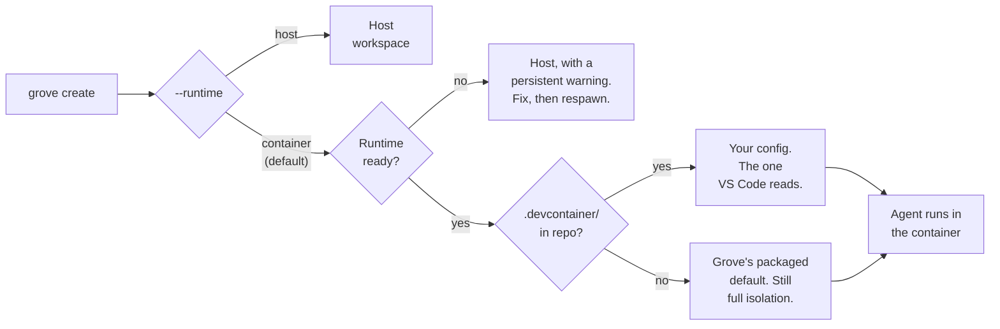

# Containerized agents

## Give each agent an isolated environment

A container workspace gives one agent its own stack. Docker in Docker, a database, services, ports, none of them yours.

<video preload="auto" poster="../img/posters/devcontainer-still.png">
  <source src="../videos/3-grove-devcontainer.mp4" type="video/mp4" />
</video>

## Agents in their own stack

- You own the repo, in committed `.devcontainer/` and Grove config.
- Grove owns the boundary.
- The agent runtime owns the work, ungated.
- Twenty agents spawning tests and builds turn into a number you set, instead of a saturated machine.

## Host or container

Runtime is a per workspace choice, so two workspaces in one repo can differ.

| Run on the host when | Put it in a container when |
|---|---|
| One or two agents, sharing your machine like any program. | Twenty agents spawning sub agents, tests, and builds with no ceiling. |
| You approve tool calls as they come. | Permissions off, so the blast radius has to be the workspace. |
| One environment, already on your machine. | Dev and test stacks side by side, with their own services and ports. |
| Fastest start, your credentials, your `PATH`, nothing to build. | The environment your `.devcontainer/` describes, the one VS Code teammates read. |

## What the container is for

- Permission prompts are the host's safety mechanism. The container is the mechanism for `claude --dangerously-skip-permissions` or Codex full auto.
- The reachable set shrinks to the worktree, the mounts and the nested docker daemon. Not another workspace, not your dotfiles, not the host engine.
- It is a blast radius boundary, not a credential boundary. Under the default `share: full` your credentials are mounted in, so set `share: isolated` for an untrusted repository.

## How the runtime gets chosen

Grove selects the runtime at creation.



- Container is the configured default, and every create surface shows the choice.
- A repo with a `.devcontainer/` gets its own config, the one VS Code reads. A repo without one gets Grove's packaged default, still isolated.
- A missing Docker or devcontainer CLI is caught before Grove touches the filesystem. The workspace lands on the host with a warning naming the remedy, and `grove respawn` promotes it later.
- An explicit `--runtime host` is your decision, so Grove never promotes on its own.

## Where your code lands

Grove bind mounts the worktree instead of cloning it, so the container edits the same files your host sees.

- The default container path is `/workspaces/<worktree-directory-name>`, and that is the agent's working directory.
- Your own `workspaceFolder` wins when the devcontainer sets one, and Grove translates the paths the CLI reports.

```json title=".devcontainer/devcontainer.json"
"workspaceMount": "source=${localWorkspaceFolder},target=${localWorkspaceFolder},type=bind",
"workspaceFolder": "${localWorkspaceFolder}"
```

!!! tip "Why a linked worktree still works"

    A worktree's `.git` is a file pointing outside it, so Grove also binds
    the shared git directory at its identical host path with
    `GIT_COMMON_DIR` set. Those are the only two host paths it preserves.

## Sessions outlive your terminal

The agent runs under tmux inside the container, not your host tmux, so your host session is only a viewport.

- Detach, close the terminal, restart the daemon, or let your host tmux die. The container owns the terminal and the work continues.
- `grove attach` returns you mid task with its scrollback, and `grove respawn` rebuilds the viewport, not the agent.
- A detached workspace stays observable, since peek, the webapp terminal and steering read its own pane.
- `grove shell WORKSPACE` goes straight to a prompt inside the container, trying the shells in `container.shell` in order.
- Grove brings its own static tmux and terminfo when the image ships none, the same way it brings `iptables`.

## Reading the container status line

Grove bind mounts read only terminal assets at `/grove/decor`, so attach shows a status bar instead of bare default chrome.

| Behavior | Detail |
|---|---|
| Vocabulary follows your terminal's fonts | Nerd Font icons by default. Set `GROVE_STATUSLINE_GLYPHS=ascii` for words instead. |
| Figures come from the container's own cgroup, not the host | `/proc/loadavg` isn't namespaced. The bundled script reads cgroup CPU and memory limits, with a v1 fallback. |
| An absent segment means an absent fact, not a bug | An API-key login has no quota pools, so that segment is absent, not zero. |
| Toggles: `container.decor.enabled`, `.statusline`, `.tmux_conf`, `.payload` | Turn pieces off or replace the bundle. A host workspace already has your own. |

## Several agents in one container

A workspace runs one agent. For a second, say a reviewer reading what the first wrote, start it in the same container.

- `grove agent add WORKSPACE --agent codex --name reviewer` gives it its own persistent tmux session, only when you ask.
- `grove agent list`, `attach`, `peek`, `message` and `kill` manage them.
- They share the worktree, branch and container, which is the point and the caveat. Two agents editing the same files collide like two people would.
- A host workspace holds one agent only.

## Opening it in VS Code

`grove code WORKSPACE` opens VS Code's editor inside the container.

- Source stays on the bind mount and build artifacts stay in the container's own volumes.
- The editor's server runs inside too, so a container built `node_modules` never confuses a host language server.
- Cursor and VSCodium cannot open it this way, since Dev Containers is proprietary. `grove shell` and `grove attach` are the way in.

## Start from the devcontainer you already have

A repository devcontainer is used as it stands, and `grove doctor` checks the tools it needs.

```
grove create "fix login" --agent claude                      # configured default
grove create "fix login" --agent claude --runtime container
grove create "fix login" --agent claude --runtime host
```

## Getting secrets and environment in

Choose one source for container secrets.

```
container.env_file: ".env.grove"                    # pick one
container.env_command: "./scripts/print-secrets.sh" # or the other
```

| Fact | Detail |
|---|---|
| Two knobs, mutually exclusive | `env_file` loads a dotenv file (repo relative, absolute, or `~` expanded). `env_command` parses a host command's stdout as dotenv, so a secret never touches disk. |
| Any command printing `KEY=value` works | `container.env_command: "acme-secrets export --format=dotenv --project=my-app"`. |
| Two entry points | `--secrets-file` reaches `postCreateCommand`/`postStartCommand`. `--remote-env` reaches the agent. |
| Precedence, lowest to highest | Telemetry, `env_file`/`env_command`, agent config sharing, agent's own `env`. |
| A committed layer can't set `env_command` | It would run an arbitrary command on anyone who clones the repo. Use `.grove/config.local.json`. |
| A committed `env_file` loads inside the repo only | An absolute path, or one escaping the repo, is ignored. |

## Extending the environment

A container workspace accepts the devcontainer specification.

| Tier | Mechanism | Cost | What belongs here |
|---|---|---|---|
| 0 | `build` or a `Dockerfile` | minutes, rare | OS packages and language runtimes |
| 1 | `features` | cached layers | reusable toolchains pulled from a registry |
| 2 | `postCreateCommand` | once per container | dependency sync such as `uv sync` or `npm ci` |
| 3 | `postStartCommand` | every start, seconds | env seeding, trust, reachability checks |

`grove init devcontainer` scaffolds the default, and the later tiers are where frequent changes belong.

!!! tip "Your image needs `iproute2`. Grove brings its own `iptables`."

    The egress allowlist is a firewall inside the container, and a missing
    tool aborts the start rather than leave an unfirewalled workspace. Grove
    mounts its own `iptables` at `/grove/netfilter` when your image ships
    none, but supplies no `ip`, so `python:*-slim` and `node:*` images need
    `apt-get install -y iproute2`. The alternative is `container.egress.mode = "open"`.

## Setting the limits

Three settings control sharing, network access, and resources.

```
container.agent_config.share: full | projects | isolated   # default: full
container.egress.mode: allowlist | open | deny             # default: allowlist
container.resources: { memory: "8g", cpus: 4, pids: 2048 }
```

| Value | What the agent sees | When to use it |
|---|---|---|
| `full` | Sign-in, skills, commands, project memory. Works like the host. | The default. Trusted repositories. |
| `projects` | Transcripts only. No sign-in, no skills. | History persists without sharing credentials. |
| `isolated` | A separate Grove-owned config directory, with its own sign-in. | An untrusted repository. |

| Fact | Detail |
|---|---|
| Claude Code plugins cross as a read only seed | Anything installed lands in the workspace's own plugin directory, never on your host. |
| Workspace folder stamped trusted before the container starts | The first-run trust dialog is a prompt nobody answers. `container.agent_config.trust: false` restores it. |
| Egress allowlist is derived | From the agent's plane, your registries, your git remote, and Grove's plane. Ordinary development needs none. |
| `container.egress.allow` entries are hostnames or CIDRs | Resolved once at start, so wildcards don't work. List the hosts you reach, or set `mode: open`. |
| A container started outside Grove reads unprovisioned | Until you respawn, since the firewall runs from `postStartCommand`. |
| Resources apply to every service the workspace runs | Take effect next launch. Default is uncapped. |

!!! danger "A blast radius boundary, not a credential boundary"

    Under `share: full` an agent fed a hostile prompt could use your token
    as you. The egress allowlist bounds where a token can go, and Grove
    seeds `~/.claude.json` per workspace so an MCP rewrite attack dies with
    the workspace. For an untrusted repository, set `share: isolated`.

## Grove init scripts and container hooks

A [Grove init script](configure-init-scripts.md) prepares the host worktree first, then the devcontainer's own hooks run inside. `init_script.applies_to: "host"` stops it running twice when your hooks already install what it would. `all` is the default and `container` is the other value.

## Configuration reference

| Field | Default | Meaning |
|---|---|---|
| `container.enabled` | `true` | Cascade default for `runtime`. |
| `container.docker_bin` | `docker` | Container CLI Grove shells out to. |
| `container.shell` | `["bash", "sh"]` | Shells `grove shell` tries, in order. |
| `container.tmux.enabled` | `true` | Agent under in-container tmux. `false` is a bare exec, no persistence. |
| `container.tmux.prefer_image` | `true` | Prefer the image's own tmux. |
| `container.tmux.payload` | unset | Directory with a supplied `bin/<arch>/tmux` and `terminfo/`. |
| `container.tmux.session` | `agent` | Agent's session. Renaming orphans a live agent. |
| `container.tmux.shell_session` | `shell` | Session `grove shell` attaches to. |
| `container.tmux.term_fallback` | `xterm-256color` | `TERM` retried on a refused attach. Empty disables it. |
| `container.default_config` | packaged default | `devcontainer.json` for a repo with none. |
| `container.decor.enabled` | `true` | Mount and compose the terminal chrome. |
| `container.decor.statusline` | `true` | Statusline into the agent's settings. |
| `container.decor.tmux_conf` | `true` | Grove's tmux config into the container. |
| `container.decor.payload` | unset | Host assets replacing the bundled ones. |
| `container.agent_config.share` | `full` | `full`, `projects`, or `isolated`. |
| `container.agent_config.trust` | `true` | Folder seeded trusted, `.mcp.json` servers approved. |
| `container.env_file` | unset | Dotenv file loaded into container and agent. |
| `container.env_command` | unset | Host command printing dotenv. Excludes `env_file`. |
| `container.egress.mode` | `allowlist` | `allowlist`, `open`, or `deny`. |
| `container.egress.allow` | derived | Extra hosts and CIDRs on the allowlist. |
| `container.resources.memory` | uncapped | Memory limit, for example `8g`. |
| `container.resources.cpus` | uncapped | CPU limit, for example `4`. |
| `container.resources.pids` | uncapped | Process count limit. |
| `container.up_timeout_seconds` | `900` | Seconds before a container counts as failed. |

Full schema on the [configuration reference](configure-reference.md) page.

## See also

- [Workspace lifecycle](features-workspace-lifecycle.md) covers `respawn`.
- [CLI](use-cli.md) lists the container commands.
