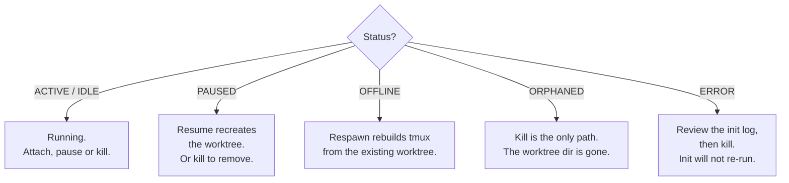

# Status semantics

## The three status axes

Grove tracks three signals.

- **Workspace status**. Worktree on disk, tmux up, pane output.
- **Agent activity**. Tool loop, turn handed back, blocked.
- **Task phase**. How far through, scoping through done.

A workspace can be ACTIVE while its agent is WAITING while it reports
`verifying`, all three at once, and an orchestrator watching twenty
workspaces needs all three. Status is a persisted intent (what Grove
was last told to make true) plus a computed view (what is actually
true), reconciled at one site, named below.

## The spectrum

Colors and glyphs match the running TUI, sourced from
[`src/grove/tui/theme.py`](https://github.com/bearlike/Grove/blob/current/src/grove/tui/theme.py).

<div class="grove-status-grid" markdown>

<div class="grove-status-chip" data-status="active">
  <span class="grove-status-chip__glyph">●</span>
  <div class="grove-status-chip__text">
    <p class="grove-status-chip__label">Active</p>
    <p class="grove-status-chip__body">Session up. Pane output within the activity threshold.</p>
  </div>
</div>

<div class="grove-status-chip" data-status="idle">
  <span class="grove-status-chip__glyph">◐</span>
  <div class="grove-status-chip__text">
    <p class="grove-status-chip__label">Idle</p>
    <p class="grove-status-chip__body">Session up. Pane quiet past the threshold.</p>
  </div>
</div>

<div class="grove-status-chip" data-status="paused">
  <span class="grove-status-chip__glyph">‖</span>
  <div class="grove-status-chip__text">
    <p class="grove-status-chip__label">Paused</p>
    <p class="grove-status-chip__body">Worktree removed, branch retained. <code>R</code> resumes.</p>
  </div>
</div>

<div class="grove-status-chip" data-status="offline">
  <span class="grove-status-chip__glyph">○</span>
  <div class="grove-status-chip__text">
    <p class="grove-status-chip__label">Offline</p>
    <p class="grove-status-chip__body">Session vanished externally. <code>o</code> respawns from the worktree.</p>
  </div>
</div>

<div class="grove-status-chip" data-status="orphaned">
  <span class="grove-status-chip__glyph">⊘</span>
  <div class="grove-status-chip__text">
    <p class="grove-status-chip__label">Orphaned</p>
    <p class="grove-status-chip__body">Worktree directory missing. No respawn. <code>k</code> only.</p>
  </div>
</div>

<div class="grove-status-chip" data-status="error">
  <span class="grove-status-chip__glyph">✗</span>
  <div class="grove-status-chip__text">
    <p class="grove-status-chip__label">Error</p>
    <p class="grove-status-chip__body">Init failed with <code>fail_fast: false</code>. Review the log. <code>k</code> only.</p>
  </div>
</div>

</div>

## Two domains, one enum

`WorkspaceStatus` is a single enum that carries both kinds of values:

- **Persisted**, survives restarts. `RUNNING`, `PAUSED`, `ERROR`.
  `create()`/`resume()` write `RUNNING`, `pause()` writes `PAUSED`, init
  failure with `fail_fast: false` writes `ERROR`.
- **Computed**, derived from intent plus world state. `ACTIVE`, `IDLE`,
  `OFFLINE`, `ORPHANED`, `PROVISIONING`. `JsonWorkspaceStore.save`
  rejects any other value, a defense in depth.

## What each status means

| Status | Domain | Meaning |
|---|---|---|
| **`RUNNING`** | persisted | Last write said "should be running". |
| **`ACTIVE`**  | computed  | RUNNING, activity within `activity_threshold_seconds`. |
| **`IDLE`**    | computed  | RUNNING, no recent activity. |
| **`OFFLINE`** | computed  | RUNNING, tmux gone. Respawn recovers it. |
| **`ORPHANED`**| computed  | RUNNING, worktree gone. Not recoverable, kill only. |
| **`PROVISIONING`** | computed | Container mid build. Wait, don't respawn or kill. |
| **`PAUSED`**  | persisted | Worktree removed, branch kept. Resume re-creates it. |
| **`ERROR`**   | persisted | Init failed with `fail_fast: false`. Review the log, then kill. |

## The single reconcile site

`WorkspaceManager._reconcile_status` is the only site promoting a
persisted intent into a computed view. Every consumer (`list()`,
`peek()`, `peek_pane()`, `attach()`, `respawn()`) calls it, so a new
computed status extends this method, never call sites.

Order matters. A gone session always reports `OFFLINE`, even worktree
gone too, since ORPHANED is more severe and runs first.

1. `PAUSED`/`ERROR` persisted, return as is.
2. Worktree missing, `ORPHANED`.
3. tmux missing, `OFFLINE`.
4. Activity below threshold, `ACTIVE`.
5. Otherwise, `IDLE`.

## Recovery decision tree



The footer enforces this mapping, dimming keys that do not apply to the
current row. The rule is data, not branches, in `screens/list.py`.

## Legacy values

Older state files sometimes carry a `stale` value no longer in the
enum. The decoder coerces it back to the intent that produced it,
usually `RUNNING`, so old files load with no migration.

## The other axis: agent activity

Workspace status answers "is this container running", nothing about
the agent inside. That axis is read agent-agnostically from the agent's
own transcript, not tmux output, as `AgentActivityState` in
`grove.core.agents`, rendered by every client from
`grove.core.contracts.agent_palette`.

| Agent state | Meaning |
|---|---|
| **`STARTING`** | Session id known, transcript not yet on disk. |
| **`WORKING`** | In the tool loop or mid response. |
| **`WAITING`** | Turn ended. May need you. |
| **`BLOCKED`** | A permission or input prompt is open. |
| **`IDLE`** | Session alive but quiet. |
| **`ERROR`** | Parse error, process error, or a failed run. |
| **`UNKNOWN`** | Unreadable or suppressed, for example a generic agent with no adapter. |

The two axes are orthogonal and happen together constantly. An agent
prints its final message (ACTIVE) then waits for you (WAITING). The
[Activity Dashboard](features-activity.md) shows both at once.
[Agents](configure-agents.md) covers each kind's adapter.

## The third axis: task phase

Neither status nor activity state says how far through the *job* the
agent is. Task phase is its own report, telling "still reading the
ticket" from "opening the PR" with no transcript.

Six ordered, converging phases, not a one-way bar:

| Phase | Meaning |
|---|---|
| `scoping` | Reading the ticket and code, scoping the job. |
| `planning` | Understands the problem, choosing an approach. |
| `implementing` | Editing files. |
| `verifying` | Running tests, linters, the build, reviewing its own diff. |
| `delivering` | Committing, pushing, opening or updating the PR. |
| `done` | Handed off. |

Moving backwards is a correct report, not an error. If `verifying`
shows the design was wrong, the honest next report is `planning` again.
No phase reported is its own distinct state, not "step zero" of
`scoping`, just that the agent has said nothing yet.

### How an agent reports

An agent reports its phase by writing the file Grove names in the
launch environment as `GROVE_PHASE_FILE`.

```json
{"phase": "implementing", "note": "wiring the parser"}
```

- Grove composes the path, since a worktree can host several agents.
  Each gets a distinct file under `.grove/phase/`, never overwritten.
- No variable set falls back to `.grove/phase.json` at the worktree top.
- `note` is optional, under 200 characters, no timestamp. Grove reads
  the file's mtime.
- Excluded from git automatically, and a malformed file is ignored
  silently, never surfaced as an error.
- Working several attached tickets at once? Add a `tickets` map keyed
  `provider:id`; each entry is that ticket's own claim, published to
  that ticket's own comment, independent of the workspace's.
- `blocked` is a flag beside a phase, at either level, never a seventh
  phase: it says the agent is stuck on the step, not which step.

Writing a file, not calling an API, is deliberate. A containerized
agent reaches neither the loopback bound daemon nor the absent `grove`
CLI. The bind mounted worktree makes a written file visible on the host
at once, for any harness, with no workspace id to know.

### Convenience surfaces

The file is the only channel guaranteed everywhere. A host workspace
gets three more optional surfaces.

- **CLI**: `grove phase <phase> --note "..."`, inferring the workspace
  from your directory like `grove show`. Add `--ticket provider:id` to
  scope the claim to one attached ticket, or `--blocked` to flag the
  current step as stuck.
  [CLI: `grove phase`](use-cli.md#grove-phase).
- **MCP**: `grove_set_workspace_phase` and `grove_get_workspace_phase`.
  [MCP tools](use-mcp.md#tools).
- **Daemon**: `POST`/`GET /workspaces/{id}/phase`, called by the web
  dashboard and MCP server.

### Where it shows up

The phase renders wherever Grove shows workspace state, the TUI card,
the web dashboard's workspace card, and, for a ticket-linked workspace,
the sticky comment ([issue-ops](issue-ops.md)), as dot progress with
the latest note:

```
●●●○○○ Verifying (4/6) — running make lint
```

## See also

- [Workspace lifecycle](features-workspace-lifecycle.md): each op's writes.
- [The peek rail](features-peek.md): activity feeding ACTIVE, IDLE.
- [Agent activity and sessions](features-activity.md): the other axis.
- [Issue ops](issue-ops.md): the sticky comment's dot progress.
- [Daily workflow](use-workflow.md): a vanished session.
