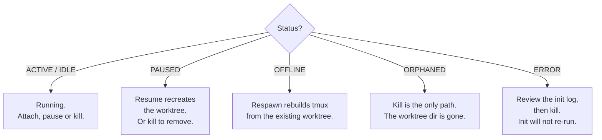

# Status semantics

## Read the state of your fleet

Grove shows workspace status, agent activity, and task phase so you can see what needs attention.

<div class="grove-status-grid" markdown>

<div class="grove-status-chip" data-status="active">
  <span class="grove-status-chip__glyph">●</span>
  <div class="grove-status-chip__text">
    <p class="grove-status-chip__label">Active</p>
    <p class="grove-status-chip__body">Session up. Pane output within the activity threshold.</p>
  </div>
</div>

<div class="grove-status-chip" data-status="idle">
  <span class="grove-status-chip__glyph">◐</span>
  <div class="grove-status-chip__text">
    <p class="grove-status-chip__label">Idle</p>
    <p class="grove-status-chip__body">Session up. Pane quiet past the threshold.</p>
  </div>
</div>

<div class="grove-status-chip" data-status="paused">
  <span class="grove-status-chip__glyph">‖</span>
  <div class="grove-status-chip__text">
    <p class="grove-status-chip__label">Paused</p>
    <p class="grove-status-chip__body">Worktree removed, branch retained. <code>R</code> resumes.</p>
  </div>
</div>

<div class="grove-status-chip" data-status="offline">
  <span class="grove-status-chip__glyph">○</span>
  <div class="grove-status-chip__text">
    <p class="grove-status-chip__label">Offline</p>
    <p class="grove-status-chip__body">Session vanished externally. <code>o</code> respawns from the worktree.</p>
  </div>
</div>

<div class="grove-status-chip" data-status="orphaned">
  <span class="grove-status-chip__glyph">⊘</span>
  <div class="grove-status-chip__text">
    <p class="grove-status-chip__label">Orphaned</p>
    <p class="grove-status-chip__body">Worktree directory missing. No respawn. <code>k</code> only.</p>
  </div>
</div>

<div class="grove-status-chip" data-status="error">
  <span class="grove-status-chip__glyph">✗</span>
  <div class="grove-status-chip__text">
    <p class="grove-status-chip__label">Error</p>
    <p class="grove-status-chip__body">Init failed with <code>fail_fast: false</code>. Review the log. <code>k</code> only.</p>
  </div>
</div>

</div>

## The three status axes

- Workspace status tells you whether the worktree and session are ready.
- Agent activity tells you whether the agent is working, waiting, blocked, idle, or in error.
- Task phase tells you how far the agent has reached in the job.
- A workspace can be ACTIVE while its agent is WAITING and its task phase is `verifying`.

## The spectrum

- The chips use the running TUI palette from [`src/grove/tui/theme.py`](https://github.com/bearlike/Grove/blob/current/src/grove/tui/theme.py).
- ACTIVE and IDLE mean the session is up, with recent output deciding which one you see.
- PAUSED keeps the branch and removes the worktree, while OFFLINE keeps the worktree and needs a respawn.
- ORPHANED has no worktree to recover, and ERROR needs log review before you remove it.

## What each status means

| Status | Domain | Meaning |
|---|---|---|
| **`RUNNING`** | persisted | Grove last recorded that the workspace should run. |
| **`ACTIVE`**  | computed  | RUNNING, activity within `activity_threshold_seconds`. |
| **`IDLE`**    | computed  | RUNNING, no recent activity. |
| **`OFFLINE`** | computed  | RUNNING, tmux gone. Respawn recovers it. |
| **`ORPHANED`**| computed  | RUNNING, worktree gone. Not recoverable, kill only. |
| **`PROVISIONING`** | computed | Container mid build. Wait, do not respawn or kill. |
| **`PAUSED`**  | persisted | Worktree removed, branch kept. Resume recreates it. |
| **`ERROR`**   | persisted | Init failed with `fail_fast: false`. Review the log, then kill. |

- RUNNING, PAUSED, and ERROR record the last lifecycle action.
- ACTIVE, IDLE, OFFLINE, ORPHANED, and PROVISIONING describe the workspace now.
- Wait while a container is PROVISIONING instead of respawning or killing it.
- Older saved `stale` values load as the intent that produced them, usually RUNNING.

## The other axis: agent activity

| Agent state | Meaning |
|---|---|
| **`STARTING`** | Session id known, transcript not yet on disk. |
| **`WORKING`** | In the tool loop or mid response. |
| **`WAITING`** | Turn ended. May need you. |
| **`BLOCKED`** | A permission or input prompt is open. |
| **`IDLE`** | Session alive but quiet. |
| **`ERROR`** | Parse error, process error, or a failed run. |
| **`UNKNOWN`** | Unreadable or suppressed, for example a generic agent with no adapter. |

- Agent activity is independent of workspace status.
- An agent can finish output while the workspace remains ACTIVE and the agent becomes WAITING.
- The [Activity Dashboard](features-activity.md) shows workspace status and agent activity together.
- [Agents](configure-agents.md) explains the activity states for each agent kind.

## The third axis: task phase

Task phase reports job progress without requiring you to read the transcript.

| Phase | Meaning |
|---|---|
| `scoping` | Reading the ticket and code, scoping the job. |
| `planning` | Understands the problem, choosing an approach. |
| `implementing` | Editing files. |
| `verifying` | Running tests, linters, the build, reviewing its own diff. |
| `delivering` | Committing, pushing, opening or updating the PR. |
| `done` | Handed off. |

- An agent can return from `verifying` to `planning` when verification changes the approach.
- No reported phase is distinct from `scoping` and means the agent has not reported yet.
- An agent writes its phase to the file named by `GROVE_PHASE_FILE`.

```json
{"phase": "implementing", "note": "wiring the parser"}
```

- Each agent gets a separate phase file, while a missing variable uses `.grove/phase.json`.
- The file works for container workspaces, and a host workspace can also use [CLI: `grove phase`](use-cli.md#grove-phase) or [MCP tools](use-mcp.md#tools).
- The TUI, web dashboard, and ticket comment from [issue-ops](issue-ops.md) show the latest phase and note.
- A `blocked` flag marks the current phase as stuck without adding another phase.

## Recovery decision tree

Use the action named for the status you see.



- Attach, pause, or kill an ACTIVE or IDLE workspace.
- Resume a PAUSED workspace to recreate its worktree.
- Respawn an OFFLINE workspace from its existing worktree.
- Kill an ORPHANED workspace or an ERROR workspace after reviewing its log.

## See also

- [Workspace lifecycle](features-workspace-lifecycle.md) explains each lifecycle action.
- [The peek rail](features-activity.md#the-peek-rail) explains the activity behind ACTIVE and IDLE.
- [Agent activity and sessions](features-activity.md) covers the agent axis.
- [Issue ops](issue-ops.md) explains task phase in ticket comments.
- [Daily workflow](use-workflow.md) helps when a session vanishes.
