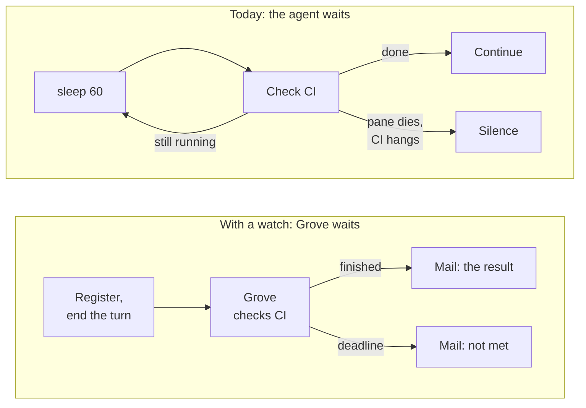

# Watches

## Stop sleeping, start waiting

An agent waiting on a CI run has had one option: sleep in a loop and check again. That costs a process and a terminal for as long as the wait lasts, it dies without a word if the pane dies, and nothing survives a daemon restart — so the agent waits forever for something that will never arrive.

A watch is the durable replacement. The agent says what it is waiting for, stops, and Grove delivers the outcome as ordinary mail when it settles.

## Before and after

The difference is who does the waiting. Today the agent waits, and a watch hands the waiting to Grove.



| | A sleep loop today | A watch |
|---|---|---|
| While it waits | The agent holds a turn, a process and a pane, and every check costs tokens | The turn has ended. One scheduler for the whole host does the checking |
| If CI hangs | The loop runs until somebody notices | The deadline passes and the agent is told the condition was not met |
| If the pane or daemon restarts | The loop dies and the result is lost | The watch is saved to disk and picks up where it left off |
| When it settles | Only a loop that is still running sees it | The result arrives as mail, even in an idle session |
| Many agents waiting | Each one adds its own process and polling | They share one timer, so waiting is free |

## How it behaves

- Register a watch and **end the turn**. When the thing settles, the callback arrives through the [mailbox](features-catalog.md) and the agent picks up where it left off.
- If the deadline passes first, the expiry is delivered too — so stopping is always safe. There is no case where an agent halts and hears nothing back, which is the guarantee a sleep loop cannot make.
- The callback is a self-contained message, not a ping. It may reach a fresh turn with no memory of the registration, so it carries what happened and where to look.
- One scheduler serves the whole host. Nothing runs while nothing is due, and a hundred pending watches cost one timer between them — waiting is free.
- A watch outlives a restart. The registry is durable, and recovered watches re-arm spread across their interval rather than all firing at once.

## What you can wait for

| Predicate | Settles when | Typical use |
|---|---|---|
| `ci` | Every check on a commit has concluded | A pushed branch before opening a PR |
| `timer` | A wall-clock instant arrives | A durable `sleep` |
| `cmd` | A command exits with a status you name | Anything Grove does not model |
| `ticket` | Never: it reports each change and keeps watching | Registered by Grove for you, below |

## Changes to your attached tickets

Attach an issue or pull request to a running workspace, and Grove tells the agent whenever a person changes it:

- A new title, a close, reopen or merge, a draft marked ready, an edited description, or a new comment arrives as one message listing each change.
- Nobody registers this, and it lasts exactly as long as the workspace runs. Detaching the ticket, or pausing or killing the workspace, stops it.
- Grove's own writes never count. Its status comment, its badge footer, its assignment and anything its bot account posts are left out of what is compared, so its progress updates cannot wake the agent in a loop.
- Each ticket is read at most once a minute, however many workspaces are attached to it. The status comment reuses the same read.
- The Watches card in the web dashboard lists each ticket watch as "Watching while the workspace runs", and `grove watch ls` shows them too.

`ci` is keyed on the commit SHA, never a branch name: a force-push makes a different commit, and a watch that followed the name would answer about work nobody asked about.

## Using it

```bash
grove watch ci <commit-sha> --owner <owner> --repo <repo> --deadline 45
grove watch timer 20
grove watch cmd -- <command>
grove watch ls
grove watch cancel <id>
```

Over MCP the same three verbs are `grove_register_watch`, `grove_list_watches` and `grove_cancel_watch`. The recipient defaults to the calling workspace, read from `GROVE_PHASE_FILE`, exactly as the mailbox does — so an agent registers for itself without knowing its own id.

## What a callback does and does not say

A delivered callback means Grove handed the message to that session's transport. It is not evidence that a model read it or acted on it — the same contract every mailbox receipt carries.

A ticket watch stays `pending` for as long as its workspace runs, and ends `cancelled` when the ticket is detached or the workspace pauses or ends. Every other watch ends in one of four states: `fired` (it settled and the callback went out), `expired` (the deadline came first), `cancelled` (withdrawn), or `undeliverable` (it settled, but the recipient was no longer live to be told). `grove watch ls` shows all of them, including recently settled ones, because that record is also what stops a restart from delivering the same callback twice.

## Limits

- Checks run **at most every 15 seconds**. A faster interval is refused: nothing real settles quicker, and a fleet of impatient watches is a rate-limit incident on somebody else's forge.
- **Every watch an agent waits on has a deadline, and the agent chooses it** — up to a day. A ticket watch has none, because nobody waits on it. When it passes, the agent is messaged that the condition was not met, so no watch can leave a session stalled.
- With no deadline set, `ci` and `cmd` give up after **15 minutes**; a timer defaults to its own time. Pass `--deadline` for anything you expect to take longer, such as a full CI run.
- A failure to reach a forge is never read as a result. "I could not tell" and "it failed" are different answers, and only the second one is ever delivered.
