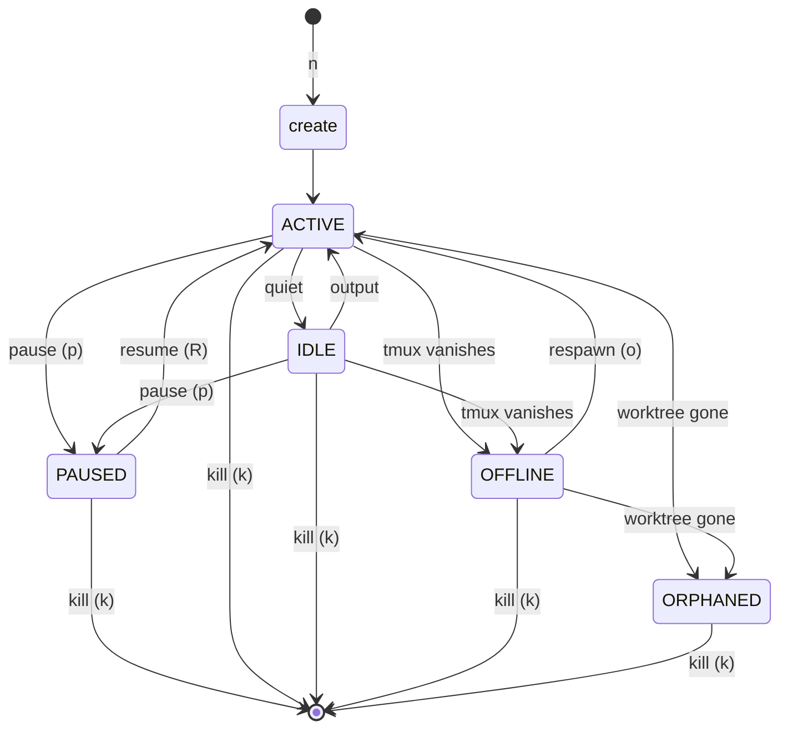

# Workspace lifecycle

Every Grove workspace passes through the same small set of operations.
This page covers what each one touches and what each one deliberately
does not.

<figure class="ms-shot">
  

  <figcaption class="ms-shot__body">Four workspaces, four lifecycle moments. Active and idle on top. The offline row offers <code>o</code> (respawn) and <code>k</code> (kill).</figcaption>
</figure>

## Four operations and a recovery path

| Op | Branch | Worktree | tmux session | Init script |
|---|---|---|---|---|
| **create** (`n`)  | created or attached | created | created | runs if `enabled: true` |
| **pause** (`p`)   | kept | **removed** | killed | n/a |
| **resume** (`R`)  | kept | recreated from branch | recreated | re-runs only if `run_on_resume: true` |
| **kill** (`k`)    | deleted (Grove-created default; user-attached default keeps it) | removed | killed | n/a |
| **respawn** (`o`) | kept | **must exist** | recreated | not re-run by default |

`create`, `pause`, `resume`, and `kill` are the four lifecycle verbs the
operator drives directly. `respawn` is a recovery path for the specific
case where the tmux session vanished externally but the worktree is
intact.

The table above describes the default shape, where each workspace gets
its own worktree. A workspace can also run in the repo root instead. See
[root workspaces](#root-workspaces) for how that changes the picture.

## Why pause refuses dirty worktrees

`pause` removes the worktree, which would silently lose any uncommitted
work. Grove refuses. The lifecycle method raises a typed
`DirtyWorktreeError`. The TUI surfaces a flash message that names the
dirty paths. The fix is yours: commit, stash, or push, then pause.

This is the same principle that keeps Grove out of `git commit` and
`git push`. The user owns the code's lifecycle, and Grove owns the
workspace's lifecycle. The two sit alongside each other and do not
share a verb.

## Why kill never touches remotes

`kill` deletes the local branch by default when Grove created it. It
does not touch remotes. There is no flag that opts in. Remote branches
are deleted with `git push --delete`, which uses your push credentials
and your access policy. That belongs in your shell, with the rest of the
team-policy machinery (CI, branch protection, code review) that Grove
sits below.

The provenance details that decide which local branch gets deleted by
default live in [branch provenance](features-branch-provenance.md).

## Root workspaces

Most workspaces get a private worktree under `.worktrees`, like a clean
bench cloned from your repo. A root workspace skips that. It runs the
agent and the tmux session in the repo root itself, on whatever branch
you already have checked out.

Pick "Root" in the create modal when you want an agent working in place
rather than in an isolated copy. There is no worktree to set up and no
branch to create. Grove manages only the tmux session.

Because the working directory is your real repo and the branch is your
live checkout, Grove never removes either. `kill` stops the session and
forgets the record. It does not delete the directory, and it does not
delete the branch, even if you ask it to. Your git stays yours.

Root workspaces support a smaller set of verbs: create, kill, and
respawn. Pause and resume do not apply, because there is no worktree to
free or rebuild. If the session vanishes, `respawn` brings it back. A
root workspace is never orphaned, because the repo root is always there.

The init script is built to bootstrap a fresh worktree, so it can be
unwanted in your real repo root. The create modal checks "Skip init
script" for you when you pick Root. Uncheck it if you do want the script
to run this time. The checkbox is also available in every other mode,
for the times a worktree simply does not need its init step.

Two agents in two root workspaces share one directory and one branch.
Grove allows it, and the call is yours. Two agents editing the same
files at once can step on each other, so reach for root when you want
one agent in place, and reach for worktrees when you want isolation.

## Recovery from a vanished session

A tmux session can disappear without notice. A terminal restarts, a host
reboots, or someone runs `tmux kill-server`. The worktree on disk does
not move; it stays exactly where it was.

When this happens, Grove's reconciler promotes the workspace from
RUNNING to OFFLINE on the next list refresh. The footer offers exactly
two keys: `o` (respawn) and `k` (kill). `respawn` rebuilds the tmux
session from scratch with the same windows and the same agent command.
The workspace returns to ACTIVE.

If the worktree directory is also gone (someone deleted it manually),
the workspace is ORPHANED. There is nothing to respawn against. `kill`
is the only path forward.

## Side effects live at the edges

Grove's manager reads no config file directly and shells out to nothing.
Two modules carry every side effect. `grove/core/git.py` wraps the five
`git` subcommands the lifecycle needs. `grove/core/tmux.py` wraps
`libtmux`. Everything else (branch resolution, cascade merging, state
reconciliation, init-outcome capture) is pure logic that runs against
in-memory data.

The manager is testable without git or tmux binaries. The side-effect
modules are testable with real binaries behind an integration marker.
New I/O concerns belong in those two files, or a third side-effect
module. They should not be scattered across the codebase. See
[architecture](develop-architecture.md) for the full boundary diagram.
