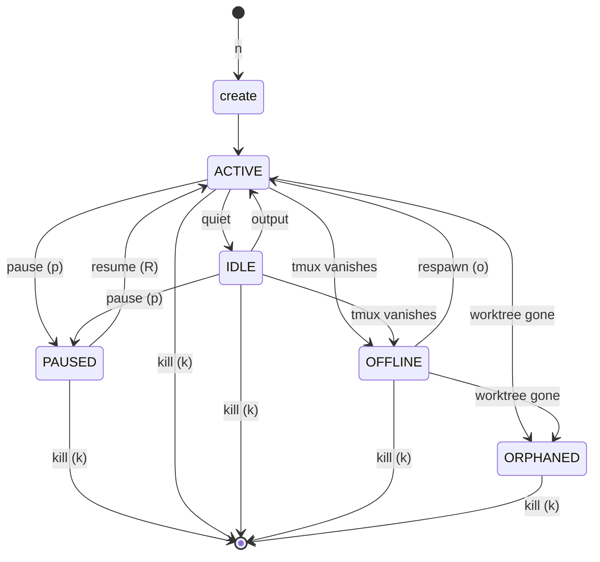

# Workspace lifecycle

## Every verb and its effect

Every Grove workspace passes through the same small set of operations. This
page covers what each touches and what it deliberately does not.

<figure class="ms-shot">
  

  <figcaption class="ms-shot__body">Four workspaces, four lifecycle moments. Active and idle on top. The offline row offers <code>o</code> (respawn) and <code>k</code> (kill).</figcaption>
</figure>

## Four operations and a recovery path

```mermaid
stateDiagram-v2
    [*] --> create : n
    create --> ACTIVE
    ACTIVE --> IDLE : quiet
    IDLE --> ACTIVE : output
    ACTIVE --> PAUSED : pause (p)
    IDLE --> PAUSED : pause (p)
    PAUSED --> ACTIVE : resume (R)
    ACTIVE --> OFFLINE : tmux vanishes
    IDLE --> OFFLINE : tmux vanishes
    OFFLINE --> ACTIVE : respawn (o)
    ACTIVE --> ORPHANED : worktree gone
    OFFLINE --> ORPHANED : worktree gone
    PAUSED --> [*] : kill (k)
    ACTIVE --> [*] : kill (k)
    IDLE --> [*] : kill (k)
    OFFLINE --> [*] : kill (k)
    ORPHANED --> [*] : kill (k)
```

| Op | Branch | Worktree | tmux session | Init script |
|---|---|---|---|---|
| **create** (++n++)  | created or attached | created | created | runs if `enabled: true` |
| **pause** (++p++)   | kept | **removed** | killed | n/a |
| **resume** (++shift+r++)  | kept | recreated from branch | recreated | re-runs only if `run_on_resume: true` |
| **kill** (++k++)    | deleted if Grove-created, kept if user-attached | removed | killed | n/a |
| **respawn** (++o++) | kept | **must exist** | recreated | not re-run by default |

`create`, `pause`, `resume` and `kill` are the four verbs you drive directly.
`respawn` recovers a vanished tmux session over an intact worktree, and
`attach` opens an interactive session into a running workspace.

Every verb reaches the same engine and behaves identically across the
[TUI](use-tui.md), [CLI](use-cli.md), [web dashboard](use-webapp.md) and
[MCP server](use-mcp.md): one lifecycle, four front doors, one shared store.

The table describes the default shape, one worktree per workspace, though a
workspace can also run in the [repo root](#root-workspaces).

## Why pause refuses dirty worktrees

`pause` removes the worktree, which would silently lose uncommitted work, so
Grove refuses before any side effect runs. A refused pause really is a
no-op: the lifecycle method raises a typed `WorkspaceStateError`, and the TUI
warns with the count of uncommitted changes. Commit, stash, or push, then
pause, or `grove pause --force` to discard them on purpose.

The same principle keeps Grove out of `git commit` and `git push`. You own
the code's lifecycle, Grove owns the workspace's, and the two share no verb.

## Why kill never touches remotes

`kill` deletes the local branch by default when Grove created it, and never
touches remotes. No flag opts in. A remote branch is deleted with
`git push --delete`, using your own credentials and shell, alongside the CI,
branch protection and review machinery Grove sits below.

[Branch provenance](features-branch-provenance.md) decides which local
branch gets deleted by default.

## Root workspaces

Most workspaces get a private worktree under `.worktrees`, a clean bench
cloned from your repo. A root workspace skips that, running the agent and
tmux session in the repo root on whatever branch you already have checked
out. Pick "Root" in the create modal. Grove manages only the tmux session:
no worktree, no branch.

| Aspect | In a root workspace |
|---|---|
| Ownership | Your working directory and branch are your real, live checkout, so Grove never removes either. `kill` stops the session and forgets the record, even if asked to remove more. Your git stays yours |
| Verb set | Only create, kill and respawn apply. Pause and resume do not, since there is no worktree to free or rebuild. `respawn` brings a vanished session back, and a root workspace is never orphaned, since the repo root is always there |
| Init script | Often unwanted against a real repo root, so the create modal checks "Skip init script" for you on Root. Uncheck it to run anyway. The checkbox is available in every mode |
| Sharing | Two agents in two root workspaces can share one directory and branch, which Grove allows, though editing the same files can make them collide. Reach for root for one agent in place, worktrees for isolation |

## Recovery from a vanished session

A tmux session can disappear without notice: a terminal restart, a host
reboot, or a `tmux kill-server`. The worktree on disk does not move, and
Grove's reconciler promotes the workspace from RUNNING to OFFLINE on the next
refresh. The footer offers ++o++ (respawn) and ++k++ (kill). `respawn`
rebuilds the tmux session from scratch with the same windows and agent
command, back to ACTIVE. If the worktree is also gone, the workspace is
ORPHANED, and `kill` is the only path.

A [container workspace](features-containers.md) reads this differently,
since its agent was never in the host session. A vanished host session costs
only the viewport, so Grove asks the container before calling it OFFLINE,
and `respawn` rebuilds the session around the agent still running.

## Side effects live at the edges

Grove's manager touches no config file and shells out to nothing directly.
Two modules carry every side effect:
[`src/grove/core/git.py`](repo:src/grove/core/git.py) wraps the five `git`
subcommands the lifecycle needs, and
[`src/grove/core/tmux.py`](repo:src/grove/core/tmux.py) wraps `libtmux`.
Everything else, branch resolution, cascade merging, state reconciliation,
init-outcome capture, is pure logic against in-memory data.

The manager tests without git or tmux binaries, and the side-effect modules
test with real ones behind an integration marker. New I/O concerns belong in
those two files, or a third, never scattered across the codebase. See
[architecture](develop-architecture.md) for the full boundary diagram.
