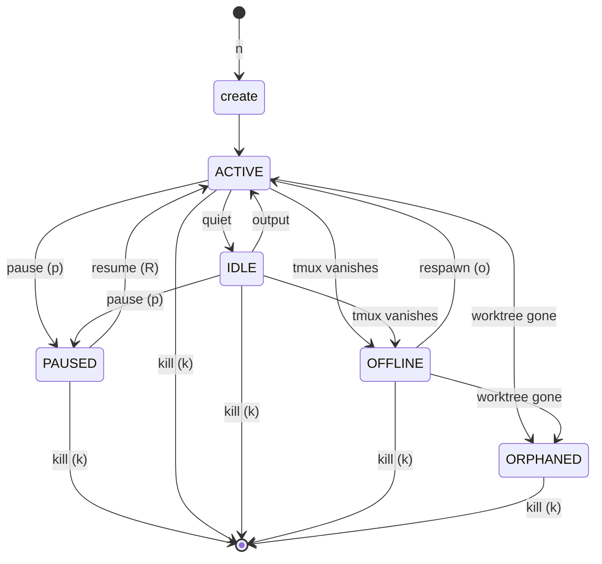

# Workspace lifecycle

## Start, pause and recover your work

Every Grove workspace passes through the same small set of operations, and every verb behaves identically across the [TUI](use-tui.md), [CLI](use-cli.md), [web dashboard](use-webapp.md) and [MCP server](use-mcp.md).

<figure class="ms-shot">
  

  <figcaption class="ms-shot__body">Four workspaces, four lifecycle moments. Active and idle on top. The offline row offers <kbd>o</kbd> (respawn) and <kbd>k</kbd> (kill).</figcaption>
</figure>

## Four operations and a recovery path

```mermaid
stateDiagram-v2
    [*] --> create : n
    create --> ACTIVE
    ACTIVE --> IDLE : quiet
    IDLE --> ACTIVE : output
    ACTIVE --> PAUSED : pause (p)
    IDLE --> PAUSED : pause (p)
    PAUSED --> ACTIVE : resume (R)
    ACTIVE --> OFFLINE : tmux vanishes
    IDLE --> OFFLINE : tmux vanishes
    OFFLINE --> ACTIVE : respawn (o)
    ACTIVE --> ORPHANED : worktree gone
    OFFLINE --> ORPHANED : worktree gone
    PAUSED --> [*] : kill (k)
    ACTIVE --> [*] : kill (k)
    IDLE --> [*] : kill (k)
    OFFLINE --> [*] : kill (k)
    ORPHANED --> [*] : kill (k)
```

| Op | Branch | Worktree | tmux session | Init script |
|---|---|---|---|---|
| **create** (++n++)  | created or attached | created | created | runs if `enabled: true` |
| **pause** (++p++)   | kept | **removed** | killed | n/a |
| **resume** (++shift+r++)  | kept | recreated from branch | recreated | re-runs only if `run_on_resume: true` |
| **kill** (++k++)    | deleted if Grove-created, kept if user-attached | removed | killed | n/a |
| **respawn** (++o++) | kept | **must exist** | recreated | not re-run by default |

- `create`, `pause`, `resume` and `kill` are the four verbs you drive. `respawn` recovers a vanished tmux session over an intact worktree.
- `pause` refuses a dirty worktree before any side effect runs. Commit, stash or push first, or `grove pause --force` to discard on purpose.
- You own the code's lifecycle, Grove owns the workspace's, and the two share no verb. Grove never commits or pushes.
- `kill` deletes the local branch only when Grove created it, per [Branch provenance](features-branch-provenance.md), and never touches a remote.
- A workspace can also run in the [repo root](#root-workspaces) with no worktree.

## Recovery from a vanished session

A terminal restart, a host reboot or a `tmux kill-server` can take the session without notice. The worktree does not move.

- The workspace reads OFFLINE on the next refresh, and `respawn` rebuilds the tmux session with the same agent command, back to ACTIVE.
- If the worktree is also gone the workspace is ORPHANED and `kill` is the only path.
- A [container workspace](features-containers.md) loses only its viewport, since the agent was never in the host session, and `respawn` rebuilds it around the agent still running.

## Root workspaces

Pick **Root** in the create modal and the agent runs in the repo root on the branch you already have checked out. Grove manages only the tmux session.

- Grove never removes your working directory or branch. `kill` stops the session and forgets the record. Your git stays yours.
- Only create, kill and respawn apply, and a root workspace is never orphaned.
- The modal checks **Skip init script** for you on Root. Uncheck it to run anyway.
- Two root workspaces sharing one directory collide like two people would. Root is for one agent in place, worktrees for isolation.

## Where the side effects live

Two modules carry every side effect, [`src/grove/core/git.py`](repo:src/grove/core/git.py) and [`src/grove/core/tmux.py`](repo:src/grove/core/tmux.py). Everything else is pure logic. See [architecture](develop-architecture.md).
