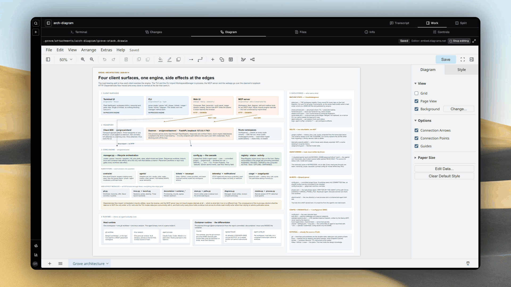
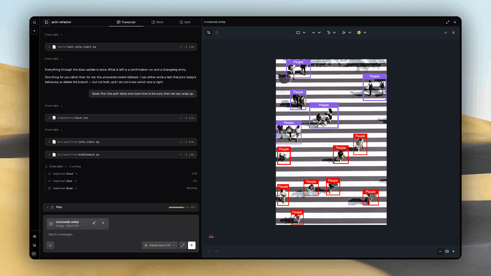

  
Grove · workspaces for AI coding agents

  <h1 class="ms-hero__title">Run a forest of coding agents</h1>
  

    Twenty agents, twenty isolated workspaces, and you never lose your place. Grove does not touch
    your agent. It owns everything around it, and every workspace reports to the ticket you filed.
  

  

    <a class="ms-btn ms-btn--primary" href="getting-started/">
      <iconify-icon icon="lucide:download" width="18" height="18" aria-hidden="true"></iconify-icon>
      Install &amp; first workspace
    </a>
    <a class="ms-btn ms-btn--secondary" href="use-tui/">
      <iconify-icon icon="lucide:compass" width="18" height="18" aria-hidden="true"></iconify-icon>
      Take the tour
    </a>
    <a class="ms-btn ms-btn--ghost" href="https://github.com/bearlike/Grove">
      <iconify-icon icon="lucide:github" width="18" height="18" aria-hidden="true"></iconify-icon>
      Source on GitHub
    </a>
  

  
    <iconify-icon class="ms-pill__icon" icon="lucide:bot" width="14" height="14" aria-hidden="true"></iconify-icon>
    Bring your agents
  
  
    <iconify-icon class="ms-pill__icon" icon="lucide:users" width="14" height="14" aria-hidden="true"></iconify-icon>
    Shared team configuration
  
  
    <iconify-icon class="ms-pill__icon" icon="lucide:container" width="14" height="14" aria-hidden="true"></iconify-icon>
    Isolated agent workspaces
  
  
    <iconify-icon class="ms-pill__icon" icon="lucide:ticket" width="14" height="14" aria-hidden="true"></iconify-icon>
    Issue driven workflows
  
  
    <iconify-icon class="ms-pill__icon" icon="lucide:pencil-ruler" width="14" height="14" aria-hidden="true"></iconify-icon>
    Shared diagrams and annotations
  
  
    <iconify-icon class="ms-pill__icon" icon="lucide:activity" width="14" height="14" aria-hidden="true"></iconify-icon>
    Agent activity monitoring
  

  

    

      <figure>
        
        <figcaption>Start here. Describe the task, pick the agent and runtime, and a workspace opens around it.</figcaption>
      </figure>
    

    

      <figure>
        
        <figcaption>CLI. Every command and live value completes in your shell, from agent models to workspace ids.</figcaption>
      </figure>
    

    

      <figure>
        
        <figcaption>Terminal fleet. Create, attach, pause and steer beside a live peek at the selected agent.</figcaption>
      </figure>
    

    

      <figure>
        
        <figcaption>Activity dashboard. Every project on one wall, sized by which workspace needs you.</figcaption>
      </figure>
    

    

      <figure>
        
        <figcaption>Issue ops. The phase, checklist and pull request stay current on the ticket that started the work.</figcaption>
      </figure>
    

    

      <figure>
        
        <figcaption>Containerized agents. One complete stack per workspace, built from the repository's own devcontainer.</figcaption>
      </figure>
    

    

      <figure>
        
        <figcaption>Workspace detail. Read the transcript and inspect the branch, runtime, tickets and diff without attaching.</figcaption>
      </figure>
    

    

      <figure>
        
        <figcaption>Diagrams. An agent draws a mockup or an architecture spec in draw.io, Grove validates the XML, you approve the picture.</figcaption>
      </figure>
    

    

      <figure>
        
        <figcaption>Annotation. Paste a screenshot, box what matters, and the agent is handed the marked-up copy.</figcaption>
      </figure>
    

    

      <figure>
        
        <figcaption>Session catalog. Search every recorded agent session on the host, including work Grove did not launch.</figcaption>
      </figure>
    

    

      <figure>
        
        <figcaption>Usage. Subscription windows, burn rate and a year of tokens, cost and latency from local transcripts.</figcaption>
      </figure>
    

    

      <figure>
        
        <figcaption>MCP. Claude Code, Codex and other orchestrators can create workspaces and steer the fleet themselves.</figcaption>
      </figure>
    

    

      <figure>
        
        <figcaption>Telemetry. Every turn can become one trace with model generations, tool calls, latency and cost.</figcaption>
      </figure>
    

    

      <figure>
        
        <figcaption>Web fleet. Reach every workspace from any device, sorted by the one that needs you.</figcaption>
      </figure>
    

  

  

  

  

## What is Grove? { .ms-h2-icon data-icon="target" }

- **Writing the code stopped being the slow part.** Deciding what to build did. More agents can build in parallel but shared checkouts cause conflicts and laptops limit capacity. Grove adds IDE tools around those agents without replacing them. It manages their workspaces and runtimes and gives you tools to guide their work.
- **Give each task its own workspace.** Each agent gets its own worktree and branch in a separate window. Agents report progress phases for the workspace and each attached ticket independently. You can see what is being planned, built or verified across the fleet.
- **Choose how each agent runs.** Run agents on your host with the environment they normally inherit. Or use a [container](features-containers.md) defined by your repository's `.devcontainer/`. It provides separate services and ports with resource limits. Use that isolation for runs with agent permission checks disabled.
- **Choose where the work runs.** Tests, builds and scripts compete for CPU and memory across concurrent workspaces. Move those workloads off your laptop when it slows down. Reuse the container configuration on a shared team machine or serverless cloud infrastructure.
- **Let the tracker start the work.** Assign an issue and Grove starts a workspace for it. Progress returns to [the same ticket](issue-ops.md). Follow the task where you defined it.
- **Show it instead of describing it.** Mark up a [screenshot](features-attachments.md) or collaborate with the agent on a [diagram](features-diagrams.md). Approve the diagram or mockup and attach it to a ticket. Then coordinate your fleet around it.

## Choose your surface { .ms-h2-icon data-icon="route" }

Every workspace is reachable from all four.

<a class="ms-card" href="use-tui/">
  
    <iconify-icon icon="lucide:terminal" width="20" height="20" aria-hidden="true"></iconify-icon>
  
  Terminal
  Manage multiple coding agents without leaving your terminal. Switch between workspaces and inspect live output to see which agent needs you.
</a>
<a class="ms-card" href="use-webapp/">
  
    <iconify-icon icon="lucide:layout-panel-top" width="20" height="20" aria-hidden="true"></iconify-icon>
  
  Web dashboard
  Manage your agents from any device and track their transcripts and task progress. Review diagrams and annotate screenshots to show what needs changing.
</a>
<a class="ms-card" href="issue-ops/">
  
    <iconify-icon icon="lucide:ticket" width="20" height="20" aria-hidden="true"></iconify-icon>
  
  Your tracker
  Delegate work from Linear, GitHub or Gitea without opening another tool. Assign an issue to start a workspace and follow its phase and checklist on the same ticket.
</a>
<a class="ms-card" href="use-mcp/">
  
    <iconify-icon icon="lucide:plug" width="20" height="20" aria-hidden="true"></iconify-icon>
  
  Another agent
  Give an orchestrating agent the tools to delegate across isolated workspaces. Through MCP it can launch agents, inspect their progress and send follow ups while you retain oversight.
</a>

## What you get { .ms-h2-icon data-icon="grid" }

Built for the founder or lead who wants a whole team running agents the same way, and able to see what every one of them did.

  <a class="ms-card" href="features-cascade/">
    
      <iconify-icon icon="lucide:layers" width="20" height="20" aria-hidden="true"></iconify-icon>
    
    Shared configuration
    A committed <code>.grove/config.json</code> carries the agents, models, setup and container policy every workspace starts from. Each engineer overrides locally, and a workspace picks its own model without touching the shared file.
  </a>
  <a class="ms-card" href="features-telemetry/">
    
      <iconify-icon icon="lucide:waypoints" width="20" height="20" aria-hidden="true"></iconify-icon>
    
    Agent monitoring
    Every turn becomes one trace with its model calls, tool calls, latency and cost, in Langfuse or any OTLP backend. Usage, subscription windows and a year of spend come from transcripts on your own disk.
  </a>
  <a class="ms-card" href="features-containers/">
    
      <iconify-icon icon="lucide:box" width="20" height="20" aria-hidden="true"></iconify-icon>
    
    Isolated containers
    Each agent runs in the repository's own devcontainer with resource and egress ceilings, so permissions off is safe and twenty agents cannot saturate one machine. Sessions survive restarts and re-adopt on their own.
  </a>
  <a class="ms-card" href="features-diagrams/">
    
      <iconify-icon icon="lucide:pencil-ruler" width="20" height="20" aria-hidden="true"></iconify-icon>
    
    Shared diagrams
    A UI mockup or an architecture spec lives as one draw.io file both of you edit, with revision checks. Grove validates the XML and you approve the picture before code exists.
  </a>
  <a class="ms-card" href="features-attachments/">
    
      <iconify-icon icon="lucide:image-plus" width="20" height="20" aria-hidden="true"></iconify-icon>
    
    Image annotation
    Drop a screenshot or a file into either composer, draw on the image, and the agent is handed a path inside its own worktree. The day to day handoffs your agent harness leaves out.
  </a>
  <a class="ms-card" href="use-mcp/">
    
      <iconify-icon icon="lucide:plug" width="20" height="20" aria-hidden="true"></iconify-icon>
    
    Remote access
    The same fleet from a terminal, a browser on any device, a tracker comment, or another agent over MCP. One daemon on loopback, a pairing handshake, and push notifications when an agent needs you.
  </a>

## From first workspace to a whole fleet { .ms-h2-icon data-icon="route" }

Start with one agent, share your setup with the team and choose how you manage the work.

  

    
Install

    

      
Set up Grove and launch your first isolated workspace.

      <ul class="ms-step__links">
        <li><a href="getting-started/">Get Started</a></li>
        <li><a href="getting-started/#prerequisites">Prerequisites</a></li>
        <li><a href="configure-project/">Project setup</a></li>
        <li><a href="troubleshooting/">Troubleshooting</a></li>
      </ul>
    

  

  

    
Configure

    

      
Choose your agents and share workspace defaults across the team.

      <ul class="ms-step__links">
        <li><a href="configure-agents/">Agents and models</a></li>
        <li><a href="configure-init-scripts/">Init scripts</a></li>
        <li><a href="issue-ops/">Issue ops</a></li>
        <li><a href="configure-reference/">Configuration reference</a></li>
      </ul>
    

  

  

    
Use

    

      
Run your fleet and follow its work from the surface that suits you.

      <ul class="ms-step__links">
        <li><a href="use-tui/">Terminal tour</a></li>
        <li><a href="use-cli/">CLI commands</a></li>
        <li><a href="use-webapp/">Web dashboard</a></li>
        <li><a href="use-mcp/">MCP server</a></li>
      </ul>
    

  

  

    
Capabilities

    

      
Contain each agent's environment and make its work easier to review.

      <ul class="ms-step__links">
        <li><a href="features-catalog/">Capability catalog</a></li>
        <li><a href="features-containers/">Containerized agents</a></li>
        <li><a href="features-diagrams/">Diagram collaboration</a></li>
        <li><a href="features-attachments/">Attachments and annotation</a></li>
      </ul>
    

  

  

    
Developers

    

      
Build on Grove's public API or contribute to the engine and its clients.

      <ul class="ms-step__links">
        <li><a href="develop-architecture/">Architecture</a></li>
        <li><a href="develop-public-api/">Public API</a></li>
        <li><a href="develop-principles/">Engineering principles</a></li>
        <li><a href="develop-contributing/">Contributing</a></li>
      </ul>
    

  

