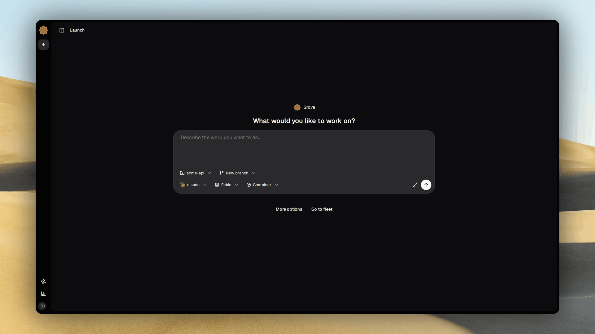
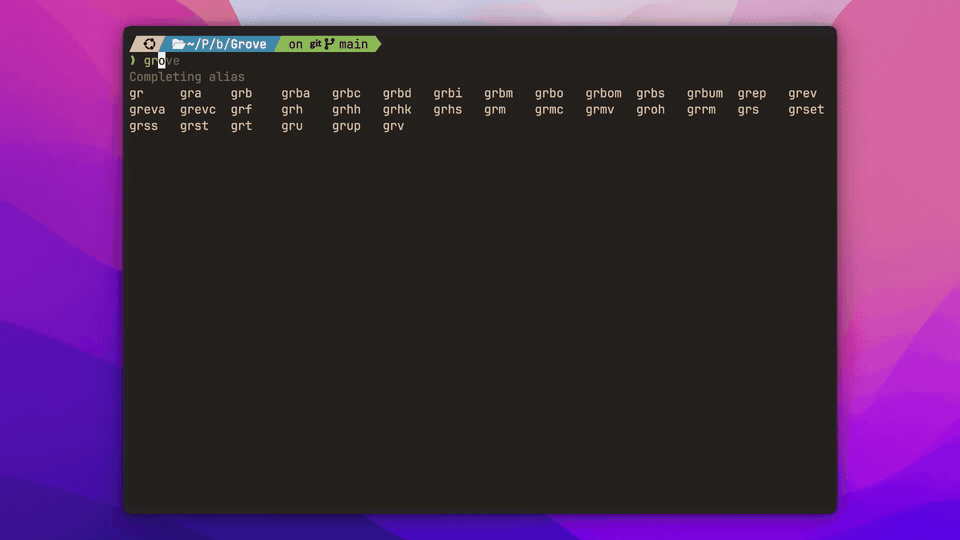
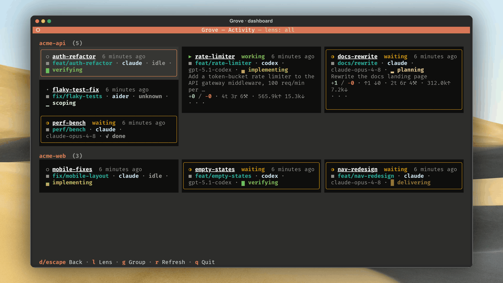
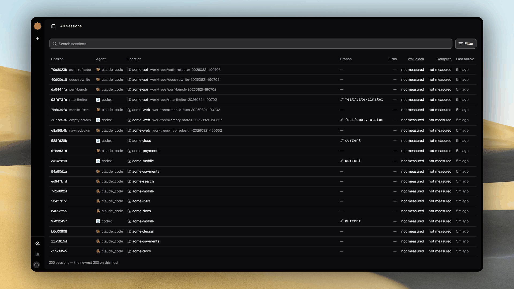
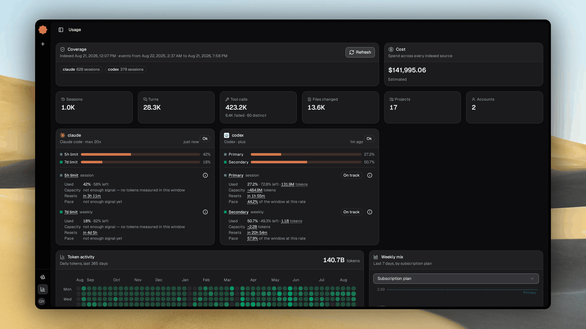
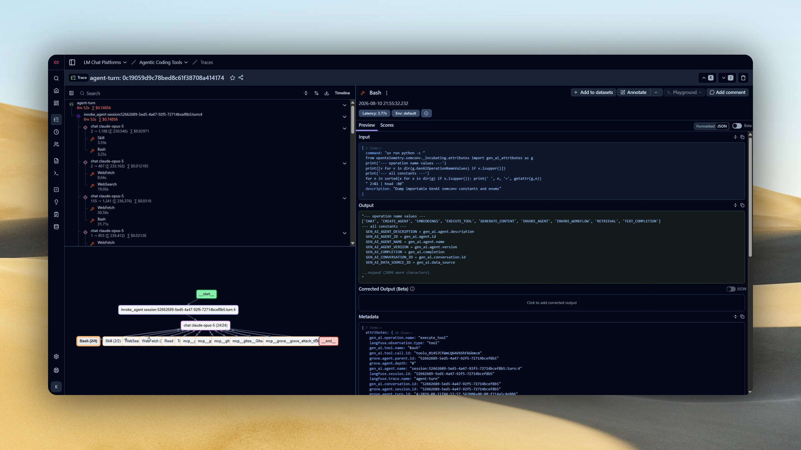

<div class="ms-hero">
  <p class="ms-hero__eyebrow">Grove · workspaces for AI coding agents</p>
  <h1 class="ms-hero__title">Run a forest of coding agents</h1>
  <p class="ms-hero__lede">
    Twenty agents, twenty isolated workspaces, and you never lose your place. Grove does not touch
    your agent. It owns everything around it, and every workspace reports to the ticket you filed.
  </p>
  <div class="ms-cta-row">
    <a class="ms-btn ms-btn--primary" href="getting-started/">Install &amp; first workspace</a>
    <a class="ms-btn ms-btn--secondary" href="use-tui/">Take the tour</a>
    <a class="ms-btn ms-btn--ghost" href="https://github.com/bearlike/Grove">Source on GitHub</a>
  </div>
</div>

<div class="ms-pills" aria-label="What makes Grove different">
  <span class="ms-pill">
    <iconify-icon class="ms-pill__icon" icon="lucide:git-branch" width="14" height="14" aria-hidden="true"></iconify-icon>
    One agent, one worktree, one window
  </span>
  <span class="ms-pill">
    <iconify-icon class="ms-pill__icon" icon="lucide:box" width="14" height="14" aria-hidden="true"></iconify-icon>
    Containers by default
  </span>
  <span class="ms-pill">
    <iconify-icon class="ms-pill__icon" icon="lucide:ticket" width="14" height="14" aria-hidden="true"></iconify-icon>
    Work arrives from your tracker
  </span>
  <span class="ms-pill">
    <iconify-icon class="ms-pill__icon" icon="lucide:smartphone" width="14" height="14" aria-hidden="true"></iconify-icon>
    Terminal, browser, or another agent
  </span>
  <span class="ms-pill">
    <iconify-icon class="ms-pill__icon" icon="lucide:check-check" width="14" height="14" aria-hidden="true"></iconify-icon>
    Claude Code and Codex
  </span>
</div>

<div class="swiper ms-shots">
  <div class="swiper-wrapper">
    <div class="swiper-slide">
      <figure>
        
        <figcaption>Start here. Describe the task, pick the agent and runtime, and a workspace opens around it.</figcaption>
      </figure>
    </div>
    <div class="swiper-slide">
      <figure>
        
        <figcaption>CLI. Every command and live value completes in your shell, from agent models to workspace ids.</figcaption>
      </figure>
    </div>
    <div class="swiper-slide">
      <figure>
        
        <figcaption>Terminal fleet. Create, attach, pause and steer beside a live peek at the selected agent.</figcaption>
      </figure>
    </div>
    <div class="swiper-slide">
      <figure>
        
        <figcaption>Activity dashboard. Every project on one wall, sized by which workspace needs you.</figcaption>
      </figure>
    </div>
    <div class="swiper-slide">
      <figure>
        
        <figcaption>Issue ops. The phase, checklist and pull request stay current on the ticket that started the work.</figcaption>
      </figure>
    </div>
    <div class="swiper-slide">
      <figure>
        
        <figcaption>Containerized agents. One complete stack per workspace, built from the repository's own devcontainer.</figcaption>
      </figure>
    </div>
    <div class="swiper-slide">
      <figure>
        
        <figcaption>Workspace detail. Read the transcript and inspect the branch, runtime, tickets and diff without attaching.</figcaption>
      </figure>
    </div>
    <div class="swiper-slide">
      <figure>
        
        <figcaption>Session catalog. Search every recorded agent session on the host, including work Grove did not launch.</figcaption>
      </figure>
    </div>
    <div class="swiper-slide">
      <figure>
        
        <figcaption>Usage. Subscription windows, burn rate and a year of tokens, cost and latency from local transcripts.</figcaption>
      </figure>
    </div>
    <div class="swiper-slide">
      <figure>
        
        <figcaption>MCP. Claude Code, Codex and other orchestrators can create workspaces and steer the fleet themselves.</figcaption>
      </figure>
    </div>
    <div class="swiper-slide">
      <figure>
        
        <figcaption>Telemetry. Every turn can become one trace with model generations, tool calls, latency and cost.</figcaption>
      </figure>
    </div>
    <div class="swiper-slide">
      <figure>
        
        <figcaption>Web fleet. Reach every workspace from any device, sorted by the one that needs you.</figcaption>
      </figure>
    </div>
  </div>
  <div class="swiper-pagination"></div>
  <div class="swiper-button-prev"></div>
  <div class="swiper-button-next"></div>
</div>

## What is Grove? { .ms-h2-icon data-icon="target" }

Each agent gets a **workspace** of its own. One git worktree, one branch, one tmux window, and by
default a container.

Two agents in one checkout otherwise overwrite each other's files and fight over one branch. Grove
passes your tool's flags through untouched and manages everything around it.

## Choose your surface { .ms-h2-icon data-icon="route" }

Every workspace is reachable from all four.

<div class="ms-grid ms-grid--4">
<a class="ms-card" href="use-tui/">
  <span class="ms-card__icon">
    <iconify-icon icon="lucide:terminal" width="20" height="20" aria-hidden="true"></iconify-icon>
  </span>
  <span class="ms-card__title">Terminal</span>
  <span class="ms-card__body">Create, attach, pause and kill in one keypress, beside a live peek rail.</span>
</a>
<a class="ms-card" href="use-webapp/">
  <span class="ms-card__icon">
    <iconify-icon icon="lucide:layout-panel-top" width="20" height="20" aria-hidden="true"></iconify-icon>
  </span>
  <span class="ms-card__title">Web dashboard</span>
  <span class="ms-card__body">The whole fleet in one grid, from any device.</span>
</a>
<a class="ms-card" href="issue-ops/">
  <span class="ms-card__icon">
    <iconify-icon icon="lucide:ticket" width="20" height="20" aria-hidden="true"></iconify-icon>
  </span>
  <span class="ms-card__title">Your tracker</span>
  <span class="ms-card__body">Assign an issue on Linear, GitHub or Gitea and a workspace starts.</span>
</a>
<a class="ms-card" href="use-mcp/">
  <span class="ms-card__icon">
    <iconify-icon icon="lucide:plug" width="20" height="20" aria-hidden="true"></iconify-icon>
  </span>
  <span class="ms-card__title">Another agent</span>
  <span class="ms-card__body">Claude Code and Codex steer workspaces themselves, over MCP.</span>
</a>
</div>

## The ticket you filed is the ticket you check { .ms-h2-icon data-icon="flow" }

A workspace treats its issue as the spec. One comment, rewritten as the work moves, carries the agent's
phase, what it has finished and the pull request it opened.

## What you get { .ms-h2-icon data-icon="grid" }

<div class="ms-grid ms-grid--3">
  <a class="ms-card" href="features-containers/">
    <span class="ms-card__icon">
      <iconify-icon icon="lucide:box" width="20" height="20" aria-hidden="true"></iconify-icon>
    </span>
    <span class="ms-card__title">A stack per agent</span>
    <span class="ms-card__body">Docker in Docker, so permissions off bounds the blast radius.</span>
  </a>
  <a class="ms-card" href="use-webapp/#working-in-a-session">
    <span class="ms-card__icon">
      <iconify-icon icon="lucide:columns-3" width="20" height="20" aria-hidden="true"></iconify-icon>
    </span>
    <span class="ms-card__title">Transcript, terminal, diff</span>
    <span class="ms-card__body">Steer while it works, answer questions inline, watch the diff grow.</span>
  </a>
  <a class="ms-card" href="use-webapp/">
    <span class="ms-card__icon">
      <iconify-icon icon="lucide:sliders-horizontal" width="20" height="20" aria-hidden="true"></iconify-icon>
    </span>
    <span class="ms-card__title">A model per workspace</span>
    <span class="ms-card__body">Each agent exposes its own catalog. Cheap for scaffolding, strong for the refactor.</span>
  </a>
  <a class="ms-card" href="features-cascade/">
    <span class="ms-card__icon">
      <iconify-icon icon="lucide:layers" width="20" height="20" aria-hidden="true"></iconify-icon>
    </span>
    <span class="ms-card__title">Principles, versioned</span>
    <span class="ms-card__body">One committed config carries agents, setup and container policy. Six layers override it locally.</span>
  </a>
  <a class="ms-card" href="features-workspace-lifecycle/">
    <span class="ms-card__icon">
      <iconify-icon icon="lucide:rotate-ccw" width="20" height="20" aria-hidden="true"></iconify-icon>
    </span>
    <span class="ms-card__title">Session recovery</span>
    <span class="ms-card__body">Sessions re-adopt across daemon restarts. A stale pointer remaps in a click.</span>
  </a>
  <a class="ms-card" href="features-notifications/">
    <span class="ms-card__icon">
      <iconify-icon icon="lucide:bell" width="20" height="20" aria-hidden="true"></iconify-icon>
    </span>
    <span class="ms-card__title">Push notifications</span>
    <span class="ms-card__body">Get pinged when an agent finishes a turn or needs an answer.</span>
  </a>
</div>

## Install { .ms-h2-icon data-icon="plug" }

Grove needs `git`, `tmux`, and Docker for a container workspace. It installs as `grove` on your PATH.

```bash
uv tool install "grove[daemon] @ git+https://github.com/bearlike/Grove"
uv tool upgrade grove        # update on demand

cd path/to/your/repo
grove config init            # scaffold .grove/config.json
grove                        # launch the TUI
```

No uv? See [Get Started](getting-started.md) for `pipx`, `pip` and every install path.

## Explore the docs { .ms-h2-icon data-icon="book" }

<div class="ms-grid ms-grid--3">
  <a class="ms-card" href="getting-started/">
    <span class="ms-card__title">Get Started</span>
    <span class="ms-card__body">Install and first run.</span>
  </a>
  <a class="ms-card" href="use-tui/">
    <span class="ms-card__title">Use</span>
    <span class="ms-card__body">TUI, CLI, web dashboard, pairing, workflow.</span>
  </a>
  <a class="ms-card" href="configure-project/">
    <span class="ms-card__title">Configure</span>
    <span class="ms-card__body">Projects, agents, init scripts, the cascade.</span>
  </a>
  <a class="ms-card" href="features-containers/">
    <span class="ms-card__title">Capabilities</span>
    <span class="ms-card__body">Containers, lifecycle, issue ops, notifications.</span>
  </a>
  <a class="ms-card" href="develop-architecture/">
    <span class="ms-card__title">Developer reference</span>
    <span class="ms-card__body">Architecture, public API, contributing.</span>
  </a>
</div>
