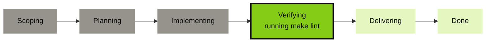

# Issue ops

## Drive agents from an issue

Comment `@grove fix the flaky test` on an issue and your own self-hosted Grove agent picks it up. One sticky
comment on the ticket rewrites itself in place for the life of the session, carrying the agent's
[task phase](features-status.md#the-third-axis-task-phase), a live todo checklist, the tickets it touches,
and a link to the workspace. Attach the pull request with `grove tickets attach` and the same comment
appears there too, each copy keeping its own identity so a failure on one never disturbs the other.

A follow-up comment steers that same running agent, because Grove's executor is a long-lived tmux session
your daemon owns rather than a CI job that dies with the workflow.



Finished phases go gray, the current one wears a heavy outline, and everything ahead stays pale. The same
progress reads as one line of text too, so nothing is lost where diagrams do not render.

```
**Phase** ●●●●○○ Verifying (4/6) — running make lint

**Checklist**
- [x] Reproduce the flaky test
- [x] Add a retry-free fix
- [ ] Run the suite 20x to confirm

**Tracking**
- Issue #42 — open
- Pull request #43 — merged
- Open workspace
```

Both forges draw the diagram natively, with no extension to install. An agent that has never reported a
phase gets no diagram at all, rather than an empty one. Not reporting is different from being at the start,
and Grove will not guess.

---

## How it works

1. You comment `@grove <task>`. A thin caller workflow, triggered on `issue_comment`, forwards the event.
2. Grove's composite action checks the commenter's permission, reacts 👀, and POSTs a normalized event to
   your daemon.
3. The engine resolves the repo, parses the command, and creates a workspace or steers the one already on
   this ticket, while a status publisher rewrites the sticky comment on the issue and on any linked pull
   request.


Only the first two steps run in CI. Everything after them runs inside your own daemon, on your own host.

---

## Setup: GitHub

The daemon [binds loopback by design](use-auth.md#the-security-model) with no blessed `--host 0.0.0.0`, so
GitHub's hosted runners cannot reach it. The caller needs a **self-hosted runner on the same host** as
`grove daemon serve`, registered under *Settings → Actions → Runners* with a label the caller pins to.

A minimal caller, copied from `docs/examples/`:

```yaml title=".github/workflows/grove-issue-ops.yml"
name: Grove issue-ops
on:
  issue_comment:
    types: [created]

jobs:
  grove:
    runs-on: [self-hosted, grove-host]   # pinned to the host running grove daemon serve
    steps:
      - uses: bearlike/Grove/actions/issue-ops@main
        with:
          daemon-url: ${{ vars.GROVE_DAEMON_URL }}
          daemon-token: ${{ secrets.GROVE_DAEMON_TOKEN }}
```

`GROVE_DAEMON_URL` is an **organization variable**, not a secret. It is only an address such as
`http://127.0.0.1:7421`, since runner and daemon share a host. `GROVE_DAEMON_TOKEN` is an **organization
secret**, so every caller reuses one pairing. The action is
[`actions/issue-ops/action.yml`](repo:actions/issue-ops/action.yml).

### Minting the daemon token

The token is a normal Grove session from the same human-gated
[pairing handshake](use-auth.md#the-handshake) the dashboard uses, and it is forge-agnostic.

```bash
# 1. Ask the daemon to start a pairing (run from anywhere that can reach it)
curl -s -X POST http://127.0.0.1:7421/auth/pair \
  -H 'content-type: application/json' -d '{"label":"issue-ops ci"}'
# {"challenge_id": "...", "code": "XXXX-XXXX", ...}

# 2. Approve it on the host, the same way you'd approve a new device
grove auth pending
grove auth approve <challenge-id>

# 3. Poll for the minted token (only returns it once, right after approval)
curl -s http://127.0.0.1:7421/auth/pair/<challenge-id>
# {"challenge_id": "...", "state": "consumed", "token": "grove_v1_...", ...}
```

Paste that `token` into `GROVE_DAEMON_TOKEN`. List it with `grove auth sessions` and revoke it with
`grove auth revoke <session-id>`.

---

## Setup: Gitea

Gitea's default `act_runner` job runs on an isolated Docker bridge network, and there is no
`host.docker.internal` on Linux, so it cannot reach host loopback either. Register a runner labelled
`:host`, act_runner's non-containerized mode, on the daemon's machine, and pin `runs-on` to that label.

The caller must live in `.gitea/workflows/`, **on the default branch**. Both forges load issue-event
workflows from there only, so a caller on a feature branch never fires.

```yaml title=".gitea/workflows/grove-issue-ops.yml"
name: Grove issue-ops
on:
  issue_comment:
    types: [created]

jobs:
  grove:
    runs-on: [host]
    permissions:
      issues: write
      pull-requests: write
    steps:
      - uses: https://gitea.example.com/bearlike/Grove/actions/issue-ops@main
        with:
          daemon-url: ${{ vars.GROVE_DAEMON_URL }}
          daemon-token: ${{ secrets.GROVE_DAEMON_TOKEN }}
```

Mint `GROVE_DAEMON_TOKEN` as [above](#minting-the-daemon-token). The full `https://gitea.example.com/...`
form in `uses:` is Gitea's absolute-URL extension, which lets one repo reference the action in another
without the newer, collaborative-owner `workflow_call` floor.

> [!WARNING] Version floors
> - **Gitea ≥ 1.21.6 is a hard requirement.** Earlier versions fire `issue_comment` only for comments on a
>   genuine issue, never on a pull request (go-gitea#29277). Below it, `@grove` in PR conversations has no
>   workaround.
> - **Gitea ≥ 1.26.0 in Restricted mode needs the `permissions:` block above.** Earlier versions parse it
>   and ignore it. 1.26.0 enforces it, and a Restricted-mode instance 403s an undeclared `issues: write`
>   (go-gitea#36173). Declaring it on an older instance is harmless.

---

## Commands

A command opens with the configured `trigger` (`@grove` by default) as the comment's first word, matched
case-insensitively at a word boundary, so `@grovebot` or a mid-sentence mention never fires. The trigger,
who may drive it, and the agent are cascade config, never comment syntax.

| Comment | What happens |
|---|---|
| `@grove <free text>` | No workspace yet for this ticket: create one, seeded with the text as its initial prompt. One already running: steer it, as a message to the live agent. |
| `@grove status` | Refresh the sticky status comment now. |
| `@grove pause` | Pause the ticket's running workspace. |
| `@grove resume` | Resume a paused workspace. |
| `@grove stop` | Kill the ticket's workspace. |
| `@grove` alone, or any other verb-shaped word | A usage reply. Grove never stays silent on a malformed command. |

A prompt aimed at a paused workspace gets a reply telling you to `@grove resume` it first. Resume is its own
explicit verb, never something a prompt implies.

### Assignment, the other way in

A comment is one route. The other is the tracker's own assignee field: assign Grove's account to an issue
and the pickup poll starts a workspace for it, with no comment and no CI runner involved. That is the only
inbound route on a deployment with no runner at all. `grove tickets handover`, `owned` and `handback` drive
the same path by hand, `issueops.pickup_max_active` (default 3, host-wide) bounds how many run at once, and
both halves default off. Reading Grove's assigned issues works on all three trackers, while Grove putting
its own account on a ticket needs Gitea or GitHub. See
[the assignee is the work queue](features-ticket-providers.md#the-assignee-is-the-work-queue).

---

## Configuration

Everything above cascades through the ordinary [configuration cascade](features-cascade.md), under one
`issueops` section.

```json
{
  "issueops": {
    "enabled": true,
    "trigger": "@grove",
    "allowed_actors": ["a-trusted-bot-account"],
    "agent": "claude",
    "update_window_seconds": 5,
    "deep_link_base_url": "https://grove.example.com"
  }
}
```

| Field | Default | Meaning |
|---|---|---|
| `enabled` | `false` | Gates the sticky comment only, never routing. Commands still work with this `false`, and the checklist never comes back. Set it `true` for the live status comment. |
| `trigger` | `"@grove"` | The mention token that must open a comment for Grove to act. |
| `allowed_actors` | `[]` | Logins allowed to drive issue-ops whatever their repo permission. Widens the write-access default, never narrows it. |
| `agent` | `"claude"` | Which agent from your `agents` list a created workspace spawns. |
| `prompt_template` | a built-in autonomous issue-to-PR prompt | The prompt a created workspace boots on. Placeholders `{title}`, `{body}`, `{number}`, `{url}`, `{command_text}`. |
| `update_window_seconds` | `5.0` | Coalescing window. Changes fold and flush at most once per window, so a burst of activity does not trip the forge's rate limit on comment edits. |
| `deep_link_base_url` | `""` | Your dashboard's base URL. Set it and the comment links to `{base}/w/{workspace-id}`. Empty, and it only names the workspace. |

The assignee queue adds `assign_bot`, `pickup_enabled`, `pickup_interval_seconds`, `pickup_max_active` and
`pickup_backoff_seconds` to the same section.

Routing also needs the matching [`tickets.gitea` or `tickets.github`](configure-ticket-providers.md) section
`enabled`, with `owner`/`repo` set. Issue-ops resolves an event against that config, never by a fleet-wide
scan.

---

## Security model

- **Write access is the default gate.** A command is honored only when the forwarder asserts the commenter
  has write access or above on the repo. `allowed_actors` adds trusted logins on top of that and never
  narrows it.
- **Bots and self-replies are dropped before routing.** A comment from a bot actor, or one carrying Grove's
  own signature marker (the invisible tag every Grove comment is stamped with), is ignored outright. The
  marker is the belt to the bot-flag's suspenders, so Grove's own comments can never trigger Grove.
- **No fork code is ever checked out or executed.** `issue_comment` runs in the base repo's context with
  normal token permissions on both forges, so there is no `pull_request_target`-style exfiltration risk to
  guard against. The rest of this list is what protects the repo.
- **The daemon re-checks and dedupes rather than trusting the workflow.** Every event is deduplicated by
  `(provider, owner, repo, comment_id)` first, so an at-least-once CI retry cannot act twice. A malformed or
  refused command always gets a reply. Issue-ops never fails silently.

---

## Troubleshooting

| Symptom | Cause | Fix |
|---|---|---|
| No reaction at all | The caller is not on the default branch | Both forges load issue-event workflows from there only. Merge it in. |
| No reaction at all | Commenter lacks write access and is not in `allowed_actors` | Grant write access, or add the login to `issueops.allowed_actors`. |
| No reaction at all | The comment was edited, not created | Only `created` events trigger the pipeline. An `edited` trigger is a silent re-fire hole. Leave a new comment. |
| No reaction at all | The trigger is misspelled, or is not the first word | It must open the comment at a word boundary (`@grove ...`, not `hey @grove` or `@grovebot`). Check `issueops.trigger` with `grove config show`. |
| 👀 appears, replies or status comments 403 | Gitea ≥ 1.26.0 Restricted mode needs `permissions:` | Add `permissions: {issues: write, pull-requests: write}` to the caller. |
| Runner job times out reaching the daemon | The runner is on an isolated Docker bridge network | Use a `:host`-labeled act_runner (Gitea) or a same-host self-hosted runner (GitHub). |
| The same command runs twice | CI retried the delivery | Expected. The engine dedupes by `(provider, owner, repo, comment_id)`. |
| Status comment never appears, or stops updating | The provider token lacks comment-write scope | Confirm `tickets.<provider>.token_env` names a token with issue-comment write access, then check the daemon log for a swallowed provider error. Publishes retry next window. |

---

## See also

- [Ticket providers](features-ticket-providers.md) and [their setup](configure-ticket-providers.md)
- [Task phase](features-status.md#the-third-axis-task-phase), the six phases and how an agent reports one
- [Authentication & pairing](use-auth.md), the handshake the CI token comes from
- [Configuration cascade](features-cascade.md)
- [Workspace lifecycle](features-workspace-lifecycle.md), what the verbs above do underneath
