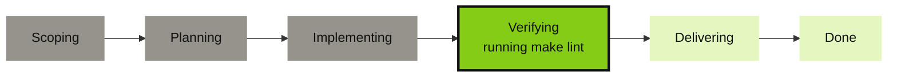

# Issue ops

## Drive agents from an issue

Comment `@grove fix the flaky test` on an issue and your self-hosted agent picks it up. A sticky comment
tracks the session: [task phase](features-status.md#the-third-axis-task-phase), a live todo checklist, the
tickets touched, and a link to the workspace (`grove tickets attach` copies it to the pull request too).
A follow-up comment steers the same agent, since the executor is a long-lived tmux session, not a CI job
that dies with the workflow.



Both forges draw this natively: finished phases gray out, the current one gets a heavy outline, and the
same progress also renders as plain text below.

```
**Phase** ●●●●○○ Verifying (4/6) — running make lint

**Checklist**
- [x] Reproduce the flaky test
- [x] Add a retry-free fix
- [ ] Run the suite 20x to confirm

**Tracking**
- Issue #42 — open
- Pull request #43 — merged
- Open workspace
```

An agent that never reported a phase gets no diagram, since Grove will not guess whether that means the
start.

---

## How it works

1. You comment `@grove <task>`, and a thin caller workflow on `issue_comment` forwards the event.
2. Grove's composite action checks the commenter's permission, reacts 👀, and POSTs to your daemon.
3. The engine parses the command, creates or steers a workspace, and a status publisher rewrites the
   sticky comment.


Only the first two steps run in CI. Everything after runs inside your own daemon.

---

## Setup: GitHub

The daemon [binds loopback by design](use-auth.md#the-security-model), so GitHub's hosted runners cannot
reach it. Register a **self-hosted runner on the same host** as `grove daemon serve`, under
*Settings → Actions → Runners*, with a label the caller pins to. A minimal caller, from `docs/examples/`:

```yaml title=".github/workflows/grove-issue-ops.yml"
name: Grove issue-ops
on:
  issue_comment:
    types: [created]

jobs:
  grove:
    runs-on: [self-hosted, grove-host]   # pinned to the host running grove daemon serve
    steps:
      - uses: bearlike/Grove/actions/issue-ops@main
        with:
          daemon-url: ${{ vars.GROVE_DAEMON_URL }}
          daemon-token: ${{ secrets.GROVE_DAEMON_TOKEN }}
```

`GROVE_DAEMON_URL` is an **organization variable**, not a secret: an address like `http://127.0.0.1:7421`,
since runner and daemon share a host. `GROVE_DAEMON_TOKEN` is an **organization secret** every caller
reuses. The action is [`actions/issue-ops/action.yml`](repo:actions/issue-ops/action.yml).

### Minting the daemon token

The token comes from the same human-gated, forge-agnostic [pairing handshake](use-auth.md#the-handshake)
the dashboard uses.

```bash
# 1. Ask the daemon to start a pairing (run from anywhere that can reach it)
curl -s -X POST http://127.0.0.1:7421/auth/pair \
  -H 'content-type: application/json' -d '{"label":"issue-ops ci"}'
# {"challenge_id": "...", "code": "XXXX-XXXX", ...}

# 2. Approve it on the host, the same way you'd approve a new device
grove auth pending
grove auth approve <challenge-id>

# 3. Poll for the minted token (only returns it once, right after approval)
curl -s http://127.0.0.1:7421/auth/pair/<challenge-id>
# {"challenge_id": "...", "state": "consumed", "token": "grove_v1_...", ...}
```

Paste that `token` into `GROVE_DAEMON_TOKEN`. List it with `grove auth sessions` and revoke it with
`grove auth revoke <session-id>`.

---

## Setup: Gitea

Gitea's default `act_runner` job runs on an isolated Docker bridge network, with no
`host.docker.internal` on Linux either. Register a `:host`-labelled runner, act_runner's non-containerized
mode, on the daemon's machine, and pin `runs-on` to it. The caller must live in `.gitea/workflows/` on the
default branch, since both forges load issue-event workflows from there only.

```yaml title=".gitea/workflows/grove-issue-ops.yml"
name: Grove issue-ops
on:
  issue_comment:
    types: [created]

jobs:
  grove:
    runs-on: [host]
    permissions:
      issues: write
      pull-requests: write
    steps:
      - uses: https://gitea.example.com/bearlike/Grove/actions/issue-ops@main
        with:
          daemon-url: ${{ vars.GROVE_DAEMON_URL }}
          daemon-token: ${{ secrets.GROVE_DAEMON_TOKEN }}
```

Mint `GROVE_DAEMON_TOKEN` as [above](#minting-the-daemon-token). The full `https://gitea.example.com/...`
form in `uses:` is Gitea's absolute-URL extension for cross-repo actions, older than the `workflow_call`
floor.

> [!WARNING] Version floors
> - **Gitea ≥ 1.21.6 is a hard requirement.** Earlier versions fire `issue_comment` only on a genuine
>   issue, never a pull request (go-gitea#29277), no workaround.
> - **Gitea ≥ 1.26.0 in Restricted mode needs the `permissions:` block above.** Earlier versions parse
>   and ignore it. 1.26.0 enforces it and 403s an undeclared `issues: write` (go-gitea#36173), harmless
>   to declare on an older instance.

---

## Commands

A command opens with the configured `trigger` (`@grove` by default) as the first word, matched
case-insensitively at a word boundary, so `@grovebot` never fires. Trigger, driver, and agent are cascade
config, never comment syntax.

| Comment | What happens |
|---|---|
| `@grove <free text>` | No workspace yet for this ticket: create one, seeded with the text as its initial prompt. One already running: steer it, as a message to the live agent. |
| `@grove status` | Refresh the sticky status comment now. |
| `@grove pause` | Pause the ticket's running workspace. |
| `@grove resume` | Resume a paused workspace. |
| `@grove stop` | Kill the ticket's workspace. |
| `@grove` alone, or any other verb-shaped word | A usage reply. Grove never stays silent on a malformed command. |

A prompt aimed at a paused workspace gets a reply telling you to `@grove resume` it first, since resume is
explicit and never implied.

### Assignment, the other way in

A comment is one route. The other is the tracker's own assignee field: assign Grove's account to an issue
and the pickup poll starts a workspace for it, with no comment and no CI runner involved. That is the only
inbound route on a deployment with no runner at all. `grove tickets handover`, `owned` and `handback` drive
the same path by hand, `issueops.pickup_max_active` (default 3, host-wide) bounds how many run at once, and
both halves default off. Reading Grove's assigned issues works on all three trackers, while Grove putting
its own account on a ticket needs Gitea or GitHub. See
[the assignee is the work queue](features-ticket-providers.md#the-assignee-is-the-work-queue).

### Showing what Grove is working, on the board

`issueops.assign_bot` puts Grove's own account on every issue a live workspace holds, so a Grove managed
ticket is findable with the tracker's own assignee filter by people who never open Grove. It happens as the
status comment is written, which is the moment a workspace is known for certain to be working the ticket.

> [!TIP]
> `assign_bot` and `pickup_enabled` are independent opt ins and the direction is the difference. Assignment
> is an **output**, describing work that already exists, and can never start any. Pickup is the **input**,
> where the assignee field causes a workspace to appear. Turn on `assign_bot` alone for board presence with
> no chance of the tracker triggering an agent.

The assignment is **released when the workspace ends**, so the board says who is working an issue now rather
than who once did. Only assignments this daemon made are released, so a ticket somebody assigned by hand is
left alone, and a restart forgets rather than undoing a human's. Every other assignee is untouched in both
directions. Assigning needs repo write, which commenting does not; where the token cannot, Grove logs the
refusal and carries on.

### The badges on the ticket itself

Grove also keeps a small footer at the bottom of the ticket's own description. A reader meets the description
first, and on a busy thread the status comment is a long scroll away, so two badges carry them there. One
opens the workspace, one jumps to the status comment.

Grove owns only the region between its markers. Everything around it comes back byte for byte, and the footer
is replaced in place rather than appended, so it never accumulates copies.

> [!TIP]
> Both links are rebuilt on every update, which is what makes them survive a ticket moving between
> workspaces. Kill a workspace, let another pick the issue up, and the next status update repoints both
> badges. Nothing is reconciled by hand.

A badge with no destination is not drawn. Without `deep_link_base_url` there is no workspace to open, and
before the first status comment there is nothing to scroll to, so the footer renders short or not at all
rather than showing a button that goes nowhere. Editing a description needs repo write, the same grant
assigning does.

---

## Configuration

Everything above cascades through the ordinary [configuration cascade](features-cascade.md), under one
`issueops` section.

```json
{
  "issueops": {
    "enabled": true,
    "trigger": "@grove",
    "allowed_actors": ["a-trusted-bot-account"],
    "agent": "claude",
    "update_window_seconds": 5,
    "deep_link_base_url": "https://grove.example.com"
  }
}
```

| Field | Default | Meaning |
|---|---|---|
| `enabled` | `false` | Gates the sticky comment only, never routing. Commands still work with this `false`, and the checklist never comes back. Set it `true` for the live status comment. |
| `trigger` | `"@grove"` | The mention token that must open a comment for Grove to act. |
| `allowed_actors` | `[]` | Logins allowed to drive issue-ops whatever their repo permission. Widens the write-access default, never narrows it. |
| `agent` | `"claude"` | Which agent from your `agents` list a created workspace spawns. |
| `prompt_template` | a built-in autonomous issue-to-PR prompt | The prompt a created workspace boots on. Placeholders `{title}`, `{body}`, `{number}`, `{url}`, `{command_text}`. |
| `update_window_seconds` | `5.0` | Coalescing window. Changes fold and flush at most once per window, so a burst of activity does not trip the forge's rate limit on comment edits. |
| `deep_link_base_url` | `""` | Your dashboard's base URL. Set it and the comment links to `{base}/w/{workspace-id}`. Empty, and it only names the workspace. |

The assignee queue adds `assign_bot`, `pickup_enabled`, `pickup_interval_seconds`, `pickup_max_active` and
`pickup_backoff_seconds` to the same section, both defaulting `false`. See
[assignment](#assignment-the-other-way-in) and [the board](#showing-what-grove-is-working-on-the-board)
above.

Routing also needs the matching [`tickets.gitea` or `tickets.github`](configure-ticket-providers.md)
section `enabled`, with `owner`/`repo` set, since issue-ops resolves an event against that config, never a
fleet-wide scan.

---

## Security model

- **Write access is the default gate.** A command runs only with write access or above asserted.
  `allowed_actors` adds trusted logins on top, never narrowing the default.
- **Bots and self-replies are dropped before routing.** A comment from a bot actor, or one carrying Grove's
  invisible signature marker, is ignored outright, so Grove can never trigger Grove.
- **No fork code is ever checked out or executed.** `issue_comment` runs in the base repo's context with
  normal token permissions, so there is no `pull_request_target`-style exfiltration risk.
- **The daemon re-checks and dedupes rather than trusting the workflow.** Every event is deduplicated by
  `(provider, owner, repo, comment_id)`, so an at-least-once CI retry cannot act twice, and a malformed or
  refused command always gets a reply.

---

## Troubleshooting

| Symptom | Cause | Fix |
|---|---|---|
| No reaction at all | The caller is not on the default branch | Both forges load issue-event workflows from there only. Merge it in. |
| No reaction at all | Commenter lacks write access and is not in `allowed_actors` | Grant write access, or add the login to `issueops.allowed_actors`. |
| No reaction at all | The comment was edited, not created | Only `created` events trigger the pipeline. An `edited` trigger is a silent re-fire hole. Leave a new comment. |
| No reaction at all | The trigger is misspelled, or is not the first word | It must open the comment at a word boundary (`@grove ...`, not `hey @grove` or `@grovebot`). Check `issueops.trigger` with `grove config show`. |
| 👀 appears, replies or status comments 403 | Gitea ≥ 1.26.0 Restricted mode needs `permissions:` | Add `permissions: {issues: write, pull-requests: write}` to the caller. |
| Runner job times out reaching the daemon | The runner is on an isolated Docker bridge network | Use a `:host`-labeled act_runner (Gitea) or a same-host self-hosted runner (GitHub). |
| The same command runs twice | CI retried the delivery | Expected. The engine dedupes by `(provider, owner, repo, comment_id)`. |
| Status comment never appears, or stops updating | The provider token lacks comment-write scope | Confirm `tickets.<provider>.token_env` names a token with issue-comment write access, then check the daemon log for a swallowed provider error. Publishes retry next window. |

---

## See also

- [Ticket providers](features-ticket-providers.md) and [their setup](configure-ticket-providers.md)
- [Task phase](features-status.md#the-third-axis-task-phase), the six phases
- [Authentication & pairing](use-auth.md), the handshake the CI token comes from
- [Configuration cascade](features-cascade.md)
- [Workspace lifecycle](features-workspace-lifecycle.md), what the verbs above do
