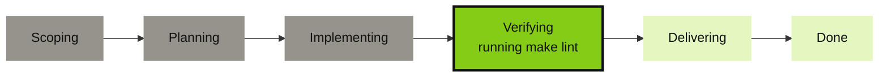
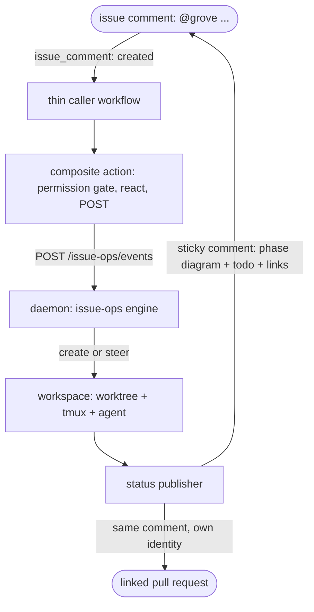

# Issue ops

## Delegate work without leaving your tracker

Comment `@grove fix the flaky test` on an issue and your own agent picks it up.

<figure class="ms-shot">
  <div class="ms-shot__frame"></div>
  <figcaption class="ms-shot__body">One comment per ticket, rewritten in place as the work moves.</figcaption>
</figure>

## Drive agents from an issue

- One sticky comment tracks the session. The [task phase](features-status.md#the-third-axis-task-phase), a live checklist, the tickets touched, and a link to the workspace.
- A follow up comment steers the same agent, since the executor is a long lived tmux session, not a CI job that dies with the workflow.
- Both forges draw the phase as a diagram. An agent that has not reported one gets none.
- The same comment lands on the linked pull request, so a reader on either side finds the other.



```
**Phase** ●●●●○○ Verifying (4/6) — running make lint

**Checklist**
- [x] Reproduce the flaky test
- [x] Add a retry-free fix
- [ ] Run the suite 20x to confirm

**Tracking**
- Issue #42 — open
- Pull request #43 — merged
- Open workspace
```

## How it works

- A thin caller workflow on `issue_comment` forwards the event.
- Grove's composite action checks the commenter's permission, reacts 👀, and POSTs to your daemon.
- The engine creates or steers a workspace, and a status publisher rewrites the sticky comment.
- Only the caller and the action run in CI. Everything after the POST happens on your host.



## Commands

A command opens with the configured `trigger`, `@grove` by default, as the first word, matched at a word boundary and ignoring case, so `@grovebot` never fires.

| Comment | What happens |
|---|---|
| `@grove <free text>` | No workspace yet for this ticket: create one, seeded with the text as its initial prompt. One already running: steer it, as a message to the live agent. |
| `@grove status` | Refresh the sticky status comment now. |
| `@grove pause` | Pause the ticket's running workspace. |
| `@grove resume` | Resume a paused workspace. |
| `@grove stop` | Kill the ticket's workspace. |
| `@grove` alone, or any other verb-shaped word | A usage reply. Grove never stays silent on a malformed command. |

A prompt aimed at a paused workspace gets a reply telling you to `@grove resume` it first, since resume is explicit and never implied.

### Assignment, the other way in

- Assign Grove's account to an issue and the pickup poll starts a workspace for it, with no comment and no CI runner.
- `grove tickets handover`, `owned` and `handback` drive the same path by hand.
- `issueops.pickup_max_active`, default 3, bounds how many run at once, and both halves default off.
- Reading assigned issues works on all three trackers. Assigning Grove's own account needs Gitea or GitHub. See [the assignee is the work queue](features-ticket-providers.md#the-assignee-is-the-work-queue).

### Showing what Grove is working, on the board

- `issueops.assign_bot` puts Grove's account on every issue a live workspace holds, so the ticket is findable with the tracker's own assignee filter by people who never open Grove.
- Assignment is an output and pickup is the input. Turn on `assign_bot` alone for board presence with no chance of the tracker triggering an agent.
- The assignment is released when the workspace ends, so the board says who is working an issue now.
- Only assignments this daemon made are released. A ticket somebody assigned by hand is left alone.
- Assigning needs repo write, which commenting does not. Where the token cannot, Grove logs the refusal and carries on.

### The badges on the ticket itself

- A small footer at the bottom of the ticket's own description, because on a busy thread the status comment is a long scroll away. One badge opens the workspace, one jumps to the status comment.
- Grove owns only the region between its markers. Everything around it comes back byte for byte, and the footer is replaced, never appended.
- Both links are rebuilt on every update, so they survive a ticket moving between workspaces.
- A badge with no destination is not drawn, and editing a description needs the same repo write that assigning does.

## Security model

- **Write access is the default gate.** A command runs only with write access or above, and `allowed_actors` adds trusted logins on top, never narrowing the default.
- **Bots and self replies are dropped before routing.** A comment from a bot actor, or one carrying Grove's invisible signature marker, is ignored outright, so Grove can never trigger Grove.
- **No fork code is ever checked out or executed.** `issue_comment` runs in the base repo's context with normal token permissions.
- **The daemon rechecks and dedupes rather than trusting the workflow.** Every event is deduplicated by provider, owner, repo and comment id, so a CI retry cannot act twice, and a malformed or refused command always gets a reply.

## Setup: GitHub

- The daemon [binds loopback by design](use-auth.md#the-security-model), so register a same host runner.
- Pin the caller to it on the default branch.
- `GROVE_DAEMON_URL` is a variable and `GROVE_DAEMON_TOKEN` is a secret.
- Use [`actions/issue-ops/action.yml`](repo:actions/issue-ops/action.yml).

```yaml title=".github/workflows/grove-issue-ops.yml"
name: Grove issue-ops
on:
  issue_comment:
    types: [created]

jobs:
  grove:
    runs-on: [self-hosted, grove-host]   # pinned to the host running grove daemon serve
    steps:
      - uses: bearlike/Grove/actions/issue-ops@main
        with:
          daemon-url: ${{ vars.GROVE_DAEMON_URL }}
          daemon-token: ${{ secrets.GROVE_DAEMON_TOKEN }}
```

### Minting the daemon token

Use the [pairing handshake](use-auth.md#the-handshake) from the dashboard.

```bash
# 1. Ask the daemon to start a pairing (run from anywhere that can reach it)
curl -s -X POST http://127.0.0.1:7421/auth/pair \
  -H 'content-type: application/json' -d '{"label":"issue-ops ci"}'
# {"challenge_id": "...", "code": "XXXX-XXXX", ...}

# 2. Approve it on the host, the same way you'd approve a new device
grove auth pending
grove auth approve <challenge-id>

# 3. Poll for the minted token (only returns it once, right after approval)
curl -s http://127.0.0.1:7421/auth/pair/<challenge-id>
# {"challenge_id": "...", "state": "consumed", "token": "grove_v1_...", ...}
```

Paste `token` into `GROVE_DAEMON_TOKEN`.

## Setup: Gitea

- Register a `:host` runner because the default runner cannot reach loopback.
- Pin the caller to it on the default branch.
- Mint `GROVE_DAEMON_TOKEN` as [above](#minting-the-daemon-token).
- The absolute action URL supports cross repository actions.

```yaml title=".gitea/workflows/grove-issue-ops.yml"
name: Grove issue-ops
on:
  issue_comment:
    types: [created]

jobs:
  grove:
    runs-on: [host]
    permissions:
      issues: write
      pull-requests: write
    steps:
      - uses: https://gitea.example.com/bearlike/Grove/actions/issue-ops@main
        with:
          daemon-url: ${{ vars.GROVE_DAEMON_URL }}
          daemon-token: ${{ secrets.GROVE_DAEMON_TOKEN }}
```

> [!WARNING] Version floors
> - **Gitea 1.21.6 or later is a hard requirement.** Earlier versions fire `issue_comment` only on a genuine issue, never a pull request, and there is no workaround.
> - **Gitea 1.26.0 or later in Restricted mode needs the `permissions:` block above.** Earlier versions parse and ignore it, so it is harmless to declare on an older instance.

## Configuration

- Put settings in one `issueops` section of the [configuration cascade](features-cascade.md).
- The matching [`tickets.gitea` or `tickets.github`](configure-ticket-providers.md) section needs `enabled`, `owner`, and `repo`.
- `assign_bot` and `pickup_enabled` are independent. See [assignment](#assignment-the-other-way-in) and [the board](#showing-what-grove-is-working-on-the-board) above.
- Trigger, driver, and agent come from configuration.

```json
{
  "issueops": {
    "enabled": true,
    "trigger": "@grove",
    "allowed_actors": ["a-trusted-bot-account"],
    "agent": "claude",
    "update_window_seconds": 5,
    "deep_link_base_url": "https://grove.example.com"
  }
}
```

| Field | Default | Meaning |
|---|---|---|
| `enabled` | `false` | Gates the sticky comment only, never routing. Commands still work with this `false`, and the checklist never comes back. Set it `true` for the live status comment. |
| `trigger` | `"@grove"` | The mention token that must open a comment for Grove to act. |
| `allowed_actors` | `[]` | Logins allowed to drive issue-ops whatever their repo permission. Widens the write-access default, never narrows it. |
| `agent` | `"claude"` | Which agent from your `agents` list a created workspace spawns. |
| `prompt_template` | a built-in autonomous issue-to-PR prompt | The prompt a created workspace boots on. Placeholders `{title}`, `{body}`, `{number}`, `{url}`, `{command_text}`. |
| `update_window_seconds` | `5.0` | Coalescing window. Changes fold and flush at most once per window, so a burst of activity does not trip the forge's rate limit on comment edits. |
| `deep_link_base_url` | `""` | Your dashboard's base URL. Set it and the comment links to `{base}/w/{workspace-id}`. Empty, and it only names the workspace. |

## Troubleshooting

Find the symptom in the left column.

| Symptom | Cause | Fix |
|---|---|---|
| No reaction at all | The caller is not on the default branch | Both forges load issue-event workflows from there only. Merge it in. |
| No reaction at all | Commenter lacks write access and is not in `allowed_actors` | Grant write access, or add the login to `issueops.allowed_actors`. |
| No reaction at all | The comment was edited, not created | Only `created` events trigger the pipeline. An `edited` trigger is a silent re-fire hole. Leave a new comment. |
| No reaction at all | The trigger is misspelled, or is not the first word | It must open the comment at a word boundary (`@grove ...`, not `hey @grove` or `@grovebot`). Check `issueops.trigger` with `grove config show`. |
| 👀 appears, replies or status comments 403 | Gitea ≥ 1.26.0 Restricted mode needs `permissions:` | Add `permissions: {issues: write, pull-requests: write}` to the caller. |
| Runner job times out reaching the daemon | The runner is on an isolated Docker bridge network | Use a `:host`-labeled act_runner (Gitea) or a same-host self-hosted runner (GitHub). |
| The same command runs twice | CI retried the delivery | Expected. The engine dedupes by `(provider, owner, repo, comment_id)`. |
| Status comment never appears, or stops updating | The provider token lacks comment-write scope | Confirm `tickets.<provider>.token_env` names a token with issue-comment write access, then check the daemon log for a swallowed provider error. Publishes retry next window. |

## See also

- [Ticket providers](features-ticket-providers.md) and [their setup](configure-ticket-providers.md).
- [Task phase](features-status.md#the-third-axis-task-phase) for the six phases.
- [Authentication & pairing](use-auth.md) for the CI token handshake.
- [Configuration cascade](features-cascade.md) to layer settings.
- [Workspace lifecycle](features-workspace-lifecycle.md) for the verbs.
