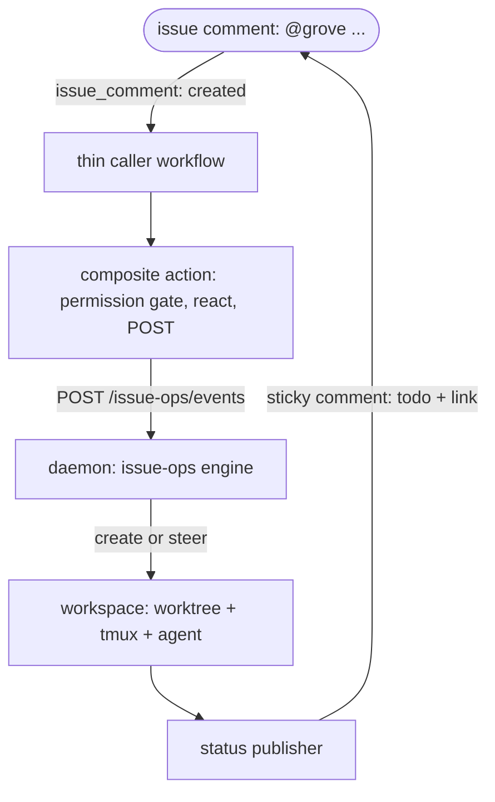

# Issue ops

Comment `@grove fix the flaky test` on an issue, and your own self-hosted Grove agent picks it up. One
sticky status comment appears on the issue: a live todo checklist plus a link to the workspace, and it
keeps rewriting itself in place for the whole life of the session. Leave a follow-up comment and Grove
steers the same running agent instead of starting over. Think of the status comment the way a pinned chat
message works: one place that always shows the current state, edited in place, never a growing feed of
separate posts.

That last part is the differentiator. Every CI-bound coding bot re-runs fresh per comment, because its
executor is a job that dies the moment the workflow ends. Grove's executor is a long-lived daemon-owned
tmux session, so a follow-up comment reaches the same agent, mid-task, instead of restarting it from
scratch. A comment is a command, not a fresh run.

---

## How it works

1. You comment `@grove <task>` on a GitHub or Gitea issue.
2. A thin caller workflow, triggered on `issue_comment`, forwards the event.
3. Grove's composite action checks the commenter's permission, reacts 👀 to acknowledge receipt, and POSTs
   a normalized event to your daemon.
4. The daemon's issue-ops engine resolves the repo, parses the command, and creates a workspace or steers
   the one already running for this ticket.
5. A status publisher keeps one sticky comment on the issue rewritten with the current todo checklist and
   a link to the workspace, for as long as the session runs.



Only steps 2 and 3 run in CI. Everything from step 4 on runs inside your own daemon, on your own host,
against your own git remote. Nothing about the task itself ever leaves your infrastructure.

---

## Setup: GitHub

GitHub's own hosted runners can't reach your daemon: they are a different machine entirely, and the
daemon [binds loopback by design](use-auth.md#the-security-model), with no blessed
`--host 0.0.0.0`. So the caller workflow needs a **self-hosted runner on the same host** as
`grove daemon serve`. Register one under *Settings → Actions → Runners* and give it a label your caller
pins to, so the job never lands on some other runner in your fleet.

A minimal caller, copied from `docs/examples/` and adjusted for your repo:

```yaml
# .github/workflows/grove-issue-ops.yml
name: Grove issue-ops
on:
  issue_comment:
    types: [created]

jobs:
  grove:
    runs-on: [self-hosted, grove-host]   # pinned to the host running grove daemon serve
    steps:
      - uses: bearlike/Grove/actions/issue-ops@main
        with:
          daemon-url: ${{ vars.GROVE_DAEMON_URL }}
          daemon-token: ${{ secrets.GROVE_DAEMON_TOKEN }}
```

`GROVE_DAEMON_URL` is an **organization variable** (not secret; it's just an address, e.g.
`http://127.0.0.1:7421`, since the runner and the daemon share a host). `GROVE_DAEMON_TOKEN` is an
**organization secret**, so every repo's caller reuses the one pairing without minting a token per repo.
See [`actions/issue-ops/action.yml`](repo:actions/issue-ops/action.yml) for the composite action itself.

### Minting the daemon token

The token is a normal Grove session, earned through the same human-gated [pairing
handshake](use-auth.md#the-handshake) the web dashboard uses. Nothing new to learn: the CI action is just
another paired device.

```bash
# 1. Ask the daemon to start a pairing (run from anywhere that can reach it)
curl -s -X POST http://127.0.0.1:7421/auth/pair \
  -H 'content-type: application/json' -d '{"label":"issue-ops ci"}'
# {"challenge_id": "...", "code": "XXXX-XXXX", ...}

# 2. Approve it on the host, the same way you'd approve a new device
grove auth pending
grove auth approve <challenge-id>

# 3. Poll for the minted token (only returns it once, right after approval)
curl -s http://127.0.0.1:7421/auth/pair/<challenge-id>
# {"challenge_id": "...", "state": "consumed", "token": "grove_v1_...", ...}
```

Paste that `token` into the `GROVE_DAEMON_TOKEN` secret. It's a real session like any other: list it with
`grove auth sessions` and revoke it with `grove auth revoke <session-id>` if it ever needs replacing.

---

## Setup: Gitea

Gitea's default `act_runner` job runs inside an isolated Docker bridge network, so it can't reach host
loopback either (there's no `host.docker.internal` on Linux). Register a runner with a label ending in
`:host` (act_runner's non-containerized execution mode) directly on the machine running
`grove daemon serve`, and pin your caller's `runs-on` to that label.

The caller must live in `.gitea/workflows/`, **on the repo's default branch**. Gitea (like GitHub) only
ever loads issue-event workflows from the default branch, regardless of which branch you're working on;
a caller committed to a feature branch never fires.

```yaml
# .gitea/workflows/grove-issue-ops.yml
name: Grove issue-ops
on:
  issue_comment:
    types: [created]

jobs:
  grove:
    runs-on: [host]
    permissions:
      issues: write
      pull-requests: write
    steps:
      - uses: https://gitea.example.com/bearlike/Grove/actions/issue-ops@main
        with:
          daemon-url: ${{ vars.GROVE_DAEMON_URL }}
          daemon-token: ${{ secrets.GROVE_DAEMON_TOKEN }}
```

Mint `GROVE_DAEMON_TOKEN` exactly as in the [GitHub section above](#minting-the-daemon-token): the pairing
handshake is forge-agnostic.

Note the full `https://gitea.example.com/...` form in `uses:`. Gitea's absolute-URL extension is what lets
a consumer repo reference the composite action across repos without needing the newer, collaborative-owner
`workflow_call` floor.

> [!WARNING] Version floors
> - **Gitea ≥ 1.21.6 is a hard requirement.** Earlier versions never fire `issue_comment` for a comment
>   left on a pull request, only for comments on a genuine issue (go-gitea#29277). If you want `@grove` to
>   work from PR conversations too, there's no workaround below this version.
> - **Gitea ≥ 1.26.0 in Restricted mode needs the explicit `permissions:` block shown above.** Earlier
>   versions parse but ignore `permissions:` entirely; 1.26.0 is the first release that enforces it, and a
>   Restricted-mode instance 403s an undeclared `issues: write` (go-gitea#36173). Declaring it on an older
>   instance is harmless, just unenforced.

---

## Commands

Every command opens with the configured `trigger` (`@grove` by default) as the first word of the comment,
matched case-insensitively at a word boundary, so `@grovebot` or a mid-sentence mention never fires.
There's no way to pass configuration in a comment, on purpose: the trigger word, who may drive it, and
the agent are all cascade config, never comment syntax.

| Comment | What happens |
|---|---|
| `@grove <free text>` | No workspace yet for this ticket: create one, seeded with the text as its initial prompt. A workspace already running: steer it, as a follow-up message to the live agent. |
| `@grove status` | Force an immediate refresh of the sticky status comment. |
| `@grove pause` | Pause the ticket's running workspace. |
| `@grove resume` | Resume a paused workspace. |
| `@grove stop` | Kill the ticket's workspace. |
| `@grove` alone, or any other verb-shaped word | A usage reply. Grove never stays silent on a malformed command. |

A prompt aimed at a workspace that exists but isn't running (paused, for example) gets a reply telling you
to `@grove resume` it first, rather than silently resuming it for you: resume is its own explicit verb, not
something a free-text prompt implies.

---

## Configuration

Everything above cascades through the ordinary [configuration cascade](features-cascade.md), under one
`issueops` section:

```json
{
  "issueops": {
    "enabled": true,
    "trigger": "@grove",
    "allowed_actors": ["a-trusted-bot-account"],
    "agent": "claude",
    "update_window_seconds": 5,
    "deep_link_base_url": "https://grove.example.com"
  }
}
```

| Field | Default | Meaning |
|---|---|---|
| `enabled` | `false` | Gates only the outbound sticky status comment. It does not gate command routing: a comment still creates or steers a workspace with this `false`, the sticky comment just never appears. Set it `true` for the live status comment described at the top of this page. |
| `trigger` | `"@grove"` | The mention token that must open a comment for Grove to act. |
| `allowed_actors` | `[]` | Logins allowed to drive issue-ops regardless of their own repo permission. Widens the default write-access policy; never narrows it. |
| `agent` | `"claude"` | Which configured agent (from your `agents` list) an issue-ops-created workspace spawns. |
| `prompt_template` | a built-in autonomous issue-to-PR prompt | The initial prompt a created workspace boots on. Supports `{title}`, `{body}`, `{number}`, `{url}`, `{command_text}` placeholders. |
| `update_window_seconds` | `5.0` | Coalescing window for the sticky status comment: every render-relevant change is folded and flushed at most once per window, so a burst of activity doesn't trip the forge's rate limit on repeated comment edits. |
| `deep_link_base_url` | `""` | Your web dashboard's base URL. Set it and the sticky comment links straight to `{base}/w/{workspace-id}`; leave it empty and the comment just names the workspace. |

You also need the matching `tickets.gitea` or `tickets.github` section `enabled`, with `owner`/`repo` set:
issue-ops resolves an event by matching its repo against that config, never by a fleet-wide ticket scan.
See [ticket providers](configure-ticket-providers.md).

> [!NOTE] Turn on the status comment
> `issueops.enabled` defaults to `false`, and commands keep working without it: a caller workflow plus an
> enabled `tickets.<provider>` section is all routing needs. But the sticky status comment, the flagship
> feature from the top of this page, only appears when `issueops.enabled` is `true`. Set it explicitly, or
> you'll drive workspaces from comments and never see the checklist come back.

---

## Security model

- **Write access is the default gate.** A command is honored only when the forwarder asserts the
  commenter has write access or above on the repo. `allowed_actors` is the one widening knob: it adds
  trusted logins on top of write access, it never narrows what write access already grants.
- **Bots and self-replies are dropped before routing.** A comment flagged as a bot actor, or one carrying
  Grove's own signature marker (the invisible tag every reply and status comment is stamped with), is
  ignored outright. That marker is the belt to the bot-flag's suspenders: even if the forwarder's bot
  detection is ever wrong, Grove's own comments can never trigger Grove.
- **No fork code is ever checked out or executed.** The workflow triggers only on `issue_comment`, which
  always runs in the base repo's context with normal token permissions on both forges, so there's no
  `pull_request_target`-style secret-exfiltration risk to guard against. What protects the repo instead is
  everything else on this list: the write-access gate, the `allowed_actors` allowlist, the bot and
  self-reply ignore, and the daemon's own re-check and dedupe.
- **The daemon re-checks and dedupes, it doesn't just trust the workflow.** Every event is deduplicated by
  `(provider, owner, repo, comment_id)` before anything else runs, so an at-least-once CI retry can never
  act twice. A malformed or refused command always gets a reply; issue-ops never fails silently.

---

## Troubleshooting

| Symptom | Cause | Fix |
|---|---|---|
| Comment does nothing, no reaction at all | The caller workflow isn't on the repo's default branch | Gitea and GitHub both load issue-event workflows from the default branch only. Merge the caller there. |
| Comment does nothing, no reaction at all | Commenter lacks write access and isn't in `allowed_actors` | Grant repo write access, or add the login to `issueops.allowed_actors`. |
| Comment does nothing, no reaction at all | The comment was edited, not newly created | Only `created` comment events trigger the pipeline, by design (an `edited` trigger is a silent re-fire hole). Leave a new comment. |
| Comment does nothing, no reaction at all | The trigger token is misspelled, or isn't the first word | The trigger must open the comment at a word boundary (`@grove ...`, not `hey @grove` or `@grovebot`). Check `issueops.trigger` with `grove config show`. |
| 👀 reaction appears, but replies or status comments 403 | Gitea ≥ 1.26.0 in Restricted mode needs an explicit `permissions:` block | Add `permissions: {issues: write, pull-requests: write}` to the caller workflow. |
| Runner job starts, then times out reaching the daemon | The runner executes in an isolated Docker bridge network and can't reach host loopback | Use a `:host`-labeled act_runner (Gitea) or a same-host self-hosted runner (GitHub), on the machine running `grove daemon serve`. |
| The same command appears to run twice | CI retried the delivery | Expected. The engine dedupes by `(provider, owner, repo, comment_id)`; the retry is dropped silently, not acted on twice. |
| Status comment never appears, or stops updating | The ticket provider's token lacks comment-write scope | Confirm `tickets.<provider>.token_env` names a token with issue-comment write access. Check the daemon log for a swallowed provider error; a publish failure never crashes the daemon, it retries on the next update window. |

---

## See also

- [Ticket providers](features-ticket-providers.md) and [their setup](configure-ticket-providers.md):
  issue-ops resolves through the same `tickets.<provider>` config.
- [Authentication & pairing](use-auth.md): the handshake the CI token comes from.
- [Configuration cascade](features-cascade.md): where `issueops` sits among the other layers.
- [Workspace lifecycle](features-workspace-lifecycle.md): what create, pause, resume, and kill do underneath the verbs above.
