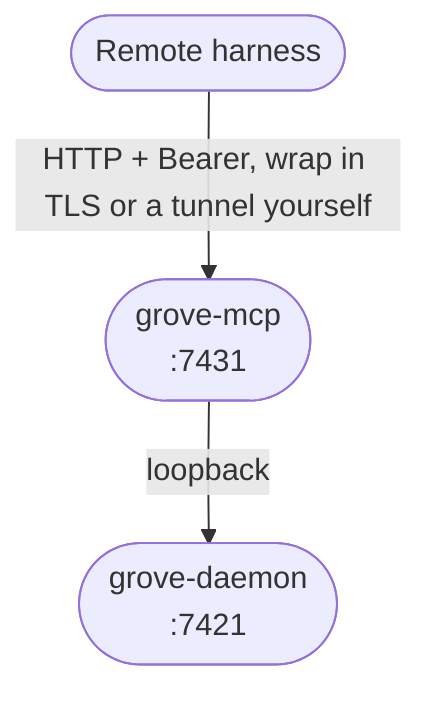

# MCP Server

## Let an agent drive Grove

<figure class="ms-shot">
  <div class="ms-shot__frame"></div>
  <figcaption class="ms-shot__body">The Grove MCP tools as seen from Claude Code.</figcaption>
</figure>

Grove exposes the daemon API to an assistant. Your git stays yours.

---

## Choosing a range

Use stdio locally. Use Streamable HTTP for remote or hosted harnesses.

| | stdio | Streamable HTTP |
|---|---|---|
| Who starts it | Your client, per connection. | You do. It keeps running. |
| Who reaches it | That client, on this machine. | Anything reaching the port. |
| What authenticates | The process boundary. | A bearer token you set. |
| What it costs | Nothing. | A token, a port, a safe path. |
| Best for | Your laptop. | A remote or hosted harness. |

---

## Same machine: stdio

```bash
pip install 'grove[all]'   # or 'grove[mcp]' for just the MCP server
grove daemon serve         # or run the packaged systemd user service
```

```json title="mcp.json"
{
  "mcpServers": {
    "grove": {
      "command": "grove-mcp",
      "env": {
        "GROVE_API_URL": "http://127.0.0.1:7421"
      }
    }
  }
}
```

```bash
claude mcp add grove -- grove-mcp
```

---

## Another machine: HTTP

HTTP accepts remote callers while the daemon remains loopback-only.



```bash
export GROVE_MCP_TOKEN="$(openssl rand -hex 32)"
grove-mcp --transport streamable-http --host 127.0.0.1 --port 7431
```

HTTP defaults to port `7431` at `/mcp`.

### Two tokens, two directions

Callers send `Authorization: Bearer <GROVE_MCP_TOKEN>`.

| Token | Direction | Required |
|---|---|---|
| `GROVE_API_TOKEN` | Outbound. This server to the daemon. | Optional. Omit it on the daemon's own host and a local session is minted from `auth.json`, like the TUI. |
| `GROVE_MCP_TOKEN` | Inbound. A remote harness to this server. | Mandatory for a network transport. |

### Connecting a client

```bash
claude mcp add --transport http grove http://<host>:7431/mcp \
  --header "Authorization: Bearer $GROVE_MCP_TOKEN"
```

```json title="mcp.json"
{
  "mcpServers": {
    "grove": {
      "type": "http",
      "url": "http://<host>:7431/mcp",
      "headers": {
        "Authorization": "Bearer ${GROVE_MCP_TOKEN}"
      }
    }
  }
}
```

### Where it is safe to run

Use HTTP only behind a trusted LAN, tunnel, VPN, or TLS proxy:

```bash
ssh -N -L 7431:127.0.0.1:7431 you@grove-host.internal
```

Use `--host 0.0.0.0` only behind a VPN or TLS proxy. `GROVE_MCP_ALLOWED_HOSTS` and `GROVE_MCP_ALLOWED_ORIGINS` are DNS-rebinding allowlists.

### Read-only exposure

`--read-only` registers only non-mutating tools.

---

## Hosting it as a service

```bash
WITH_MCP=1 make systemd
WITH_MCP=1 make systemd-enable
```

```bash
install -m 600 /dev/null ~/.config/grove/mcp.env
echo "GROVE_MCP_TOKEN=$(openssl rand -hex 32)" >> ~/.config/grove/mcp.env
```

---

## Configuration

Flags override environment variables, which override defaults.

### Talking to the daemon (outbound)

| Setting | Default | Purpose |
|---|---|---|
| `GROVE_API_URL` (or `--api-url`) | `http://127.0.0.1:7421` | Base URL of the daemon. |
| `GROVE_API_TOKEN` | unset | Bearer token for the daemon. Unset on its own host, where a local session is minted. Set it when the URL points elsewhere. Pair once, then export it. |

### Serving callers (inbound)

| Setting | Default | Purpose |
|---|---|---|
| `GROVE_MCP_TRANSPORT` (or `--transport`) | `stdio` | `stdio` or `streamable-http`. |
| `GROVE_MCP_HOST` (or `--host`) | `127.0.0.1` | Interface to bind. |
| `GROVE_MCP_PORT` (or `--port`) | `7431` | Port to bind, adjacent to the daemon's `7421`. |
| `GROVE_MCP_PATH` (or `--path`) | `/mcp` | Where the endpoint mounts. |
| `GROVE_MCP_TOKEN` | unset | Inbound bearer token. Mandatory under a network transport. |
| `GROVE_MCP_READ_ONLY` (or `--read-only`) | off | Register only the non-mutating tools. |
| `GROVE_MCP_ALLOWED_HOSTS` | unset | `Host` allowlist. Enables DNS-rebinding protection. |
| `GROVE_MCP_ALLOWED_ORIGINS` | unset | `Origin` allowlist, same switch. |

### Which file holds what

| File | Owns | Location |
|---|---|---|
| Your client's MCP registration | How a client reaches Grove. The command for stdio, URL and headers for HTTP. | `.mcp.json`, or the client's user config |
| `mcp.env` | Tokens a hosted server starts with, read by the systemd unit. | `~/.config/grove/mcp.env`, mode `600` |
| The systemd unit | How the server is supervised, and what it binds. | `~/.config/systemd/user/grove-mcp.service` |
| Grove's own config | Everything the *daemon* does: projects, agents, worktrees, tickets. | `~/.config/grove/config.json` and `.grove/config.json` |

---

## Tools

A ✓ marks a tool that survives `--read-only`.

| Tool | What it does | RO |
|---|---|---|
| `grove_list_projects` | Every configured project. No arguments, so it is where an agent holding no path starts. Rows carry `repo_root` (what repo-scoped tools take), `repo_name`, `cwd`. | ✓ |
| `grove_list_workspaces` | Every workspace with id, branch, agent, status. | ✓ |
| `grove_get_workspace` | Full state for one workspace by id. | ✓ |
| `grove_get_fleet_status` | Every workspace at once: state, phase, todo and git counts, and per session the agent's activity, `needs_attention`, task, question, tokens. The only read that reports an agent waiting on you. | ✓ |
| `grove_list_agents` | Agents for a repo with their `models` catalog. The valid `agent_name` and `model` for `grove_create_workspace`. | ✓ |
| `grove_list_sessions` | Agent sessions on this host, newest first, including ones Grove never launched. `repo_root` narrows to a project and fills the otherwise-null `activity`, `size_bytes` and prompt fields. | ✓ |
| `grove_recollect_session` | Every direct user query from one complete session, oldest first. Pass the `session_id`, `adapter_kind` as `kind`, and `cwd` from `grove_list_sessions`; optional `last` keeps only the final N. Use it to recover instructions before a context compaction. | ✓ |
| `grove_peek_workspace` | Bounded snapshot: ahead/behind, diff stats, dirty files, commits, capped pane output. | ✓ |
| `grove_get_workspace_phase` | The reported [task phase](features-status.md#the-third-axis-task-phase) and note. Null means none reported, unlike a reported `scoping`. | ✓ |
| `grove_get_workspace_todo` | The todo list parsed from the transcript (`TodoWrite`, `update_plan`, Mewbo's board), each item with its state. | ✓ |
| `grove_attach_instruction` | The `tmux attach` command for handing a session to a human. | ✓ |
| `grove_create_workspace` | Worktree, branch, tmux session, agent. Params: `repo_root`, `title`, `agent_name`, optional `description`, `branch_plan` (`auto` default, `new_named`, `existing_local`, `track_remote`, `root`), `skip_init`, `initial_prompt`, `resume_session_id`, `model`. `initial_prompt` delivers the first task race-free at boot, and `model` is forwarded verbatim. | |
| `grove_pause_workspace` | Drop worktree and session, keep the branch. Refuses a dirty worktree unless `force`. | |
| `grove_resume_workspace` | Recreate a paused workspace from its branch. | |
| `grove_respawn_workspace` | Recreate a vanished tmux session. | |
| `grove_kill_workspace` | Destroy a workspace. `delete_branch` is required with no default. Remote branches are never touched. | |
| `grove_send_workspace_message` | Steer the agent. Returns `status="sent"`, or `status="unavailable"` on a daemon predating the endpoint. | |
| `grove_remap_workspace_session` | Re-point a workspace at another session after `/clear` rotated the id. Params: `workspace_id`, `session_ref` (full id or unique prefix). | |
| `grove_attach_ticket` | Attach an issue or PR. Params: `workspace_id`, `ref` (a URL, `#42`, `42`, or `owner/repo#42`). Provider and issue-vs-PR are inferred, and an ambiguous id raises. Idempotent. See [ticket providers](features-ticket-providers.md). | |
| `grove_detach_ticket` | Remove that association. Same params. Idempotent. | |
| `grove_set_workspace_phase` | Set the phase. Params: `workspace_id`, `phase` (`scoping`, `planning`, `implementing`, `verifying`, `delivering`, `done`), optional `note`, optional `ticket` (a `provider:id` such as `gitea:498` to report against one attached ticket instead of the workspace), optional `blocked` (stuck on this step). | |

---

## Using Grove from Mewbo

Point Mewbo's MCP pool at either transport. Define it as a regular project agent:

```json title=".grove/config.json"
{
  "agents": [
    {
      "name": "mewbo",
      "command": "uv run mewbo",
      "description": "Mewbo assistant in this Grove worktree"
    }
  ]
}
```

See [Agents](configure-agents.md) and [Workspace Lifecycle](features-workspace-lifecycle.md).
