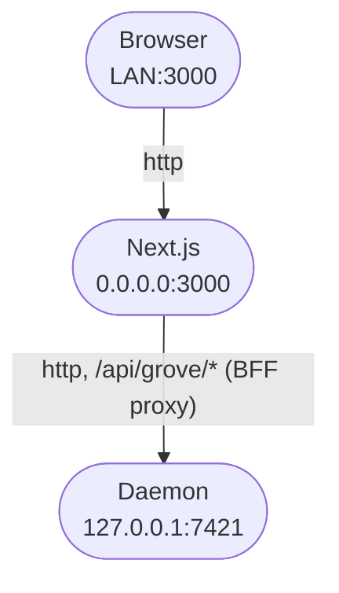

# Web dashboard

## Your fleet in a browser

Grove is a terminal program first. The web dashboard puts the same fleet on any device on your network,
so you read a transcript, steer an agent, and create or tear down a workspace without a terminal. It
drives the same engine as the TUI and the same workspaces an agent creates over [MCP](use-mcp.md).

The mental model is work in a session, switch sessions in a rail. Every route shares one shell, a rail
on the left and a slim header.

<video preload="auto" poster="../img/posters/web-still.png">
  <source src="../videos/2-grove-web.mp4" type="video/mp4" />
</video>

---

## The landing surface

The landing route (`/`) opens on a centered composer. Type a task, press ++enter++, and Grove creates a
workspace and drops you into it. A Recent strip of the latest workspaces sits below.

A persisted `Hero | Overview` toggle sits above it. **Hero** is that composer and the default.
**Overview** is the workspace-card grid, wearing the TUI's status glyphs and colors. Each card
([`card.tsx`](repo:webapp/components/workspace/card.tsx)) carries a state glyph, title, relative time and
what is happening now, then:

- Any linked issue and pull request, the agent's reported
  [task phase](features-status.md#the-third-axis-task-phase), and todo progress.
- Stats for branch, ahead, behind, dirty, runtime, turns, tool calls and tokens.
- A **Live** toggle while the agent works, mirroring its real terminal over SSE with colors and
  box-drawing intact. Only one pane runs live at a time.

Grid and rail ride a live event stream, so a fresh commit or state change lands in a second or two. The
old `/activity` wall folded in here and now redirects.

---

## The session rail

A collapsible rail runs down the left of every route
([`session-rail.tsx`](repo:webapp/components/layout/session-rail.tsx)), one flat cross-project thread list
sorted by recency, with no repository sections and no scope switcher. Each row is two lines, a state dot
with the title and age, then `project · branch · +N/−M`. A waiting or blocked session signals through its
dot color and a row tint, never a separate group.

One search box and one filter dropdown
([`sidebar-filter.tsx`](repo:webapp/components/layout/sidebar-filter.tsx)) sit above it. Toggle which
agent states show, flip **Needs attention only**, check projects, and reveal unmapped sessions,
history-only rows hidden by default. Every choice persists.

The footer ([`workspace-sidebar.tsx`](repo:webapp/components/layout/workspace-sidebar.tsx)) carries daemon
health and live uptime, the version and any update nudge, the workspace count, and a user and host
identity row, all of which used to sit in a bottom status bar, now gone.

The header toggle or ++bracket-left++ hides the rail entirely, with no half-collapsed icon strip. A phone
opens it as a drawer from the hamburger.

---

## The Session Catalog

The rail shows sessions from the projects Grove knows about. **Sessions** in the header shows every agent
session on the machine, whatever repo it ran in.

Rows group by project, newest first, each with the agent kind, its git branch, when it last changed,
whether Grove launched it or you started it by hand, and a live dot when a matching process still runs
there. Open one and the conversation renders read-only. A session whose transcript never recorded where it
ran lists dimmed, with a note on why it will not open.

The screen reads a metadata scan, not a full transcript parse, so it stays fast with hundreds of sessions
on disk. [Session history](features-activity.md#session-history) covers the same catalog in the TUI and
CLI.

---

## Working in a session

A session's detail page (`/w/[id]`) is three zones. The rail, a centered transcript column, and a tabbed
work panel.

<figure class="ms-shot">
  <div class="ms-shot__frame"></div>
  <figcaption class="ms-shot__body">The three-zone session shell.</figcaption>
</figure>

The state-led title ([`context-bar.tsx`](repo:webapp/components/workspace/context-bar.tsx)) is the
header's one control and opens the session's one popover. **Identity** is branch and base, agent and model,
placement. **Changes** is ahead, behind and dirty. **Actions** holds the reversible lifecycle verbs,
**Danger zone** the destructive one.

The work panel ([`work-panel.tsx`](repo:webapp/components/workspace/work-panel.tsx)) carries four tabs:

| Tab | What it shows |
|---|---|
| **Terminal** | The agent's live tmux pane, colors and box-drawing intact, under a permanent live pulse. |
| **Diff** | The change summary plus the full commit list. |
| **Info** | Task phase, linked issue and pull request, metrics, agent and model, placement, runtime, timestamps. |
| **Controls** | Slash commands, skills, MCP servers, and the model catalog with a switch action. Empty for an agent with no control surface. |

On a wide screen the view switcher
([`view-switcher.tsx`](repo:webapp/components/workspace/view-switcher.tsx)) puts transcript and panel side
by side at a dragged ratio that sticks. It is never the default. Every other breakpoint opens single-pane,
transcript-first, and ++cmd+j++ on macOS or ++ctrl+j++ elsewhere collapses the panel.

---

## Steering the agent

The transcript ([`chat-panel.tsx`](repo:webapp/components/chat/chat-panel.tsx)) shows your messages, the
agent's replies, tool calls grouped into collapsible runs, and background notifications. The composer at
its foot sends a follow-up to the running agent, the same as typing into the terminal.

**The steer composer never disables while the agent is working.** ++enter++ sends, ++shift+enter++ makes
a new line, and a circular **Interrupt** next to send stops the agent mid-turn.

An `AskUserQuestion` renders inline as an interactive card
([`question-card.tsx`](repo:webapp/components/workspace/question-card.tsx)). Single choice sends on tap. A
multi-select, or a batch of questions, shows checkboxes, an explicit **Submit** and an "Other" free-text
field. The card mirrors the terminal's answer grammar, so the same choice reaches the agent whichever
surface you use.

---

## Creating a workspace with the composer

The landing composer ([`composer.tsx`](repo:webapp/components/composer/composer.tsx)) is the only way to
start a workspace. Its first line becomes the title, the full text the agent's first task.

<figure class="ms-shot">
  <div class="ms-shot__frame"></div>
  <figcaption class="ms-shot__body">On a phone, with the rail one tap behind the hamburger.</figcaption>
</figure>

A chip row under the textarea sets the rest:

- **Agent**, and a per-workspace **Model** for agents that take one, offered from the daemon's per-agent
  catalog with a custom-id escape hatch.
- **Runtime**, either *Host* or *Container*. *Default* follows the engine's `container.enabled` config.
- The repository, the base, and the [branch mode](features-branch-provenance.md), the same five every
  Grove surface offers, plus **Advanced** for the base ref and a *skip init* toggle.

A fullscreen toggle opens a Markdown editor with live preview, where ++cmd+enter++ or ++ctrl+enter++
creates. The composer speaks the TUI create modal's wire contract.

**Lifecycle actions live in the session identity popover, not the composer.** *Pause*, *Resume* and
*Respawn* fire straight away. *Kill* confirms first, with a delete-branch checkbox whose default follows
where the branch came from. Which verbs appear follows status and placement, the TUI's matrix, and the
engine gates every precondition.

---

## Running it

The dashboard is two processes. The daemon exposes Grove's engine over HTTP, and the web app is the
Next.js server the browser talks to. Build once, run both.

```bash
# Build the web app once (repeat after each upgrade)
cd webapp && npm install && npm run build

# Run the two processes
grove daemon serve     # terminal 1, loopback, port 7421
npm run start          # terminal 2 from webapp/, serves the build on 0.0.0.0:3000
```

Open <http://127.0.0.1:3000> on the same machine. The web app binds `0.0.0.0`, so any phone or laptop on
the network reaches it at `http://<machine-ip>:3000`. If the daemon runs on another host or port, point
the web app at it with `GROVE_DAEMON_URL` in `webapp/.env.local`. A new device has to
[pair](use-auth.md) with the host the first time it connects.

The development server, wire-type codegen and test suites are contributor topics, documented in the
[`webapp/` README](https://github.com/bearlike/Grove/tree/current/webapp).

---

## How it stays loopback-only



The browser only ever calls the web app's own origin at `/api/grove/*`, so everything stays same-origin
and there is no CORS to configure. The Next.js server works as a backend-for-frontend, proxying those
calls to the daemon at `GROVE_DAEMON_URL`, default `http://127.0.0.1:7421`, and attaching the paired
session's token on the server side, so the daemon's token never reaches the browser.

Picture the web app as a receptionist at a front desk who carries each request to the back office and
brings the answer out. The daemon stays in that back office, bound to loopback, and never meets the public
directly. That separation is the whole security story, and [authentication & pairing](use-auth.md) covers
the rest.

---

## Always-on with systemd

To keep both processes running across reboots on a Linux host, build the web app and render the user units
with it opted in.

```bash
make webapp-build                 # npm ci + npm run build
WITH_WEBAPP=1 make systemd        # write grove-daemon + grove-webapp units
WITH_WEBAPP=1 make systemd-enable # reload, enable, start now
loginctl enable-linger "$USER"    # survive logout (remote hosts)
```

The web app unit `Wants` the daemon rather than `Requires` it, so a daemon hiccup leaves the dashboard up
to report "unreachable" instead of taking it down too. The service runs the production build and never
rebuilds itself, so after pulling new source run
`make webapp-build && systemctl --user restart grove-webapp`. Ports override with
`DAEMON_PORT=7777 WEBAPP_PORT=3030 WITH_WEBAPP=1 make systemd`.

---

## Reaching it from outside the network

The daemon's loopback bind is deliberate, so there is no blessed way to expose it directly. To reach a
remote host's dashboard, forward the web app's port over SSH.

```bash
ssh -N -L 3000:127.0.0.1:3000 you@remote-host
```

Then open <http://127.0.0.1:3000> on your own machine. A real tunnel in front of the web app works too,
such as Tailscale, WireGuard, or an authenticated reverse proxy. Widening the daemon's bind is the wrong
lever, because pairing assumes loopback. See the [security model](use-auth.md#the-security-model).

---

## See also

- [Authentication & pairing](use-auth.md): how a new device gets access.
- [CLI](use-cli.md): `grove daemon serve` options and the `grove auth` group.
- [Agent activity and sessions](features-activity.md): the signals behind the rail and terminal pane.
- [Status semantics](features-status.md): what each glyph and color means.
- [`webapp/` README](https://github.com/bearlike/Grove/tree/current/webapp): the contributor surface.
