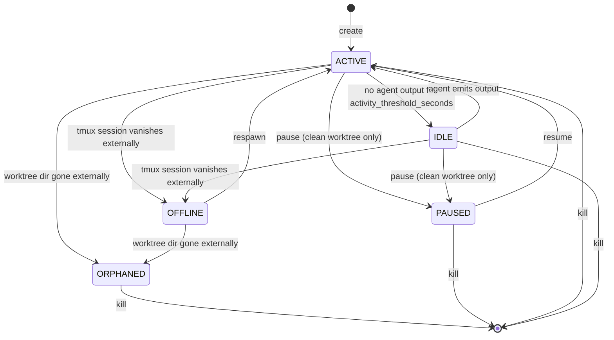

# Daily workflow

Five lifecycle operations cover almost every interaction with Grove. This
page walks the path you travel in a normal day: create a workspace, attach
to it, hand work back when you are done, and recover when something went
sideways.

## Create a workspace

Press `n`. The create modal opens. Pick a branch source, an agent, and a
title, then press `Enter`. Grove runs the create pipeline end to end:

1. **Resolve the branch** from your chosen source. *Auto* names it
   `<branch_prefix><slug-of-title>`. The other variants use the literal
   name.
2. **Add the worktree** at `<root_template>/<workspace_id>`. The default
   template is `${repo}/.worktrees`, so worktrees sit alongside the repo
   and stay out of git's main checkout.
3. **Run the init script** if one is enabled. Output streams into the
   `init` tmux window. The script must exit 0 within
   `init_script.timeout_seconds`.
4. **Spawn the tmux session** with `agent` and `shell` windows. The agent
   command goes into `agent` via `send-keys`. `shell` is a plain
   interactive shell ready for git commits and ad-hoc work.

If any step fails, the workspace stays at `ERROR` (with `fail_fast` off)
or rolls back entirely (with `fail_fast` on). Either way the manager
records the outcome once and exposes it through the `WorkspaceEvent`
stream.

Two choices on the modal change the pipeline. The *Skip init script*
checkbox skips step 3 for this one create, useful when a worktree does
not need its bootstrap. Picking *Root* as the branch source skips steps
1 and 2 entirely: the workspace runs in the repo root on your current
branch, and Grove manages only the tmux session. See
[root workspaces](features-workspace-lifecycle.md#root-workspaces).

## Attach and work

`Enter` (or `a`) attaches. Inside outer tmux, Grove uses
`tmux switch-client`. Outside outer tmux, it suspends Textual and runs
`tmux attach`. Either path lands in the `agent` window with the agent's
command already running.

Detach with `Ctrl-B d` to return to Grove without stopping anything. The
workspace keeps running. The activity rail tracks the agent window's
output and flips ACTIVE to IDLE after `tmux.activity_threshold_seconds`
of quiet (default `5`).

The `shell` window is one tmux switch away (`Ctrl-B 0/1` or `Ctrl-B w`
for the picker). Use it for `git commit`, `git push`, `lazygit`, or
anything else you do at a shell. Grove never runs commits or pushes for
you.

## Pause, resume, kill, respawn

| Op | Branch | Worktree | tmux session | Init script |
|---|---|---|---|---|
| **create** (`n`) | created or attached | created | created | runs (if enabled) |
| **pause** (`p`)  | kept | **removed** | killed | n/a |
| **resume** (`R`) | kept | recreated from branch | recreated | re-runs only if `run_on_resume: true` |
| **kill** (`k`)   | deleted (default for Grove-created) | removed | killed | n/a |
| **respawn** (`o`) | kept | kept (must exist) | recreated | not re-run by default |

State diagram:

The four computed views (ACTIVE, IDLE, OFFLINE, ORPHANED) and the three
persisted intents (RUNNING, PAUSED, ERROR) live side by side in one enum.
Reconciliation happens at one site, so the displayed status never drifts
from the truth. See [status semantics](features-status.md) for the
mechanics.

`pause` is the right verb when you are done for the day, want to free
disk, and plan to come back. It refuses on a dirty worktree. Grove will
not stash or discard your uncommitted work. Commit first, then pause.

`kill` is for finished work. By default it deletes branches Grove created
and keeps branches you attached. The kill modal lets you flip the default
either way. Remote branches are never touched.

`respawn` recovers from one specific failure: a tmux session vanished
externally (terminal restarted, host rebooted, `tmux kill-server` ran for
unrelated reasons) but the worktree is still on disk. It rebuilds the
session from scratch and the workspace returns to ACTIVE. If the worktree
directory is gone, the workspace is ORPHANED and `kill` is the only path
forward.

## Multitasking patterns

- **Two-agent split.** Run Claude on `feat/big-thing` while Aider works
  on `chore/lint-pass` in another workspace. The activity rail shows
  which one needs attention.
- **Watch the wall.** Past three or four workspaces, stop cycling
  through them. Press `d` for the
  [Activity Dashboard](features-activity.md) and let the waiting and
  blocked agents come to you. The same wall is at `/activity` in the
  [web dashboard](use-webapp.md) when you step away from the desk.
- **One agent, one shell.** Spawn an agent workspace and a `shell`
  workspace pointed at the same branch (use *Existing local* in the
  create modal). The agent makes changes; the shell side runs `make
  test`, `git diff`, etc.
- **Triage.** Pause everything that is not current. Pause keeps the
  branch and its commits intact. Resume on demand.

## What Grove never does for you

By design:

- **No `git commit`.** Commits belong to your shell or `lazygit`.
- **No `git push`.** Push happens with your credentials, in your shell.
- **No `--yolo` autoyes daemon.** Agents have their own auto-confirm
  flags. Pass them in the agent's `command`, not in Grove.
- **No diff pane.** That is `lazygit`. Grove opens the `shell` window so
  it is one tmux switch away.

The boundary keeps the engine small and the trust model legible. Grove
manages worktrees and tmux. You manage the code.
