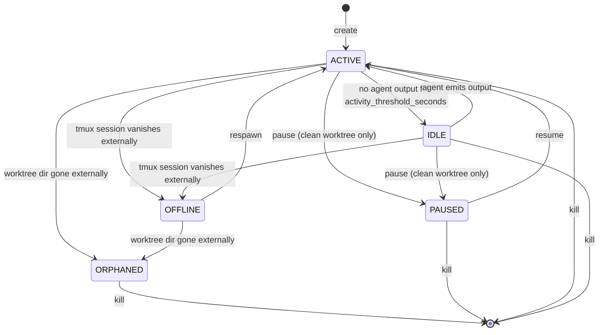

# Daily workflow

## A day with the fleet

Five lifecycle operations cover almost every interaction with Grove: create,
attach, steer, browse past sessions, and pause, resume, kill, or respawn.
All five reach the identical engine from the TUI, the CLI (`grove create`,
`grove pause`, and friends), the web dashboard, or the MCP server.

## Create a workspace

Press ++n++, pick a branch source, an agent, and a title, then ++enter++
runs the pipeline:

1. **Resolve the branch.** *Auto* names it
   `<branch_prefix><slug-of-title>`, other variants use the literal name.
2. **Add the worktree** at `<root_template>/<workspace_id>` (default
   `${repo}/.worktrees`, out of git's main checkout).
3. **Run the init script** if enabled, streaming output into the `init`
   tmux window. Must exit 0 within `init_script.timeout_seconds`.
4. **Spawn the tmux session** with `agent` and `shell` windows: the agent
   command goes into `agent` via `send-keys`, `shell` is a plain
   interactive shell for git and ad-hoc work.

A failed step leaves the workspace at `ERROR` (`fail_fast` off) or rolls it
back entirely (`fail_fast` on), recorded once through `WorkspaceEvent`.

*Skip init script* skips step 3. *Root* as the branch source skips steps 1
and 2, running in the repo root on your current branch, Grove managing
only tmux. See [root workspaces](features-workspace-lifecycle.md#root-workspaces).

## Attach and work

++enter++ (or ++a++) attaches: `tmux switch-client` inside outer tmux, or a
suspended Textual plus `tmux attach` outside it, landing in the `agent`
window with its command already running.

Detach with `Ctrl-B d` without stopping anything. The activity rail flips
ACTIVE to IDLE after `tmux.activity_threshold_seconds` of quiet (default
`30`).

The `shell` window is one tmux switch away (`Ctrl-B 0/1` or `Ctrl-B w`),
for `git commit`, `git push`, `lazygit`, or anything else. Grove never
runs commits or pushes for you.

## Steer without attaching

Press ++m++ and type a follow-up to send it straight into the agent's pane,
no attach needed, same as `grove message <id> "..."` from the CLI, the web
dashboard, or the MCP server, since steering is one engine call behind
every surface.

## Browse past sessions

Press ++s++ for recorded agent sessions across the repo and its worktrees,
with any session's turns to scrub. Sessions outlive the worktree, so even
an ORPHANED or killed workspace's transcripts stay readable, also via
`grove sessions list` and `grove sessions show`.

## Move between repos

Grove is project-scoped, so a TUI launched in repo `A` shows only repo
`A`'s workspaces. Press ++shift+p++ for the project switcher, pick another
known repo, and the list re-points there in place, instantly, since it
reads a cheap per-repo count rather than a full live status.

## Pause, resume, kill, respawn

| Op | Branch | Worktree | tmux session | Init script |
|---|---|---|---|---|
| **create** (++n++) | created or attached | created | created | runs (if enabled) |
| **pause** (++p++)  | kept | **removed** | killed | n/a |
| **resume** (++shift+r++) | kept | recreated from branch | recreated | re-runs only if `run_on_resume: true` |
| **kill** (++k++)   | deleted (default for Grove-created) | removed | killed | n/a |
| **respawn** (++o++) | kept | kept (must exist) | recreated | not re-run by default |

State diagram:

```mermaid
stateDiagram-v2
    [*] --> ACTIVE : create
    ACTIVE --> IDLE : no agent output for activity_threshold_seconds
    IDLE --> ACTIVE : agent emits output
    ACTIVE --> PAUSED : pause (clean worktree only)
    IDLE --> PAUSED : pause (clean worktree only)
    PAUSED --> ACTIVE : resume
    ACTIVE --> OFFLINE : tmux session vanishes externally
    IDLE --> OFFLINE : tmux session vanishes externally
    OFFLINE --> ACTIVE : respawn
    ACTIVE --> ORPHANED : worktree dir gone externally
    OFFLINE --> ORPHANED : worktree dir gone externally
    ORPHANED --> [*] : kill
    PAUSED --> [*] : kill
    ACTIVE --> [*] : kill
    IDLE --> [*] : kill
```

The four computed views (ACTIVE, IDLE, OFFLINE, ORPHANED) and three
persisted intents (RUNNING, PAUSED, ERROR) live in one enum, reconciled at
one site so status never drifts from the truth. Mechanics on
[status semantics](features-status.md).

`pause` suits being done for the day: it frees disk and keeps the branch.
It refuses a dirty worktree rather than stashing or discarding uncommitted
work, so commit first.

`kill` is for finished work, deleting branches Grove created and keeping
branches you attached by default, flippable from the kill modal. Remote
branches are never touched.

`respawn` recovers from one failure: a tmux session vanished externally
(terminal restart, host reboot, an unrelated `tmux kill-server`) while the
worktree stayed on disk. It rebuilds the session and returns the workspace
to ACTIVE. If the worktree itself is gone, the workspace is ORPHANED and
`kill` is the only path forward.

## Multitasking patterns

- **Two-agent split.** Run Claude on `feat/big-thing`, Aider on
  `chore/lint-pass`, the activity rail showing which needs attention.
- **Watch the wall.** Past three or four workspaces, press ++d++ for the
  [Activity Dashboard](features-activity.md): workspace status and each
  agent's live activity, together.
- **Reach the fleet asynchronously.** The same wall is the
  [web dashboard](use-webapp.md)'s home surface, reachable from any device
  over a paired session, never an open port, streaming the focused pane
  live over SSE and running the full lifecycle.
- **One agent, one shell.** Spawn an agent workspace and a `shell` workspace
  on the same branch (*Existing local*), one to change code, one to run
  `make test` or `git diff`.
- **Triage.** Pause everything not current, keeping the branch and its
  commits intact for resume on demand.

## What Grove never does for you

By design:

- **No `git commit`.** Belongs to your shell or `lazygit`.
- **No `git push`.** Happens with your credentials, in your shell.
- **No `--yolo` autoyes daemon.** Agents have their own auto-confirm flags,
  passed in the agent's `command`, not in Grove.
- **No diff pane.** That is `lazygit`. Grove opens the `shell` window one
  tmux switch away.

The boundary keeps the engine small and the trust model legible. Grove
manages worktrees and tmux. You manage the code.
