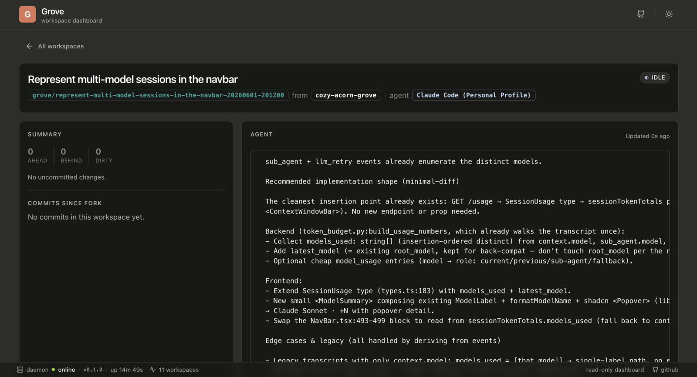
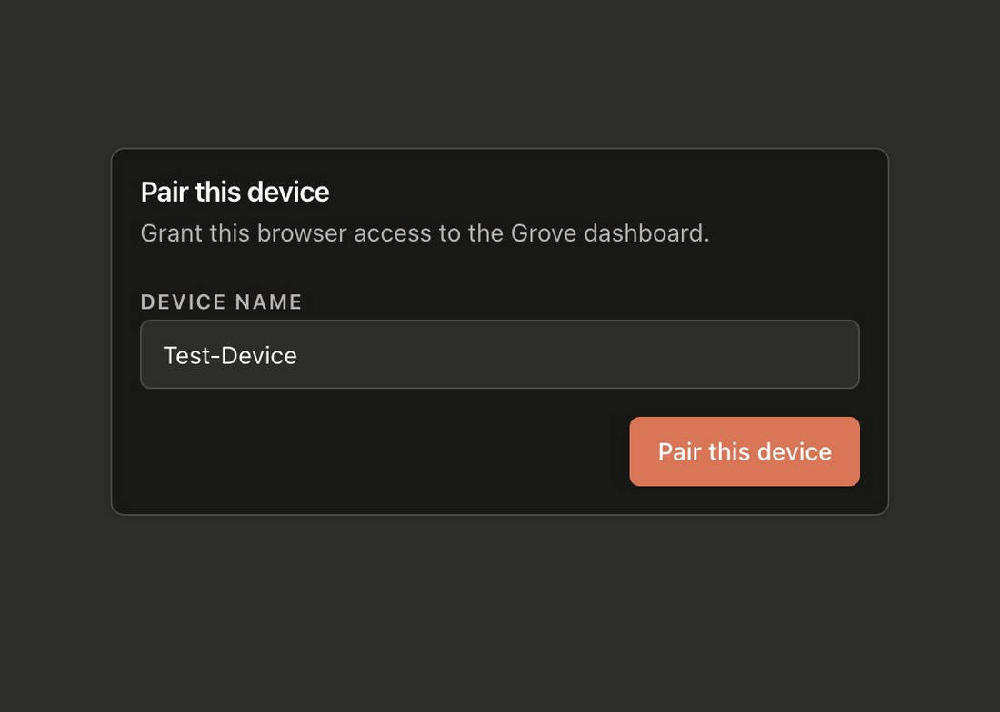

# Grove webapp

Read-only Next.js dashboard for [Grove](../README.md) workspaces. Mobile-first; same status semantics, color tokens, and live snapshot view as the TUI. Glance dashboard only, with no lifecycle controls.

> **Audience.** This README is the *contributor* surface: local setup, wire-type codegen, and tests. If you only want to *use* the dashboard, the product guide is [Web dashboard](https://bearlike.github.io/Grove/latest/use-webapp/) and [Authentication & pairing](https://bearlike.github.io/Grove/latest/use-auth/).



## Run

```bash
# 1. Start the daemon (separate shell)
uv run grove daemon serve --port 7421

# 2. Start the webapp
cd webapp
cp .env.example .env.local            # only on first run
npm install                           # only on first run
npm run dev
```

Open <http://127.0.0.1:3000>. Dev server binds `0.0.0.0`, so phone or LAN access works at `http://<machine-ip>:3000` from any device on the network. The daemon stays loopback; the webapp acts as a backend-for-frontend (BFF), proxying `/api/grove/*` server-side.

## Pairing (first access)

The daemon requires authentication, so the first time a browser opens the dashboard it pairs with the host over a Bluetooth-style handshake:

1. **Name the device** in the browser and request pairing.
2. **Approve the matching code** on the host, in the Grove TUI or via `grove auth pending` then `grove auth approve <id>`.

Sessions persist, so each device pairs only once; manage them with `grove auth sessions` and `grove auth revoke`.

| Browser: name device | Browser: code to approve | Host (TUI): approve |
|---|---|---|
|  |  |  |

## Build

```bash
npm run build
npm run start
```

## Update wire types

When `grove/core/contracts/views.py` changes, regenerate the TypeScript wire types from the daemon's OpenAPI schema:

```bash
# Daemon must be running
uv run grove daemon serve --port 7421 &

cd webapp
npm run codegen          # writes lib/grove/types.gen.ts
npm run codegen:check    # CI-friendly drift check
```

The generated file at `lib/grove/types.gen.ts` is committed; the shim at `lib/grove/types.ts` exposes the schemas the app actually consumes.

## Tests

| Layer | Command | What it covers |
|---|---|---|
| Unit + component | `npm test` | Class-atomic data layer (`GroveClient`, `RepoFacet`, `WorkspaceCardModel`), status tokens (incl. drift test against the Python source), components (StatusBadge, StatTrio, WorkspaceCard, PeekSnapshot). |
| E2E (hermetic) | `npm run test:e2e` | Playwright + Express fake daemon replaying fixtures. Mobile (Pixel 5) + desktop (1280×900) projects. |
| E2E (live) | `npm run test:e2e:live` | Same specs against a real local daemon on `127.0.0.1:7421`. |

## Architecture

```
┌───────────────┐      ┌──────────────────┐      ┌─────────────────┐
│ Browser (LAN) │◄────►│ Next.js (LAN:3000)│◄────►│ Daemon (127.0.0.1)│
│ React + TQ    │ HTTP │ /api/grove/*     │ HTTP │ /workspaces …   │
└───────────────┘      └──────────────────┘      └─────────────────┘
```

- Browser only ever hits `/api/grove/*`, so it is same-origin with no CORS.
- Next.js server-side proxy at `app/api/grove/[...path]/route.ts` forwards to `GROVE_DAEMON_URL`.
- TanStack Query polls (`5 s` list, `2 s` peek), pauses when tab hidden.

## Class-atomic data layer (`lib/grove/`)

Each class answers one question, owns its own state, and exposes behavior over that state:

- `GroveClient`: what does the daemon return?
- `RepoFacet`: what's in this repo?
- `WorkspaceCardModel`: what does this card show?
- `status-tokens.ts`: single TS source for status hex / glyph / label / polarity-aware stat color. Drift-tested against `grove.core.contracts.status_palette`.

## Read-only by design

V1 has no lifecycle controls (no create / pause / kill / respawn / update / attach). The dashboard is glance-only; manage workspaces from the TUI or `grove` CLI.

## Mobile parity with the TUI

Three role-named panels on the detail page mirror the TUI's three cards:

| TUI panel | Webapp |
|---|---|
| `workspaces` | home grid, faceted by repo |
| `summary`    | detail page summary card (ahead/behind/dirty + recent commits) |
| `agent`      | detail page agent card (live snapshot, polling 2 s) |

The same typographic tiers (bold colored values, bold default-fg counters, muted labels) and polarity-aware stat colors as the TUI's `_render_card` and `_stat()` helper. Active workspaces pulse at 4 Hz (CSS `steps(2, end)`). The gate is semantic: only ACTIVE rows pulse, while IDLE / PAUSED / OFFLINE / ORPHANED / ERROR stay still.
